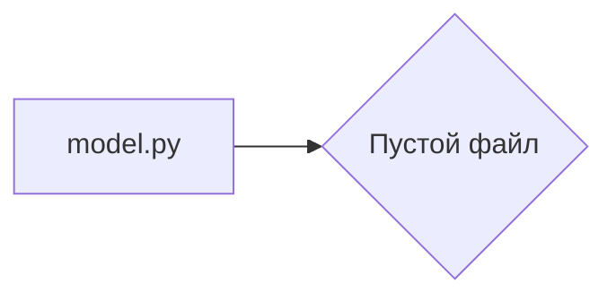

# Анализ кода hypotez/src/ai/llama/model.py

## <input code>

```python
## \file hypotez/src/ai/llama/model.py
# -*- coding: utf-8 -*-\
#! venv/Scripts/python.exe
#! venv/bin/python/python3.12

"""
.. module: src.ai.llama 
	:platform: Windows, Unix
	:synopsis:

"""
MODE = 'dev'

"""
	:platform: Windows, Unix
	:synopsis:

"""


"""
	:platform: Windows, Unix
	:synopsis:

"""


"""
  :platform: Windows, Unix

"""
"""
  :platform: Windows, Unix
  :platform: Windows, Unix
  :synopsis:
"""MODE = 'dev'
  
""" module: src.ai.llama """


```

## <algorithm>

Алгоритм работы представленного кода не определен.  Код представляет собой пустой файл с комментариями.  Нет функций, классов или переменных, поэтому блок-схема невозможна.

## <mermaid>



## <explanation>

Файл `hypotez/src/ai/llama/model.py` является пустым. Он содержит лишь многочисленные комментарии, которые описывают, но не определяют ни одного класса, функции, или переменной.  Поскольку нет кода, то нет и логики выполнения, импортов, взаимодействий с другими частями проекта или возможных ошибок.


**Возможные ошибки или области для улучшений:**

* **Отсутствие кода:** Файл не содержит никакого значимого кода, что делает его бесполезным.  Он должен содержать классы и методы, которые определяют модель Llama.

**Цепочка взаимосвязей с другими частями проекта:**

Без кода сложно определить взаимосвязь с другими частями проекта. Если в этом проекте используются модели больших языковых моделей, то ожидается, что  `hypotez/src/ai/llama/model.py` будет содержать классы, которые представляют и управляют моделью Llama.  Эти классы могли бы взаимодействовать с другими модулями (например, для загрузки данных, обучения или вывода результатов).


**Итог:**

Файл `model.py` требует значительного добавления функциональности, чтобы стать полноценной частью проекта.