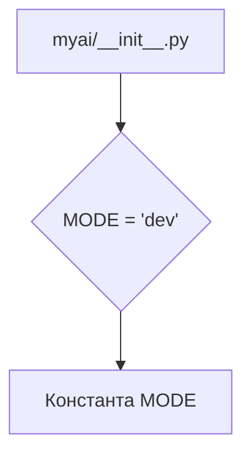
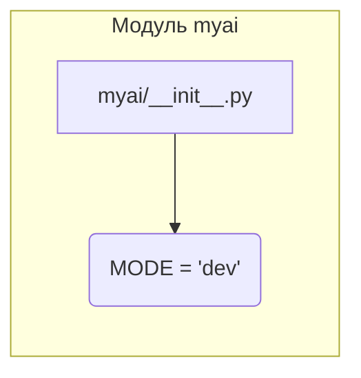

# <input code>

```python
## \file hypotez/src/ai/myai/__init__.py
# -*- coding: utf-8 -*-
#! venv/Scripts/python.exe
#! venv/bin/python/python3.12

"""
.. module: src.ai.myai 
	:platform: Windows, Unix
	:synopsis:

"""
MODE = 'dev'
```

# <algorithm>

Этот код представляет собой инициализационную функцию модуля `myai` в пакете `ai` проекта `hypotez`.  Алгоритм работы сводится к определению константы `MODE` со значением 'dev'.  Логически, это простейший пример инициализации.  Никаких вычислений или операций ввода/вывода нет.




# <mermaid>



# <explanation>

Этот файл, `hypotez/src/ai/myai/__init__.py`, служит инициализатором для модуля `myai` в подпакете `ai` проекта `hypotez`.

* **Импорты**: Нет импортируемых модулей.  Файл содержит только инициализирующее значение для константы `MODE`.

* **Классы**: Нет определённых классов.

* **Функции**: Нет определённых функций.

* **Переменные**: Единственная переменная - `MODE`. Она имеет строковое значение `'dev'`.  Это, скорее всего, глобальная константа, которая задаёт режим работы модуля `myai` (например, `dev` для разработки, `prod` для производства).  Значение `'dev'` указывает на то, что в данный момент используется режим разработки.

* **Возможные ошибки или области для улучшений**:
    * **Нет проверки на корректность `MODE`**:  Код не проверяет, что переменная `MODE` действительно имеет ожидаемое значение. В реальных приложениях, желательно проверять допустимость значений.
    * **Отсутствие документирования**:  Документирование (в виде docstrings) может улучшить читаемость и понимание назначения этой переменной.

**Цепочка взаимосвязей с другими частями проекта:**

Этот файл является частью пакета `ai`, который, скорее всего, содержит другие модули и классы, работающие с искусственным интеллектом.  Значение `MODE` может быть использовано в других модулях пакета `ai` для выбора соответствующей логики.  Например, в режиме разработки могут быть включены дополнительные проверки или отладочный вывод.


**Важно**: Файл содержит комментарии, описывающие его назначение, а также платформы, на которых он может работать.  Это хорошо, но должно быть более полное описание, например, какие функции предоставляет модуль `myai`.