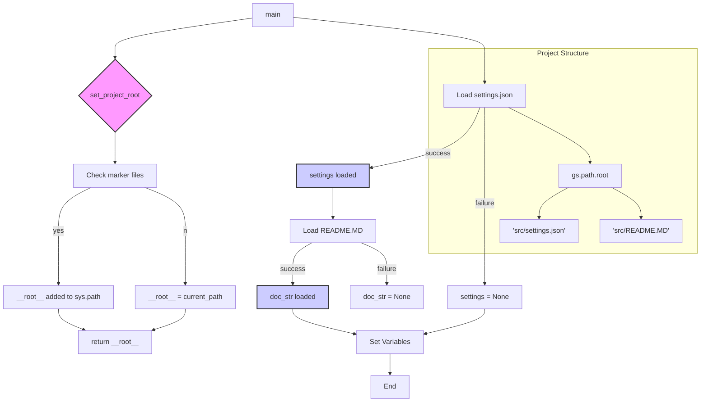

# <input code>

```python
## \file hypotez/src/ai/myai/header.py
# -*- coding: utf-8 -*-\
#! venv/Scripts/python.exe
#! venv/bin/python/python3.12

"""
.. module: src.ai.myai 
	:platform: Windows, Unix
	:synopsis:

"""
MODE = 'dev'

"""
	:platform: Windows, Unix
	:synopsis:

"""

"""
	:platform: Windows, Unix
	:synopsis:

"""


"""
  :platform: Windows, Unix

"""
"""
  :platform: Windows, Unix
  :platform: Windows, Unix
  :synopsis:
"""MODE = 'dev'
  
""" module: src.ai.myai """

import sys
import json
from packaging.version import Version

from pathlib import Path
def set_project_root(marker_files=('pyproject.toml', 'requirements.txt', '.git')) -> Path:
    """
    Finds the root directory of the project starting from the current file's directory,
    searching upwards and stopping at the first directory containing any of the marker files.

    Args:
        marker_files (tuple): Filenames or directory names to identify the project root.
    
    Returns:
        Path: Path to the root directory if found, otherwise the directory where the script is located.
    """
    __root__:Path
    current_path:Path = Path(__file__).resolve().parent
    __root__ = current_path
    for parent in [current_path] + list(current_path.parents):
        if any((parent / marker).exists() for marker in marker_files):
            __root__ = parent
            break
    if __root__ not in sys.path:
        sys.path.insert(0, str(__root__))
    return __root__


# Get the root directory of the project
__root__ = set_project_root()
"""__root__ (Path): Path to the root directory of the project"""

from src import gs

settings:dict = None
try:
    with open(gs.path.root / 'src' /  'settings.json', 'r') as settings_file:
        settings = json.load(settings_file)
except (FileNotFoundError, json.JSONDecodeError):
    ...

doc_str:str = None
try:
    with open(gs.path.root / 'src' /  'README.MD', 'r') as settings_file:
        doc_str = settings_file.read()
except (FileNotFoundError, json.JSONDecodeError):
    ...


__project_name__ = settings.get("project_name", 'hypotez') if settings  else 'hypotez'
__version__: str = settings.get("version", '')  if settings  else ''
__doc__: str = doc_str if doc_str else ''
__details__: str = ''
__author__: str = settings.get("author", '')  if settings  else ''
__copyright__: str = settings.get("copyrihgnt", '')  if settings  else ''
__cofee__: str = settings.get("cofee", "Treat the developer to a cup of coffee for boosting enthusiasm in development: https://boosty.to/hypo69")  if settings  else "Treat the developer to a cup of coffee for boosting enthusiasm in development: https://boosty.to/hypo69"
```

# <algorithm>

1. **`set_project_root` function:**
   - Takes a tuple of marker files as input.
   - Starts from the directory of the current file (`__file__`).
   - Iterates through parent directories until it finds a directory containing at least one of the marker files.
   - If found, adds the root directory to `sys.path` (this is important for importing modules from the project).
   - Returns the root directory path.

   *Example:*
   If `__file__` is `/path/to/hypotez/src/ai/myai/header.py`, and `pyproject.toml` exists in `/path/to/hypotez`, then `__root__` will be `/path/to/hypotez`.

2. **Project root retrieval:** Calls `set_project_root()` to get the project root directory.

3. **`settings` loading:** Attempts to load settings from `src/settings.json` using `json.load()`. Handles `FileNotFoundError` and `json.JSONDecodeError` if the file doesn't exist or is not valid JSON.

4. **`README.md` loading:** Attempts to load the README from `src/README.MD`. Handles errors.

5. **Variable initialization:** Sets project name, version, documentation, details, author, copyright, and coffee-link variables based on the loaded settings or default values if `settings` are missing or invalid.

   *Example:* If `settings` contains `"project_name": "MyProject"` and `"version": "1.0.0"` then `__project_name__` will be `"MyProject"`, and `__version__` will be `"1.0.0"`


# <mermaid>



# <explanation>

* **Imports:**
    * `sys`: Used for interacting with the Python interpreter, particularly modifying the `sys.path` variable, crucial for finding modules.
    * `json`: Used for loading and parsing JSON data from `settings.json`.
    * `packaging.version`: Used to deal with project versions in a reliable way.
    * `pathlib`: For manipulating file paths in a platform-independent way using Path objects.
    * `src.gs`:  Likely contains a module defining the `gs.path` object which interacts with the project's file structure. This is a custom module within the project and requires it to be properly defined in other files.

* **`set_project_root` function:** This function is a crucial part of a project's module structure. It dynamically determines the project root directory by searching up the file hierarchy until it finds a directory containing `pyproject.toml`, `requirements.txt`, or `.git`. This way, the code can import modules from other parts of the project without hardcoding paths.

* **Global Variables (`__root__`, `settings`, `doc_str`, etc.):**
    * `__root__`: Holds the absolute path to the project root directory.
    * `settings`: A dictionary containing project settings loaded from `settings.json`.
    * `doc_str`: String containing the content of the README file.
    *  Other variables hold values extracted from the settings.

* **Error Handling (`try...except` blocks):** The code uses `try...except` blocks to gracefully handle potential `FileNotFoundError` and `json.JSONDecodeError` exceptions if `settings.json` or `README.MD` are not found or have incorrect formats.

* **`gs.path.root`:** This implies a `gs` module (likely part of the same project) that provides a `path` object with a `root` attribute.  This `root` likely points to a path-management system within the project.

* **Possible improvements:**
    * **More Robust Error Handling:** Consider adding logging for better debugging if a file isn't found.
    * **Type Hinting:** Use more explicit type hints, even for simple variables like `MODE`.
    * **Docstrings:** Enhance docstrings in functions with more detailed descriptions of parameters, return values, and usage.

**Relationship to other parts of the project:**  The code interacts with `gs.path` and potentially other modules in the `src` directory, making it part of a larger project structure. The functions and variables rely on the data provided by other parts of the project. `src.gs` and `src/settings.json`, `src/README.MD` are significant components with which the code directly interacts.