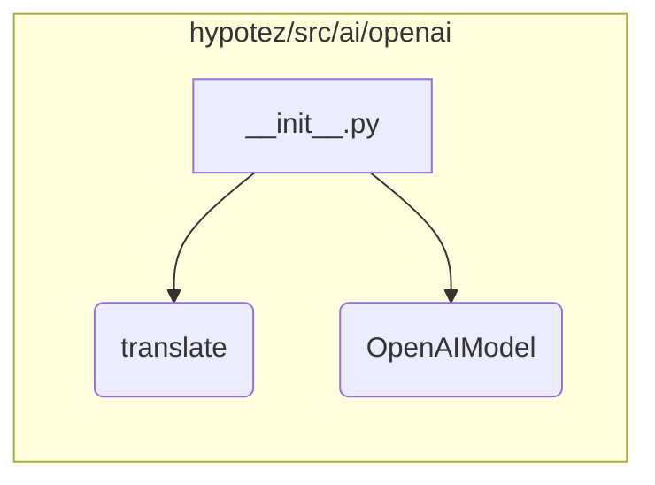

# <input code>

```python
## \file hypotez/src/ai/openai/__init__.py
# -*- coding: utf-8 -*-\
#! venv/Scripts/python.exe
#! venv/bin/python/python3.12

"""
.. module: src.ai.openai 
	:platform: Windows, Unix
	:synopsis: Модуль модели `openai`

"""
MODE = 'dev'

from .translator import translate
from .model import OpenAIModel
```

# <algorithm>

Этот код представляет собой инициализационный модуль для пакета `openai` внутри проекта `hypotez`. Он импортирует необходимые компоненты из подпапок.  Пошаговой блок-схемы нет, так как код лишь импортирует модули.

# <mermaid>



# <explanation>

Этот файл `__init__.py` является ключевым для модуля `openai` в проекте `hypotez`. Он служит точкой входа и определяет, какие компоненты будут доступны извне.

**Импорты**:

* `from .translator import translate`: Импортирует функцию `translate` из модуля `translator.py` внутри папки `openai`.  Это указывает на то, что модуль `translator` содержит функции для работы с переводом (например, перевод текста).  Связь - прямая зависимость, `__init__.py` использует функциональность `translator`.  Начальная точка входа в модуль `translator.py`.

* `from .model import OpenAIModel`: Импортирует класс `OpenAIModel` из модуля `model.py` в папке `openai`. Это указывает на то, что `model.py` содержит класс, представляющий модель OpenAI, вероятно, для взаимодействия с API OpenAI.  Связь - прямая зависимость, `__init__.py` использует функциональность `model.py`.  Начальная точка входа в класс `OpenAIModel`.

**Переменная**:

* `MODE = 'dev'`:  Это константа, которая задает режим работы (в данном случае 'dev', предположительно, для разработки).  Она может использоваться в других частях проекта для условной логики (например, для активации/деактивации дополнительных проверок или функций в режиме разработки).  Тип данных - строка.

**Функции (нет в данном файле):**

Никаких функций не определено в этом файле.

**Классы (нет в данном файле):**

Никаких классов не определено в этом файле.

**Возможные ошибки или улучшения:**

* Отсутствует документация для `MODE`.  Желательно добавить описание того, что означает каждая константа.
* Должен быть импортирован `openai`, если код использует `openai` (API).
* Отсутствует логика выбора модели.
* Модуль `__init__.py` скорее всего в дальнейшей реализации будет использоваться для управления различными вариантами модели `OpenAIModel`.

**Цепочка взаимосвязей**:

Этот `__init__.py` находится в подпапке `src/ai/openai`. Это указывает на то, что весь модуль `openai` используется для интеграции функций и классов, связанных с моделью OpenAI, в проект `hypotez`.  Связь напрямую через импорт.  В дальнейшем логика работы с `translate`, `OpenAIModel` и другими модулями будет проходить через этот инициализирующий модуль.

**Заключение**:

Код `__init__.py` служит для импорта модулей и классов, необходимых для использования функций и классов, связанных с OpenAI. Он создает интерфейс доступа к нужной функциональности для основной части приложения.  В будущем это позволит использовать OpenAI через этот модуль.