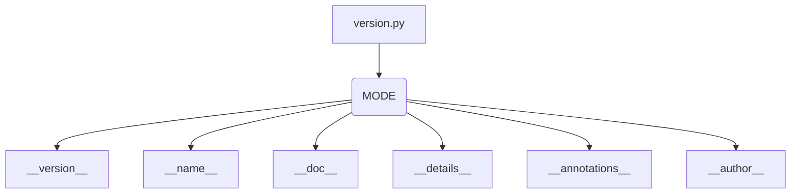

# <input code>

```python
## \file hypotez/src/ai/openai/_examples/version.py
# -*- coding: utf-8 -*-\n#! venv/Scripts/python.exe
#! venv/bin/python/python3.12
"""
.. module: src.ai.openai._examples 
	:platform: Windows, Unix
	:synopsis:

"""
MODE = 'dev'

"""
	:platform: Windows, Unix
	:synopsis:

"""

"""
	:platform: Windows, Unix
	:synopsis:

"""


"""
  :platform: Windows, Unix

"""
"""
  :platform: Windows, Unix
  :platform: Windows, Unix
  :synopsis:
"""MODE = 'dev'
  
""" module: src.ai.openai._examples """


""" @namespace src.ai._examples """


"""
- `__version__`: This variable holds the version of the module or package.
- `__name__`: Contains the name of the module. If the script is being run directly, the value will be `"__main__"`.
- `__doc__`: The module's documentation string.
- `__details__`: This variable likely contains additional details about the module, but the exact purpose depends on the specific module or package.
- `__annotations__`: Contains type annotations for variables and functions in the module.
- `__author__`: The name(s) of the author(s) of the module.
"""
__name__:str
__version__="3.12.0.0.0.4"
__doc__:str
__details__:str="Details about version for module or class"
__annotations__

__author__='hypotez '
```

# <algorithm>

Этот код не содержит алгоритма в классическом понимании. Это, скорее, определение констант, строк документации и метаданных (версии, автора) для модуля `src.ai.openai._examples`.  В нем нет циклов, условных операторов или вызовов функций, выполняющих какие-либо действия.  Данные не перемещаются между функциями или классами, так как их нет.

# <mermaid>



# <explanation>

Этот Python-файл определяет различные атрибуты для модуля `hypotez/src/ai/openai/_examples`. Он не содержит функционального кода, а задает метаданные, используемые при импорте или для docstrings.

* **`MODE = 'dev'`**:  Это переменная, хранящая строку 'dev', вероятно, определяющая режим работы модуля (например, 'dev' для разработки, 'prod' для производства).  Значение не используется непосредственно в коде, но может использоваться в других частях проекта.


* **Документационные строки (docstrings):**  Большое количество многострочных строк (`""" ... """`)  представляет собой docstrings, которые служат для документации модуля и его содержимого.  Docstrings  показывают, что модуль предназначен для работы в средах Windows и Unix. Docstrings содержат информацию о том, что это модуль, его версия, автор, а также общие подробности (`__details__`).

* **`__version__`, `__name__`, `__doc__`, `__details__`, `__annotations__`, `__author__`:**  Эти переменные являются специальными атрибутами модуля,  используемыми в основном для метаданных. `__version__` - указывает версию; `__name__` - имя модуля; `__doc__` - описание; `__details__` - дополнительные сведения (например, о версии).  `__annotations__` предназначены для аннотирования типов, но здесь не заполнены. `__author__` указывает автора.

* **Импорты**:  В этом файле нет импорта других модулей.

* **Классы**:  В этом файле нет определений классов.

* **Функции**: В файле нет определений функций.

* **Переменные**: Все определённые переменные являются строками или пустыми объектами.

**Возможные ошибки и улучшения:**

* **Неясная связь с другими частями проекта:**  Без контекста других файлов в проекте сложно понять, как именно этот модуль интегрируется и используется. Непонятно, как эти метаданные используются в других частях проекта.

* **Недостаточное использование типов данных:** Несмотря на аннотации типов, их отсутствие конкретизации (`__annotations__`) делает код менее читаемым и менее устойчивым к ошибкам.
* **Избыточные docstrings:**  В коде есть много повторяющихся docstrings, которые не предоставляют новой информации.  Можно сгруппировать их в более компактную документацию.


**Цепочка взаимосвязей с другими частями проекта:**  Этот файл предоставляет метаданные.  Он должен использоваться другими частями кода (возможно, посредством импорта), которые нуждаются в информации о версии, авторе и т.д.  Для понимания взаимосвязей нужно рассмотреть другие файлы в папке `hypotez/src/ai/openai/_examples`.