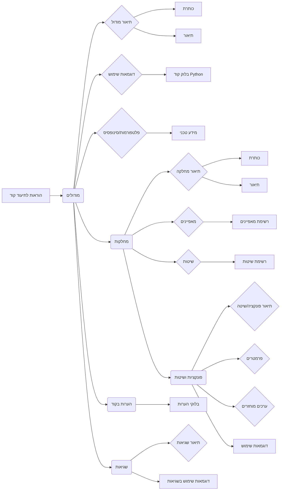

# <input code>

```
"prompt": "אתה צריך לתעד את הקוד בסגנון הבא. כל ההערות בקוד, כולל תיאורי המודול, מחלקות ופונקציות, צריכות להיות כתובות בפורמט reStructuredText (RST). לכל מודול, מחלקה ופונקציה, עקוב אחרי התבנית הבאה:\n\n1. **מודול**:\n    - תיאור המודול צריך להיכתב בכותרת, תוך ציון מטרתו.\n    - ספק דוגמאות לשימוש במודול, אם אפשר. דוגמאות קוד צריכות להיות בתוך בלוק `.. code-block:: python`.\n    - ציין את הפלטפורמות והסינופסיס של המודול.\n    - השתמש בכותרות עבור מאפיינים ושיטות של המודול כשנדרש.\n\nדוגמה לתיעוד מודול:\n```\nמודול לעבודה עם עוזר תוכנה\n=========================================================================================\n\nמודול זה מכיל את המחלקה :class:`CodeAssistant`, המשמשת לעבודה עם דגמי AI שונים, \nכגון Google Gemini ו-OpenAI, לביצוע משימות עיבוד קוד.\n\nשימוש לדוגמה\n--------------------\n\nשימוש במחלקה `CodeAssistant`:\n\n.. code-block:: python\n\n    assistant = CodeAssistant(role=\'code_checker\', lang=\'ru\', model=[\'gemini\'])\n    assistant.process_files()\n```\n\n2. **מחלקות**:\n    - כל מחלקה צריכה להיות מתועדת בהתאם למטרתה. כלל תיאור למחלקה, מאפיינים ושיטות שלה.\n    - בחלק המחלקות, ציין את כל השיטות, מטרתן ודוגמאות לשימוש.\n    - לכל שיטה, כלל תיאור של פרמטרים וערכים מוחזרים, ודוגמאות לשימוש.\n\nדוגמה לתיעוד מחלקה:\n```\nמחלקה לעבודה עם עוזר תוכנה\n=========================================================================================\n\nהמחלקה :class:`CodeAssistant` משמשת לעבודה עם דגמי AI שונים כמו Google Gemini, \nומספקת שיטות לניתוח ויצירת תיעוד עבור קוד.\n\nמאפיינים:\n----------\n- `role`: תפקיד העוזר (למשל, \'code_checker\').\n- `lang`: השפה בה העוזר יעבוד (למשל, \'ru\').\n- `model`: רשימה של דגמי AI בשימוש (למשל, [\'gemini\']).\n\nשיטות:\n--------\n- `process_files`: שיטה לעיבוד קבצי קוד.\n\nשימוש לדוגמה:\n---------------------\n\n.. code-block:: python\n\n    assistant = CodeAssistant(role=\'code_checker\', lang=\'ru\', model=[\'gemini\'])\n    assistant.process_files()\n```\n\n3. ... (המשך ההוראות)"
```

# <algorithm>

אין אלגוריתם מוגדר בקוד. הקוד מפרט הוראות כיצד ליעד קוד Python, ולא מתאר קוד פעיל.  הוא מספק דוגמאות וטמפלטים לתיעוד קוד בצורת RST.

# <mermaid>



# <explanation>

הקוד אינו קוד בפועל, אלא **הוראות** כיצד לכתוב תיעוד עבור קוד Python בפורמט reStructuredText (RST). הוא מפרט את התבניות והסגנון הנדרשים עבור תיעוד מודולים, מחלקות, פונקציות ושיטות, תוך מתן דוגמאות.

* **Импорты:**  אין import statements בקוד, מאחר והוא תיעוד.
* **Классы:** הקוד מראה כיצד ליעד מחלקה בשם `CodeAssistant`, עם מאפיינים (`role`, `lang`, `model`) ושיטה (`process_files`).
* **Функции:**  הוא מראה כיצד ליעד פונקציות ושיטות, כולל פרמטרים, ערכים מוחזרים, תיאור, ודוגמאות.
* **Переменные:**  הדוגמאות מציגות משתנים כמו `role`, `lang`, `model`, `files`, `options`, אך אין שימוש אמיתי במימוש משתנים.
* **Возможные ошибки или области для улучшений:**  הקוד טוב, אך ניתן היה להוסיף עומק נוסף בתיעוד, על ידי תיאור עמוק יותר של התנהגות המחלקות והפונקציות, כמו למשל עיבוד שגיאות אפשריות.


**מחזיקי תלות:** הקוד אינו קוד בפועל, והוא פועל בצורה נפרדת מקוד אחר. אין לו תלות בקבצים אחרים.

**קשרים עם חלקים אחרים של הפרויקט:** אין. הקוד הזה הוא כלי תיעוד.