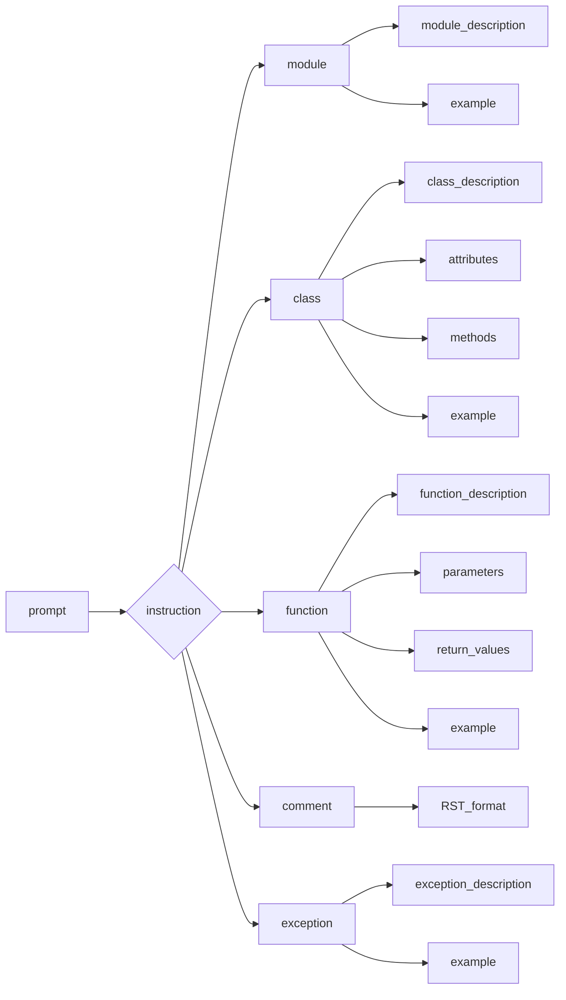

# <input code>

```
"prompt": "Ты должен оформлять документацию по коду в следующем стиле. Все комментарии к коду, включая описание модуля, классов и функций, должны быть написаны в формате reStructuredText (RST). Для каждого модуля, класса и функции следуй следующему шаблону:\n\n1. **Модуль**:\n    - Описание модуля должно быть оформлено в заголовке, с указанием его назначения.\n    - Укажи примеры использования модуля, если это возможно. Пример кода должен быть оформлен в блоке `.. code-block:: python`.\n    - Укажи платформы и синопсис модуля.\n    - Для описания функций и методов модуля используй заголовки для атрибутов и методов, если это необходимо.\n\nПример оформления для модуля:\n```\nМодуль для работы ассистента программиста\n=========================================================================================\n\nЭтот модуль содержит класс :class:`CodeAssistant`, который используется для работы с различными моделями ИИ, \nтакими как Google Gemini и OpenAI, для выполнения задач по обработке кода.\n\nПример использования\n--------------------\n\nПример использования класса `CodeAssistant`:\n\n.. code-block:: python\n\n    assistant = CodeAssistant(role=\'code_checker\', lang=\'ru\', model=[\'gemini\'])\n    assistant.process_files()\n```\n\n2. **Классы**:\n    - Каждый класс должен быть оформлен в соответствии с его назначением. Указывай описание класса, его атрибуты и методы.\n    - В разделе классов укажи все методы и их назначение, а также примеры использования.\n    - Для каждого метода используйте описание его параметров и возвращаемых значений, а также примеры использования.\n\nПример оформления для класса:\n```\nКласс для работы с ассистентом программиста\n=========================================================================================\n\nКласс :class:`CodeAssistant` используется для взаимодействия с различными моделями ИИ, такими как Google Gemini, \nи предоставляет методы для анализа и создания документации для кода.\n\nАтрибуты:\n----------\n- `role`: Роль ассистента (например, \'code_checker\').\n- `lang`: Язык, на котором будет работать ассистент (например, \'ru\').\n- `model`: Список используемых моделей ИИ (например, [\'gemini\']).\n\nМетоды:\n--------\n- `process_files`: Метод для обработки файлов с кодом.\n\nПример использования:\n---------------------\n\n.. code-block:: python\n\n    assistant = CodeAssistant(role=\'code_checker\', lang=\'ru\', model=[\'gemini\'])\n    assistant.process_files()\n```\n\n..."
```

# <algorithm>

Нет конкретного кода для анализа, поэтому алгоритм не может быть построен.  Данный текст - это промпт, инструкция для написания документации в формате RST, а не сам код.

# <mermaid>



**Объяснение диаграммы:**

Промпт (A) задаёт инструкцию (B) для создания документации в формате RST.  Инструкция определяет  структуру документации (модули, классы, функции, комментарии, исключения) и их составляющие.  Диаграмма показывает взаимосвязи между этими составляющими и их отношения.

# <explanation>

Этот код не представляет собой исполняемый код. Это текст, описывающий формат документации кода, использующий reStructuredText (RST).  Он служит как руководство,  шаблон для написания документации для Python-проекта.


* **Импорты:** Нет импортов, так как это просто описание формата, а не фрагмент кода.
* **Классы:** Текст описывает, как нужно описывать классы (например, `CodeAssistant`) в документации, указывая на атрибуты (`role`, `lang`, `model`) и методы (`process_files`).
* **Функции:**  Текст описывает, как документировать функции и методы, включая описание параметров, возвращаемых значений и примеры.
* **Переменные:**  Текст описывает  как структурировать и описывать переменные.
* **Возможные ошибки/улучшения:**  Нет кода, поэтому нет возможности выявить ошибки или предложить улучшения.

**Взаимосвязи с другими частями проекта:**

Этот промпт описывает, как создавать *документацию*.  Он не является кодом, который прямо взаимодействует с другими частями проекта.  Документация, сгенерированная по этому шаблону,  поможет другим разработчикам понять код, который, скорее всего, будет существовать в других файлах проекта.