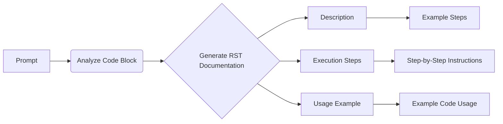

```MD
# Анализ кода

## <input code>

```
Here's the translated prompt in English:

---

**Prompt for generating `how to` documentation for code blocks**

1. You need to analyze the current block of code and all previously loaded code blocks in the project. Based on this analysis, you will create a step-by-step instruction that describes what actions need to be taken to execute the given code block.

2. For each code block, you should create a detailed instruction in reStructuredText (RST) format, following these steps:

    - **Description**: Explain what this code block does, for example, what task it solves or what validation it performs.
    - **Execution steps**: Describe the sequence of actions that need to be performed for the code to execute. For each step, explain in detail what happens during the process.
    - **Usage example**: Provide an example of how this code can be used in the project, including possible function or method calls.

3. The structure of the documentation for each code block should be as follows:

```rst
How to use this code block
=========================================================================================

Description
-------------------------
This code block performs [describe the actions of the code block, for example, "a validation check on input data"].

Execution steps
-------------------------
1. [First step, for example, "Retrieve data by calling the `get_data()` function."].
2. [Second step, for example, "Validate the data using the `validate_data()` method."].
3. [Third step, for example, "If the data is valid, further processing is performed."].
4. [Continue as needed...]

Usage example
-------------------------
An example of how to use this code block in a project:

.. code-block:: python

    <example_code_usage>
```

4. When writing documentation, be sure to:

    - If the code block performs a check, describe how it works and what data is being validated.
    - If the code block calls other functions or methods, be sure to specify which functions are called and with what parameters.
    - Use precise wording, avoiding vague terms like "getting" or "doing." Instead, describe what the code specifically does: "the code checks," "the code sends a request," and so on.

5. Example for a code block that performs a variable check:

```rst
How to use this code block
=========================================================================================

Description
-------------------------
This code block performs a validation check on the `value` variable before further processing.

Execution steps
-------------------------
1. Retrieve the value of the `value` variable by calling the `get_value()` method.
2. Check if the value is empty or invalid. If so, log an error message and halt execution.
3. If the value is valid, pass it to the next function for further processing.

Usage example
-------------------------
An example of how to use this code block:

.. code-block:: python

    value = get_value()
    if value:
        process_value(value)
    else:
        logger.error('Invalid value')
```

6. Each code block should be documented in this format, with clear and understandable steps explaining what the code does and with an example of how it can be used.

---

This prompt gives you the instructions to create detailed documentation for each code block based on its analysis. You will generate documentation that explains the sequence of actions for executing the code, as well as provide usage examples.
```

## <algorithm>

The provided code snippet is a detailed prompt, not a piece of executable code.  Therefore, no algorithm can be generated. It's a description of the format and structure required for generating documentation for code blocks, not the code itself.

## <mermaid>



This mermaid diagram illustrates the high-level steps of the documentation generation process. The prompt serves as the input (A), initiating the analysis (B) and subsequent creation of reStructuredText (RST) documentation (C).  This documentation includes distinct sections for Description (D), Execution Steps (E), and Usage Example (F), each with further details (G, H, I).

## <explanation>

The code snippet is not executable code; it's a *prompt* for generating `how to` documentation for other code blocks. It defines the structure and content for that documentation.

* **No Imports**: There are no imports because this is a prompt, not code.
* **No Classes or Functions**: There are no classes or functions to analyze, as this describes how to create documentation.
* **Variables**: The prompt refers to variables (e.g., `value`, `get_value()`) within the example usage, demonstrating how the documentation should address these elements in the code it describes.

**Possible errors/improvements**:

The prompt is well-structured and clear, but it could be improved by:

* **Specific examples of different code types**: Providing more varied examples (loops, conditional logic, specific data structures) for clarity and completeness of documentation generation.
* **Handling errors**: Explicitly mentioning how to handle errors in the code for more robust documentation.
* **Example for calling external services or libraries**: The prompt currently assumes the code is self-contained; examples handling external API calls or library usage would be useful.


**Relationship to other parts of the project**:

This prompt is a crucial part of the documentation generation process for the project, directly impacting how the documentation is written. It ensures a consistent and clear format for all code blocks in the project.