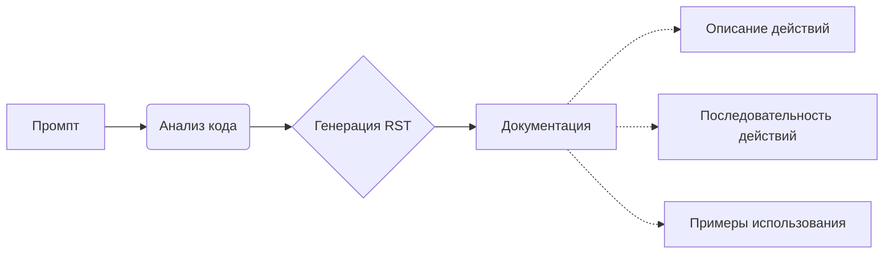

# Анализ кода - инструкция по написанию документации

## <input code>

```
Понял, вот промпт в первом лице, с командами для модели:

---

**Промпт для генерации `how to` документации для блоков кода**

1. Ты должен проанализировать текущий блок кода и все ранее загруженные блоки кода в проекте. На основе этого анализа ты сформулируешь пошаговую инструкцию, которая описывает, какие действия нужно выполнить для исполнения данного блока кода.

2. Для каждого блока кода ты должен создать подробную инструкцию в формате reStructuredText (RST), следуя следующим шагам:

    - **Описание**: Объясни, что делает этот блок кода, например, какую задачу решает или какую проверку выполняет.
    - **Шаги выполнения**: Описывай последовательность действий, которые нужно выполнить для того, чтобы код исполнился. Для каждого шага подробно укажи, что именно происходит в процессе.
    - **Пример использования**: Приведи пример того, как этот код можно использовать в проекте, в том числе с возможными вызовами функций или методов.

3. Структура документации для каждого блока кода должна быть следующей:

```rst
Как использовать блок кода
=========================================================================================

Описание
-------------------------
Этот блок кода выполняет [описание действий блока кода, например, "проверку на валидность ввода данных"].

Шаги выполнения
-------------------------
1. [Первый шаг выполнения, например, "Получение данных через вызов функции `get_data()`."
2. [Второй шаг выполнения, например, "Проверка данных на валидность с использованием метода `validate_data()`."
3. [Третий шаг выполнения, например, "Если данные валидны, выполняется дальнейшая обработка."
4. [И так далее...]

Пример использования
-------------------------
Пример того, как можно использовать данный блок кода в проекте:

.. code-block:: python
    <пример_кода_с_использованием>
```

4. При написании документации обязательно учитывай:

    - Если блок кода выполняет проверку, то опиши, как она работает и какие данные проверяются.
    - Если блок кода включает в себя вызовы других функций или методов, обязательно укажи, какие именно функции вызываются и с какими параметрами.
    - Важно использовать точные формулировки, избегая общих терминов типа "получаем" или "делаем". Вместо этого опиши, что конкретно делает код: "код проверяет", "код выполняет отправку запроса", и так далее.

5. Пример для блока кода, который выполняет проверку переменной:

```rst
Как использовать блок кода
=========================================================================================

Описание
-------------------------
Этот блок кода выполняет проверку на валидность значения переменной `value` перед дальнейшей обработкой.

Шаги выполнения
-------------------------
1. Получение значения переменной `value` через вызов метода `get_value()`.
2. Проверка, является ли значение пустым или невалидным. Если да, то логируется сообщение об ошибке и выполнение кода прекращается.
3. Если значение валидно, оно передается в следующую функцию для дальнейшей обработки.

Пример использования
-------------------------
Пример того, как можно использовать данный блок кода:

.. code-block:: python

    value = get_value()
    if value:
        process_value(value)
    else:
        logger.error('Невалидное значение')
```

6. Каждый блок кода должен быть документирован в этом формате, с четкими и понятными шагами, поясняющими, что именно делает код, и с примером того, как его можно использовать.

---

Этот промпт даст тебе команду для создания подробной документации для каждого блока кода на основе его анализа. Ты будешь генерировать документацию, которая объяснит последовательность действий для исполнения кода, а также приведет примеры использования.
```

## <algorithm>

Нет конкретного алгоритма, представлен промпт для *генерации* алгоритма (шагов) для блока кода.  Промпт описывает структуру, которую следует использовать для документации, описывающей как реализован блок кода.

## <mermaid>



## <explanation>

Этот код не является исполняемым кодом. Это текстовый файл, представляющий собой инструкцию для  искусственного интеллекта (модели). Он описывает, как генерировать документацию по коду в формате reStructuredText (RST) с акцентом на пошаговом объяснении.

**Импорты:**  Нет импортов.

**Классы:** Нет классов.

**Функции:** Нет функций.  Инструкция фокусируется на *процессе* генерации документации.

**Переменные:** Нет переменных.  Инструкция описывает *структуру* документации, но не использует переменные.

**Возможные ошибки или области для улучшений:**  Промпт не содержит кода, который можно проанализировать на предмет ошибок, поэтому этот вопрос не применимо.

**Взаимосвязь с другими частями проекта:** Промпт служит шаблоном для генерации документации, что может быть частью  процесса разработки программного обеспечения, и используется для улучшения понимания кода другими разработчиками.