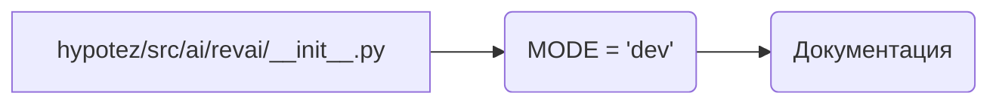

# <input code>

```python
## \file hypotez/src/ai/revai/__init__.py
# -*- coding: utf-8 -*-
#! venv/Scripts/python.exe
#! venv/bin/python/python3.12

"""
.. module: src.ai.revai 
	:platform: Windows, Unix
	:synopsis:

"""
MODE = 'dev'

"""
	:platform: Windows, Unix
	:synopsis:

"""


"""
	:platform: Windows, Unix
	:synopsis:

"""


"""
  :platform: Windows, Unix

"""
"""
  :platform: Windows, Unix
  :platform: Windows, Unix
  :synopsis:
"""MODE = 'dev'
  
# https://www.rev.com/api/docs
# https://docs.rev.ai/resources/code-samples/python/
```

# <algorithm>

Этот файл `__init__.py` является инициализирующим файлом для пакета `revai` в проекте `hypotez`.  Поскольку в нем нет функций или классов, он не выполняет вычислений или логических операций. Он просто определяет константу `MODE` и содержит документальные строки, которые, возможно, будут использоваться для автоматической генерации документации.  

Алгоритм работы:
1. Установлены константы.
2.  Комментарии содержат ссылки на документацию, которая может использоваться другими компонентами проекта для справки.
3.  Файл `__init__.py` просто импортирует и объявляет переменные. Никаких алгоритмических действий не происходит.


# <mermaid>



**Описание Диаграммы:**

Диаграмма показывает только одну переменную `MODE` и её присваивание в файле `__init__.py`. Связь с документацией показана через `C` (что означает, что комментарии предоставляют документацию). Эта простая структура, ожидаемо, будет частью более сложной системы, где этот файл `__init__.py` будет импортироваться и использоваться другими модулями или скриптами в пакете `revai`.


# <explanation>

**Импорты:**
В данном файле нет импортов. Наличие строк `#! venv/Scripts/python.exe` и `#! venv/bin/python/python3.12` указывает на то, что скрипт, возможно, предназначен для работы с определенной версией Python из виртуального окружения (`venv`).

**Классы:**
Нет определенных классов.

**Функции:**
Нет определенных функций.

**Переменные:**
`MODE`: Строковая переменная, хранящая значение 'dev'. Вероятно, используется для определения режима работы, например, "разработки", "производства" и т.д.  Значение этой переменной, как видно, может быть использовано для настройки поведения других частей проекта.


**Возможные ошибки или улучшения:**

* **Недостаток функциональности:** Файл `__init__.py` не содержит никакой логики, кроме объявления констант и документации.  Он должен содержать какие-то определения, чтобы представлять некоторую пользу.
* **Неясность использования:**  Без контекста проекта неясно, как и где используется значение `MODE`. Необходимо знать, где она используется, чтобы понять её значение в большей перспективе.
* **Документация:**  Вложенные `"""Docstring"""`- блоки следует использовать для более структурированной документации, что повысит читабельность кода и облегчит понимание разработчикам.  Ожидается, что модуль `revai` будет содержать функции и классы, которые будут описаны в документации.


**Взаимосвязи с другими частями проекта:**

Данный `__init__.py` файл скорее всего является частью пакета `revai`, который, вероятно, содержит классы и функции для взаимодействия с API Rev.ai. Это подразумевает связь с модулями, которые делают HTTP запросы (например, `requests`), и с логикой обработки полученных данных.