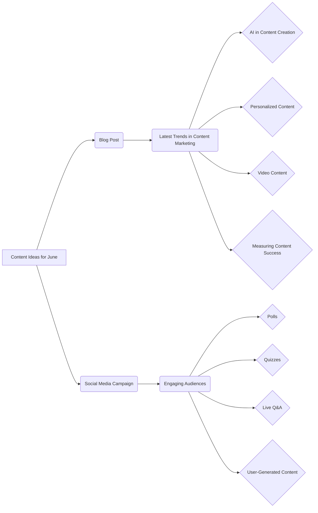

# Анализ кода

## <input code>

```
## Content Ideas for June

### 1. Blog Post: Latest Trends in Content Marketing

**Objective:** To inform our audience about the latest trends in content marketing and how they can leverage these trends to improve their own Startegies.

**Key Points to Cover:**
- The rise of AI in content creation
- The importance of personalized content
- The growing influence of video content
- How to measure the success of content marketing efforts

### 2. Social Media Campaign: Engaging Audiences Through Interactive Content

**Objective:** To increase audience engagement on social media platforms by using interactive content such as polls, quizzes, and live Q&A sessions.

**Key Elements:**
- Create a series of polls related to industry topics
- Develop fun and informative quizzes that relate to our brand
- Host live Q&A sessions with industry experts
- Encourage user-generated content by asking followers to share their experiences and tag our brand
```

## <algorithm>

Код не содержит алгоритма в формате программы. Это текстовый документ, представляющий идеи контент-планирования.  Блок-схема не применима.  Данные перемещаются в рамках структуры документа, не в формате данных для программы.

## <mermaid>



## <explanation>

Данный код представляет собой текстовый документ, содержащий идеи для контент-планирования на июнь.  В нем определены две идеи:

* **Блог-пост о последних тенденциях в контент-маркетинге.** Описывается цель, ключевые моменты, которые необходимо затронуть (подъём ИИ, персонализированный контент, видео).
* **Социальная медиа кампания для вовлечения аудитории.** Описывается цель, ключевые элементы (опросы, викторины, прямые эфиры с экспертами, вовлечение пользователей).

**Импорты:** Нет импортируемых модулей. Это просто текстовый документ.
**Классы:** Нет классов.
**Функции:** Нет функций.
**Переменные:** Нет переменных.

**Возможные ошибки/улучшения:** Документ не содержит инструкций, алгоритмов или логики.  Это просто план, и поэтому нет потенциальных ошибок в рамках логики кода.  Для улучшения можно было бы добавить более детальное описание для каждой идеи (например, темы опросов, примеры вопросов для викторин и т.д.)  В идеале, этот документ можно было бы использовать как основу для более структурированного документа контент-планирования.


**Взаимосвязь с другими частями проекта:**  Трудно определить взаимосвязь без контекста проекта. Документ является частью плана контент-планирования, который может быть связан с другим контент-стратегиями, планами продвижения и т.д. Для дальнейшего анализа необходимы дополнительные материалы о проекте.