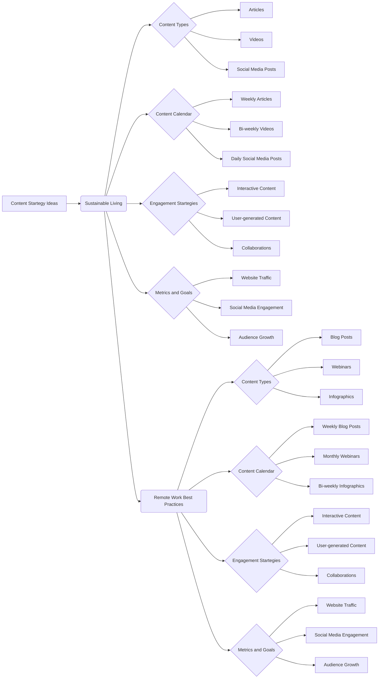

```MD
# Анализ кода: Content Startegy Ideas

## <input code>

```
# Content Startegy Ideas

## 1. Sustainable Living Tips

### Introduction
... (text continues)
```

## <algorithm>

К сожалению, предоставленный код не является исполняемым кодом. Это текстовый документ, описывающий стратегии контент-маркетинга для устойчивого образа жизни и удаленной работы. Алгоритм работы заключается в определении целевой аудитории, выборе подходящих форматов контента (статьи, видео, посты в социальных сетях), составлении графика публикации и стратегий вовлечения аудитории.  Нет явной блок-схемы в традиционном программном смысле, так как это не код.  Процесс разработки контент-плана – это последовательное планирование, а не алгоритмическое выполнение инструкций.


## <mermaid>



**Объяснение диаграммы:**

Диаграмма показывает две ветви стратегий – для устойчивого образа жизни (Sustainable Living) и удаленной работы (Remote Work Best Practices).  Каждая ветвь имеет подэлементы: типы контента, календарь публикации, стратегии вовлечения и метрики.  Подключаемые зависимости – это логические связи между разделами, например, «Content Types» влияет на «Content Calendar» и «Engagement Startegies».  Отсутствуют зависимости с другими частями проекта, так как это самостоятельный документ, описывающий контент-планы.

## <explanation>

**Импорты:** Отсутствуют импорты, так как это текстовый документ, а не код на каком-либо языке программирования.

**Классы:** Нет классов, так как это документирование планов контент-стратегии, а не программный код.

**Функции:** Нет функций, так как это документирование планов контент-стратегии, а не программный код.

**Переменные:** Нет переменных, так как это документирование планов контент-стратегии, а не программный код.

**Возможные ошибки или области для улучшений:**

* **Отсутствие конкретики:** Текст содержит общие принципы, но не хватает конкретных деталей, например, точного списка тем, планов по контенту (с датами, заголовками, авторами).
* **Недостаточное описание целевой аудитории:** Хотя упомянута целевая аудитория, недостаточно детализированы их характеристики, что может затруднить точный подбор контента.
* **Отсутствие ссылок на инструменты:** Не указаны конкретные инструменты (например, платформ для социальных сетей) для реализации стратегии.
* **Отсутствует система оценки эффективности:** Хотя указаны метрики (трафик, вовлеченность), не хватает способов измерения эффективности контент-плана и оценки достигнутых целей.

**Цепочка взаимосвязей:**

Документ `Content Startegy Ideas`  является частью маркетингового планирования и предполагает использование других инструментов, таких как CMS (система управления контентом) и платформы социальных сетей для реализации стратегий.