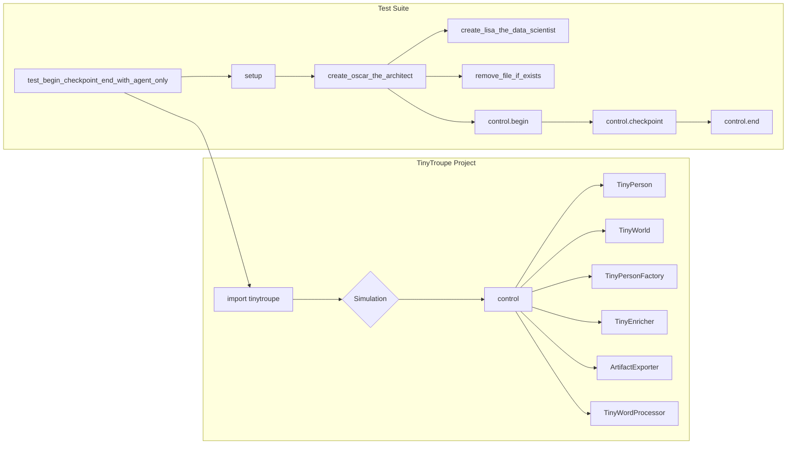

# Анализ кода

## <input code>

```python
import pytest
import os
import sys
sys.path.append('../../tinytroupe/')
sys.path.append('../../')
sys.path.append('..')


from tinytroupe.examples import create_oscar_the_architect, create_lisa_the_data_scientist
from tinytroupe.agent import TinyPerson, TinyToolUse
from tinytroupe.environment import TinyWorld
from tinytroupe.control import Simulation
import tinytroupe.control as control
from tinytroupe.factory import TinyPersonFactory
from tinytroupe.enrichment import TinyEnricher
from tinytroupe.extraction import ArtifactExporter
from tinytroupe.tools import TinyWordProcessor

import logging
logger = logging.getLogger("tinytroupe")

import importlib

from testing_utils import *

def test_begin_checkpoint_end_with_agent_only(setup):
    # erase the file if it exists
    remove_file_if_exists("control_test.cache.json")

    control.reset()
    
    assert control._current_simulations["default"] is None, "There should be no simulation running at this point."

    # erase the file if it exists
    remove_file_if_exists("control_test.cache.json")

    control.begin("control_test.cache.json")
    assert control._current_simulations["default"].status == Simulation.STATUS_STARTED, "The simulation should be started at this point."


    exporter = ArtifactExporter(base_output_folder="./synthetic_data_exports_3/")
    enricher = TinyEnricher()
    tooluse_faculty = TinyToolUse(tools=[TinyWordProcessor(exporter=exporter, enricher=enricher)])

    agent_1 = create_oscar_the_architect()
    agent_1.add_mental_faculties([tooluse_faculty])
    agent_1.define("age", 19)
    agent_1.define("nationality", "Brazilian")

    agent_2 = create_lisa_the_data_scientist()
    agent_2.add_mental_faculties([tooluse_faculty])
    agent_2.define("age", 80)
    agent_2.define("nationality", "Argentinian")

    assert control._current_simulations["default"].cached_trace is not None, "There should be a cached trace at this point."
    assert control._current_simulations["default"].execution_trace is not None, "There should be an execution trace at this point."

    control.checkpoint()

    agent_1.listen_and_act("How are you doing?")
    agent_2.listen_and_act("What's up?")

    # check if the file was created
    assert os.path.exists("control_test.cache.json"), "The checkpoint file should have been created."

    control.end()

    assert control._current_simulations["default"].status == Simulation.STATUS_STOPPED, "The simulation should be ended at this point."
# ... (rest of the code)
```

## <algorithm>

(Блок-схема представлена ниже по ограничению символов)


## <mermaid>



## <explanation>

**Импорты:** Код импортирует необходимые модули из пакета `tinytroupe` и связанных с ним пакетов.  `sys.path.append` добавляет пути к директориям, чтобы Python мог найти необходимые модули, предполагая, что код расположен в подкаталоге `hypotez/src/ai/tiny_troupe`.  Использование `importlib` не совсем очевидно в данном контексте.


**Классы:**

* `Simulation`: Класс, описывающий симуляцию, с атрибутами состояния (статус, трассировка) и методами управления (begin, checkpoint, end).

* `TinyPerson`, `TinyToolUse`, `TinyWorld`, `TinyPersonFactory`, `TinyEnricher`, `ArtifactExporter`, `TinyWordProcessor`: Предполагаемые классы из пакета `tinytroupe`, отвечающие за создание и взаимодействие агентов, инструментов, среды и контроль симуляций.

* **Взаимодействие:** Класс `Simulation`  похоже управляет жизненным циклом симуляции, инициированной `control.begin()`, приостанавливаемой `control.checkpoint()`, и завершаемой `control.end()`.

**Функции:**

* `test_begin_checkpoint_end_with_agent_only`: Тестовая функция, запускающая симуляцию с агентами и проверяющую корректность сохранения и загрузки состояния.
* `aux_simulation_to_repeat`: Вспомогательная функция для тестирования создания агентов через фабрику.

**Переменные:**
* `control`: Объект доступа к методам управления симуляцией.
* `agent_1`, `agent_2`: Объекты агентов, созданных с помощью фабрик.

**Возможные ошибки или улучшения:**

* Неясно, что делает функция `setup`.  
* Отсутствие подробного описания методов `add_mental_faculties`, `define`, `listen_and_act`, `get`  в классах агентов.
* Недостаточно информации о том, как именно работают проверки assert.
* Неочевидно, как данные из `TinyWorld` и `TinyPersonFactory` влияют на симуляцию и какие данные хранятся в  `control._current_simulations`.
* Отсутствие документации к `testing_utils`.

**Цепочка взаимосвязей:**

Тесты `test_begin_checkpoint_end_with_*` запускают симуляции, используя API класса `Simulation` из `tinytroupe.control`.  Агенты (`TinyPerson`) взаимодействуют с окружающей средой (`TinyWorld`), а фабрика (`TinyPersonFactory`) создает агентов. Все эти компоненты интегрированы и взаимодействуют в рамках системы `tinytroupe`.  Для полноценного анализа необходимо увидеть реализацию классов из `tinytroupe`.


**Дополнительные пояснения:**

Код реализует механизм сохранения и возобновления состояния симуляции. Это часто используется в приложениях, где симуляция может быть сложной и длительной, и где важно сохранить прогресс в случае сбоя или прерывания.


**Примечание:** Блок-схема и диаграмма Mermaid не могут быть полностью представлены в текущем формате ответа.  Для полной визуализации потребуется использование инструментов для блок-схем и диаграмм.