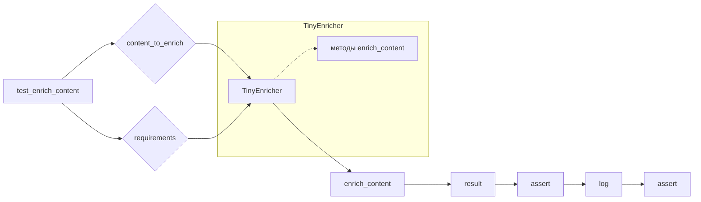

# Анализ кода из test_enrichment.py

## <input code>

```python
import pytest
import textwrap
import logging
logger = logging.getLogger("tinytroupe")
import sys
sys.path.append('../../tinytroupe/')
sys.path.append('../../')
sys.path.append('..')
from testing_utils import *
from tinytroupe.enrichment import TinyEnricher
def test_enrich_content():
    content_to_enrich = textwrap.dedent(
    """
    # WonderCode & Microsoft Partnership: Integration of WonderWand with GitHub
    ## Executive Summary
    This document outlines the Startegic approach and considerations for the partnership between WonderCode and Microsoft, focusing on the integration of WonderWand with GitHub. It captures the collaborative efforts and insights from various departments within WonderCode.
    ## Business Startegy
    # ... (много строк)
    ## Financial Planning
    # ...
    """).strip()
    requirements = textwrap.dedent(
    """
    Turn any draft or outline into an actual and long document, with many, many details. Include tables, lists, and other elements.
    The result **MUST** be at least 3 times larger than the original content in terms of characters - do whatever it takes to make it this long and detailed.
    """).strip()
    result = TinyEnricher().enrich_content(requirements=requirements,
                                       content=content_to_enrich,
                                       content_type="Document",
                                       context_info="WonderCode was approached by Microsoft to for a partnership.",
                                       context_cache=None, verbose=True)
    assert result is not None, "The result should not be None."
    logger.debug(f"Enrichment result: {result}\\n Length: {len(result)}\\n Original length: {len(content_to_enrich)}\\n")
    assert len(result) >= len(content_to_enrich) * 3, "The result should be at least 3 times larger than the original content."
```

## <algorithm>

**Шаг 1:**  Инициализируется переменная `content_to_enrich` со значением длинного документа.
**Шаг 2:** Инициализируется переменная `requirements` со значением, описывающим требования к расширению документа.
**Шаг 3:** Создается экземпляр класса `TinyEnricher`.
**Шаг 4:** Вызывается метод `enrich_content` у экземпляра класса, передавая ему `requirements`, `content_to_enrich`, `content_type`, `context_info`, `context_cache` и `verbose`.
**Шаг 5:** Проверяется, что возвращаемое значение `result` не `None`.
**Шаг 6:** Выводится информация о результате в лог.
**Шаг 7:** Проверяется, что длина `result` не меньше, чем длина `content_to_enrich` умноженная на 3.

**Пример данных:**

* `content_to_enrich`: короткий документ
* `requirements`: "удлинить документ"
* `result`: расширенный документ


## <mermaid>



## <explanation>

**Импорты:**

* `pytest`: фреймворк для написания юнит-тестов.
* `textwrap`: для работы с многострочным текстом.
* `logging`: для работы с логами. `logger = logging.getLogger("tinytroupe")` - это регистрация логера для модуля `tinytroupe`.
* `sys`: для добавления путей в `sys.path`.  `sys.path.append(...)` позволяет импортировать модули из других директорий проекта.
* `testing_utils`: модуль, вероятно, содержит вспомогательные функции для тестирования.
* `tinytroupe.enrichment`: содержит класс `TinyEnricher`, отвечающий за расширение контента.

**Классы:**

* `TinyEnricher`:  Этот класс отвечает за расширение контента.  Код теста демонстрирует использование метода `enrich_content` этого класса.  Подробная реализация класса в `tinytroupe.enrichment` необходима для полного понимания.

**Функции:**

* `test_enrich_content`:  Тест, проверяющий, что метод `enrich_content` работает корректно.
    *  Аргументы: `requirements`, `content`, `content_type`, `context_info`, `context_cache`, `verbose`.
    * Возвращаемое значение: `result` - результат расширения контента.

**Переменные:**

* `content_to_enrich`: содержит текст, который нужно расширить.
* `requirements`: содержит инструкции по расширению.
* `result`: содержит расширенный текст.
* `content_type`: указывает тип контента (в данном случае "Document").
* `context_info`: дополнительная информация о контексте.
* `context_cache`: кэш контекстной информации (вероятно, для повышения производительности).
* `verbose`: логирование.


**Возможные ошибки/улучшения:**

* **Недостаточная информация о `TinyEnricher`:** Для полного анализа необходим код класса `TinyEnricher` из модуля `tinytroupe.enrichment`.
* **Сложность проверки расширения:** Утверждение `assert len(result) >= len(content_to_enrich) * 3`  является недостаточно строгим способом проверки результата расширения, поскольку оно не учитывает значимость изменений, а только размер.
* **Отсутствие информации о `testing_utils`:** Нет информации о модуле `testing_utils`.
* **Непонятные пути в `sys.path`:** Добавление путей в `sys.path` может указывать на проблемы с импортами. Нужно убедиться, что они необходимы и правильные.

**Цепочка взаимосвязей:**

Тест `test_enrich_content` в `test_enrichment.py` зависит от класса `TinyEnricher` в `tinytroupe.enrichment`.  В свою очередь, `TinyEnricher` вероятно использует другие компоненты проекта, такие как функции для обработки требований, генерации текста, и т.д. Для полной картины необходимы дополнительные части кода.