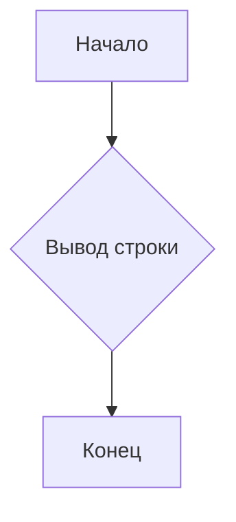
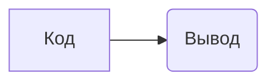

```MD
# Анализ кода

**1. <input code>**

```
This is a sample text.
```

**2. <algorithm>**

Код представляет собой просто строку текста "This is a sample text.".  В нем нет вызовов функций, циклов или сложных логических операций. Алгоритм работы сводится к отображению этой строки.

**Блок-схема:**



**Пример:**

Строка "This is a sample text." будет выведена на консоль (или куда будет направлен вывод).

**3. <mermaid>**



**Описание диаграммы:**

Код (A) напрямую выводит текст на экран (B).  Зависимости отсутствуют.

**4. <explanation>**

Код представляет собой простую строку текста, не содержащую:

* **Импорты**:  В коде нет импортируемых модулей.
* **Классы**: Нет определений классов.
* **Функции**: Нет функций или методов.
* **Переменные**: Нет переменных.

**Цепочка взаимосвязей:**

Данный код, как отдельный фрагмент, не имеет взаимосвязей с другими частями проекта.  Он, вероятно, является частью теста, который проверяет возможность вывода текста или формирование текстовых строк в какой-либо системе.


**Возможные ошибки или области для улучшений:**

Нет ошибок или областей для улучшения, поскольку код очень простой и выполняет только одну задачу – вывод текста.  Если бы это была часть теста, то более важной составляющей была бы структура теста и то, как он проверят правильность результата.  Например, проверка, что именно эта строка выводится.