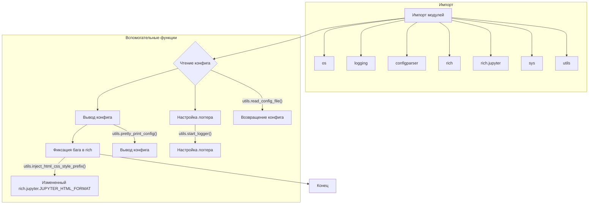

# Анализ кода из tinytroupe/__init__.py

**1. <input code>**

```python
import os
import logging
import configparser
import rich # for rich console output
import rich.jupyter

# add current path to sys.path
import sys
sys.path.append('.')
from tinytroupe import utils # now we can import our utils

# AI disclaimers
print(
"""
!!!!
DISCLAIMER: TinyTroupe relies on Artificial Intelligence (AI) models to generate content. 
The AI models are not perfect and may produce inappropriate or inacurate results. 
For any serious or consequential use, please review the generated content before using it.
!!!!
""")

config = utils.read_config_file()
utils.pretty_print_config(config)
utils.start_logger(config)

# fix an issue in the rich library: we don't want margins in Jupyter!
rich.jupyter.JUPYTER_HTML_FORMAT = \
    utils.inject_html_css_style_prefix(rich.jupyter.JUPYTER_HTML_FORMAT, "margin:0px;")
```

**2. <algorithm>**



Пример: Если в файле конфигурации (например, `config.ini`) заданы параметры: `model_type = GPT-3`, `output_format = json`, то `config` будет содержать эту информацию.


**3. <mermaid>**

```mermaid
graph LR
    subgraph TinyTroupe
        A[tinytroupe/__init__.py] --> B(utils);
        B --> C{read_config_file()};
        B --> D{pretty_print_config()};
        B --> E{start_logger()};
    end
    subgraph Libraries
        A --> F[os];
        A --> G[logging];
        A --> H[configparser];
        A --> I[rich];
        A --> J[rich.jupyter];
    end
    C --> K[config];
    D --> L[Консоль];
    E --> M[логгер];
    F --> N[Системные функции];
    G --> O[Логирование];
    H --> P[Обработка конфигов];
    I --> Q[Вывод в красивой форме];
    J --> R[Форматирование вывода в Jupyter];
```

**4. <explanation>**

* **Импорты**:
    * `os`, `logging`, `configparser`: стандартные библиотеки Python, используемые для работы с файловой системой, логами и конфигурационными файлами соответственно.
    * `rich`, `rich.jupyter`: библиотеки для красивого форматирования вывода в консоли и Jupyter Notebook.
    * `sys`: для изменения пути поиска модулей.
    * `utils`: модуль из пакета `tinytroupe`, содержащий функции для работы с конфигурацией и логами.  Связь с другими частями проекта через импорт из пакета `tinytroupe`.

* **Классы**: В данном файле нет объявлений классов.

* **Функции**:
    * `utils.read_config_file()`: Читает конфигурацию из файла (например, `config.ini`). Возвращает объект `configparser.ConfigParser`.
    * `utils.pretty_print_config(config)`: Выводит конфигурацию в красивом формате через `rich`.
    * `utils.start_logger(config)`: Настраивает логгер на основе конфигурации.

* **Переменные**:
    * `config`: Хранит объект `configparser.ConfigParser`, содержащий настройки.

* **Возможные ошибки или области для улучшений**:
    * Отсутствие обработки ошибок при чтении файла конфигурации (`config.ini`). Необходимо добавить проверку на существование файла и валидацию данных в нем.
    * Необходимо явно указывать тип конфигурационного файла (например, `ini`, `json`).
    * Для более сложных систем логгирования стоит использовать библиотеку `loguru`.


**Цепочка взаимосвязей**:

Файл `__init__.py` в пакете `tinytroupe` инициализирует приложение. Он импортирует и использует функции из модуля `utils`, который, в свою очередь, взаимодействует с конфигурационными файлами и системами логов, необходимыми для работы всей программы.  Взаимодействие с другими частями проекта (моделями ИИ, обработкой данных) реализуется через функции и методы в модуле `utils` или других связанных модулях.


```