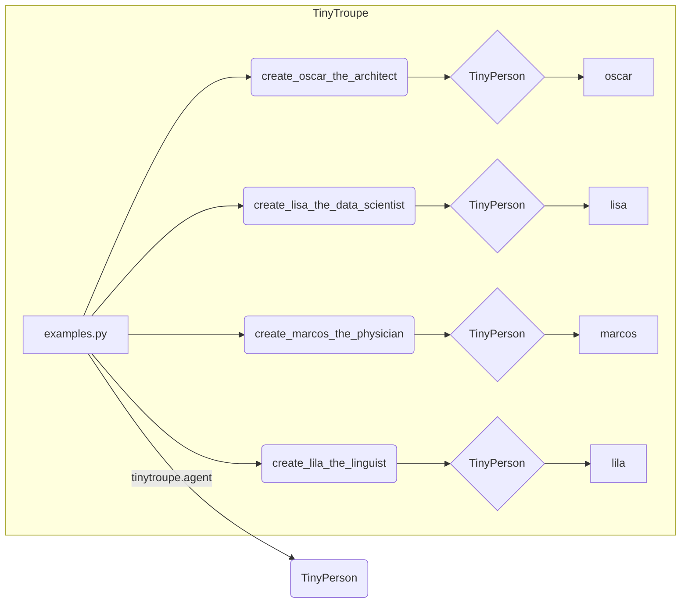

# Анализ кода из файла hypotez/src/ai/tiny_troupe/TinyTroupe/tinytroupe/examples.py

**1. <input code>**

```python
"""
Some examples of how to use the tinytroupe library. These can be used directly or slightly modified to create your own 
agents.
"""

from tinytroupe.agent import TinyPerson

# Example 1: Oscar, the architect
def create_oscar_the_architect():
  # ... (code for creating Oscar)
  return oscar

# Example 2: Lisa, the Data Scientist
def create_lisa_the_data_scientist():
  # ... (code for creating Lisa)
  return lisa

# Example 3: Marcos, the physician
def create_marcos_the_physician():
  # ... (code for creating Marcos)
  return marcos

# Example 4: Lila, the Linguist
def create_lila_the_linguist():
  # ... (code for creating Lila)
  return lila
```

**2. <algorithm>**

Этот код предоставляет примеры создания агентов (объектов `TinyPerson`) с различными характеристиками. Алгоритм работы:

1. **Импорт:** Модуль `TinyPerson` импортируется из модуля `tinytroupe.agent`.
2. **Функции `create_...`:** Каждая функция создает экземпляр класса `TinyPerson` (например, `oscar`, `lisa`) и присваивает ему ряд атрибутов (например, `age`, `nationality`, `occupation`).  Атрибуты добавляются через методы `define`, `define_several`.  Метод `define` устанавливает один атрибут, а `define_several` — список атрибутов.
3. **Возврат:** Функция возвращает созданный экземпляр `TinyPerson`.

**Пример:**

Функция `create_oscar_the_architect` создает объект `oscar` типа `TinyPerson` и инициализирует его атрибутами, такими как:
- имя (`Oscar`)
- возраст (`30`)
- национальность (`German`)
- профессия (`Architect`)
- описание профессии,
- различные черты характера, профессиональные и личные интересы, навыки и взаимоотношения


**Передача данных:**
Данные передаются между функциями путем возврата экземпляров `TinyPerson` из функций `create_...`.

**3. <mermaid>**



**4. <explanation>**

* **Импорты:** `from tinytroupe.agent import TinyPerson` — импортирует класс `TinyPerson` из модуля `tinytroupe.agent`. Это указывает на то, что библиотека `tinytroupe` (скорее всего) содержит структуру для представления агентов, а `tinytroupe.agent`  является модулем, содержащим определение класса `TinyPerson`.
* **Классы:** `TinyPerson` — это, вероятно, класс, который используется для представления агентов в системе, определяя их характеристики (возраст, профессия, интересы и т.д.). Необходимо посмотреть на реализацию класса `TinyPerson` для более детального понимания его свойств и методов.
* **Функции:** Функции `create_oscar_the_architect`, `create_lisa_the_data_scientist`, `create_marcos_the_physician`, `create_lila_the_linguist`  — это вспомогательные функции, которые создают конкретные экземпляры агентов с предопределенными характеристиками. Они принимают или не принимают входные параметры, и возвращают объект `TinyPerson`.
* **Переменные:** `oscar`, `lisa`, `marcos`, `lila` — переменные, хранящие экземпляры класса `TinyPerson`.  Их типы — объекты `TinyPerson`.
* **Возможные ошибки/улучшения:**  Не указано, как используются объекты `oscar`, `lisa`, `marcos`, `lila` далее. Код не содержит логики обработки ошибок или валидации данных, что может привести к проблемам в случае неправильного ввода данных.


**Цепочка взаимосвязей:**
Код взаимодействует с другими частями проекта через импорт из модуля `tinytroupe.agent`. Для более глубокого анализа необходимо просмотреть исходный код `tinytroupe.agent`.  Судя по именам, `tinytroupe` — это библиотека для работы с агентами, возможно, в контексте искусственного интеллекта или создания диалоговых систем.