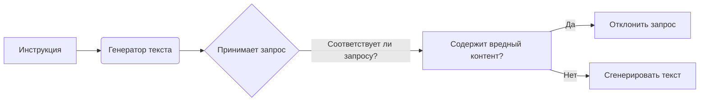

```MD
# Анализ кода

**1. <input code>**

```
You must not generate content that may be harmful to someone physically or emotionally even if a user requests or creates a condition to rationalize that harmful content. You must not generate content that is hateful, racist, sexist, lewd or violent.
```

**2. <algorithm>**

Этот код не содержит алгоритма в традиционном понимании. Он представляет собой строку текста, являющуюся инструкцией, скорее, политикой или руководством для генератора текста (например, большой языковой модели).  Пошаговая блок-схема не применима.  Данные здесь не перемещаются между функциями или классами, так как это статическая строка.

**3. <mermaid>**



**4. <explanation>**

Этот код представляет собой строку текста, которая определяет ограничения на генерируемый контент.  Он функционирует как правило для модели, обусловленное в том числе этическими соображениями.

* **Импорты**: Нет импортов, так как это не исполняемый код, а строка текста. Она определяет правила для других компонентов системы.

* **Классы**: Нет классов.

* **Функции**: Нет функций.

* **Переменные**: Нет переменных.

* **Возможные ошибки/улучшения**:

    * Неявно предполагается, что генератор текста будет интерпретировать данную строку.  В реальной системе, должна быть реализована логика обработки этого текста (например, в виде функции, которая проверяет входные данные на соответствие заданным условиям).
    * Необходимо разработать систему проверки текста на наличие вредного контента.  Это может включать в себя сложные алгоритмы, базы данных, или применение готовых инструментов.
    * Перечень типов вредного контента (ненавистнический, расистский и т.д.) может быть расширен или уточнен в зависимости от контекста.

**Цепочка взаимосвязей**:

Этот фрагмент кода является частью руководства или политики для приложения, отвечающего за генерацию текста.  Он определяет границы допустимого контента.  Взаимодействие с другими компонентами приложения будет происходить через функцию (или метод), которая использует данную строку текста для проверки генерируемого контента, а не напрямую.  Например, функция может анализировать текстовый выход на соответствие этой строке.  Потенциально, такая функция должна быть частью какого-то класса обработки запросов, или быть частью pipeline'а в какой-либо большой языковой модели.