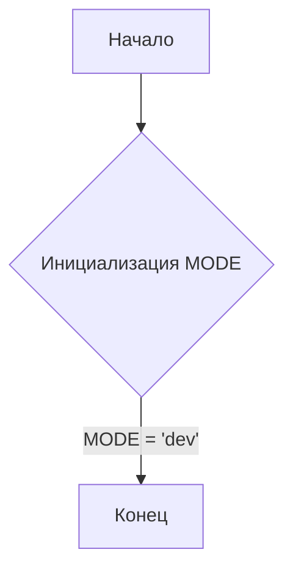
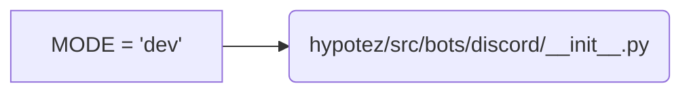

# Анализ кода hypotez/src/bots/discord/__init__.py

## <input code>

```python
## \file hypotez/src/bots/discord/__init__.py
# -*- coding: utf-8 -*-\n#! venv/Scripts/python.exe\n#! venv/bin/python/python3.12\n\n"""\n.. module: src.bots.discord \n\t:platform: Windows, Unix\n\t:synopsis:\n\n"""\nMODE = \'dev\'\n\n"""\n\t:platform: Windows, Unix\n\t:synopsis:\n\n"""\n\n"""\n\t:platform: Windows, Unix\n\t:synopsis:\n\n"""\n\n"""\n  :platform: Windows, Unix\n\n"""\n"""\n  :platform: Windows, Unix\n  :platform: Windows, Unix\n  :synopsis:\n"""MODE = \'dev\'\n  \n""" module: src.bots.discord """\n\n```

## <algorithm>

Алгоритм работы файла `__init__.py` в данном случае тривиален. Файл содержит только константу `MODE` со значением `'dev'`.  
Не выполняется никаких операций, кроме определения переменной.

**Блок-схема:**



**Примеры:**

- Входные данные: нет
- Выходные данные: нет

**Перемещение данных:**

Данные не перемещаются между функциями или классами.


## <mermaid>



## <explanation>

**Импорты:**

В файле нет импортов.  Это стандартный `__init__.py` файл, который обычно используется для инициализации модуля.


**Классы:**

Нет определенных классов.


**Функции:**

Нет определенных функций.


**Переменные:**

- `MODE`: Строковая переменная, хранящая значение `'dev'`.  Это, скорее всего, конфигурационная переменная, определяющая режим работы бота (например, 'dev', 'prod').

**Возможные ошибки или области для улучшений:**

- Отсутствие документирования:  Документация в виде `"""Docstring"""` хоть и есть, но она не информативна.  Необходимо более подробно описать назначение переменной `MODE`.
- Дополнительные действия: Если данный файл `__init__.py` предназначен для модуля бота Discord, то, вероятно, он должен содержать импорты необходимых библиотек для работы бота (например, `discord.py`).

**Цепочка взаимосвязей:**

Этот файл, вероятно, входит в структуру проекта `hypotez`, и его `MODE` значение может быть использовано в других частях проекта для настройки поведения бота.  Без дополнительного кода сложно проследить полную цепочку взаимосвязей.  Но, как минимум, ожидается использование этой переменной `MODE` в других частях кода, например, в файлах с настройками или логикой бота.