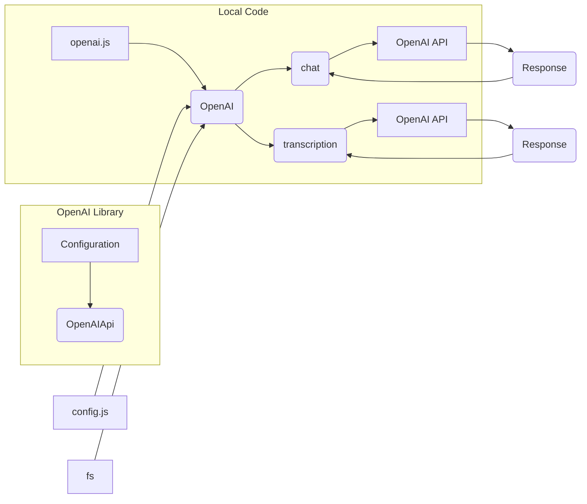

# Анализ кода openai.js

**1. <input code>**

```javascript
import { Configuration, OpenAIApi } from 'openai'
import config from 'config'
import { createReadStream } from 'fs'
class OpenAI {
    roles = {
        ASSISTANT: 'assistant',
        USER: 'user',
        SYSTEM: 'system',
    }
    constructor(apiKey) {
        const configuration = new Configuration({
            apiKey,
        })
        this.openai = new OpenAIApi(configuration)
    }
    async chat(messages) {
        try {
            const response = await this.openai.createChatCompletion({
                model: 'gpt-3.5-turbo',
                messages,
            })
            return response.data.choices[0].message
        } catch (e) {
            console.log('Error while gpt chat', e.message)
        }
    }
    async transcription(filepath) {
        try {
            const response = await this.openai.createTranscription(
                createReadStream(filepath),
                'whisper-1'
            )
            return response.data.text
        } catch (e) {
            console.log('Error while transcription', e.message)
        }
    }
}
export const openai = new OpenAI(config.get('OPENAI_KEY'))
```

**2. <algorithm>**

```mermaid
graph TD
    A[Пользовательский запрос] --> B{Инициализация OpenAI};
    B --> C[Создание экземпляра OpenAI];
    C --> D[Функция chat(messages)];
    D --> E[Вызов API OpenAI];
    E --> F[Обработка ответа];
    F --> G[Возврат сообщения];
    
    A1[Загрузка файла] --> B1{Инициализация OpenAI};
    B1 --> C1[Создание экземпляра OpenAI];
    C1 --> D1[Функция transcription(filepath)];
    D1 --> E1[Вызов API OpenAI];
    E1 --> F1[Обработка ответа];
    F1 --> G1[Возврат текста];

    subgraph OpenAI API
        E --> H[Отправка запроса к OpenAI];
        H --> I[Получение ответа];
        I --> F;
        E1 --> H1;
        H1 --> I1;
        I1 --> F1;
    end
```

* **Инициализация:**  Получает API ключ из файла `config.js`.
* **chat(messages):**  Создает запрос к API OpenAI для чат-ботов с использованием модели `gpt-3.5-turbo` и массива сообщений `messages`. Обрабатывает ответ и возвращает сообщение от модели.
* **transcription(filepath):** Создает запрос к API OpenAI для транскрипции аудио с указанным путем к файлу `filepath` с помощью модели `whisper-1`. Обрабатывает ответ и возвращает транскрибированный текст.

**3. <mermaid>**



**4. <explanation>**

* **Импорты:**
    * `import { Configuration, OpenAIApi } from 'openai'`: Импортирует необходимые классы для взаимодействия с API OpenAI из пакета `openai`.
    * `import config from 'config'`: Импортирует переменную `config`, предположительно содержащую настройки проекта, из файла `config.js` (или аналогичного).
    * `import { createReadStream } from 'fs'`: Импортирует функцию `createReadStream` из модуля `fs` для работы с файловой системой Node.js, необходимую для загрузки аудиофайлов.
* **Класс OpenAI:**
    * **`roles`**: Статический атрибут, хранящий значения ролей для сообщений в диалоге.
    * **`constructor(apiKey)`**: Инициализирует экземпляр класса, принимая API ключ `apiKey` и создает экземпляр `OpenAIApi`, настроенный с помощью этого ключа.
    * **`chat(messages)`**: Асинхронный метод для отправки запроса на чат-боту.  Возвращает сообщение от модели. Обрабатывает ошибки.
    * **`transcription(filepath)`**: Асинхронный метод для транскрипции аудио.  Возвращает текст транскрипции. Обрабатывает ошибки.
* **`openai`**: Экспортированный экземпляр класса `OpenAI`, инициализированный с ключом `config.get('OPENAI_KEY')` из `config`.  Эта переменная предоставляет глобальный доступ к методам класса `OpenAI` в других частях приложения.
* **Возможные ошибки и улучшения:**
    * Необходимо добавить проверку на корректность API ключа (например, проверка на пустоту).
    *  Можно добавить логирование прогресса операций.
    *  Добавить обработку различных типов ошибок, возвращаемых API OpenAI.
    *  Улучшить обработку ошибок:  более детальная информация в логах об ошибках API OpenAI.

**Цепочка взаимосвязей:**

Файл `openai.js` использует `config.js` для получения API ключа, а также импортирует модули `openai` и `fs`.  Предполагается, что `config.js` содержит необходимые настройки для работы с API OpenAI, а `openai.js` является самостоятельной библиотекой для работы с API.  Другие части приложения могут использовать экспортированный экземпляр `openai` для взаимодействия с API OpenAI, например, для создания диалогов или транскрипции аудио.