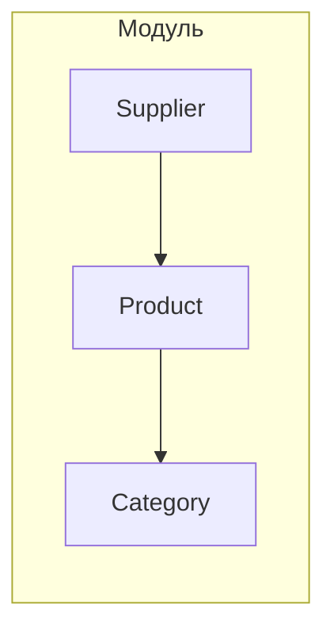

```MD
# Анализ кода модуля категоризации данных

## <input code>

Модуль категоризации данных (класс `Product`), полученных от поставщика (класс `Supplier`)


## <algorithm>

Из-за отсутствия кода, построить алгоритм и блок-схему невозможно.  Необходимо предоставить код.


## <mermaid>



## <explanation>

Из-за отсутствия кода невозможно провести анализ импортов, классов, функций, переменных, и возможных ошибок. Для того, чтобы дать полноценный анализ, пожалуйста, предоставьте код соответствующего модуля.  Описание в начале кода указывает, что этот код, вероятно, описывает взаимодействие между классом `Supplier` (поставщик данных) и классом `Product` (обрабатывающий продукт).  Он также подразумевает существование класса `Category`, который отвечает за классификацию продуктов.  Без кода невозможно определить точный алгоритм, методы взаимодействия, типы данных или возможные ошибки.

**Примеры вопросов, которые можно было бы ответить, имея код:**

* Как класс `Product` получает данные от `Supplier`?
* Какие типы данных используются в `Supplier` и `Product`?
* Какие методы есть у класса `Product` для обработки данных?
* Каким образом класс `Product` классифицирует продукт в `Category`?
* Каков формат данных, которые передаются между `Supplier`, `Product` и `Category`?
* Как этот модуль интегрируется с другими частями проекта?

Пожалуйста, предоставьте код, чтобы получить более подробный и точный анализ.