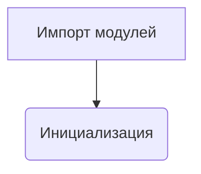
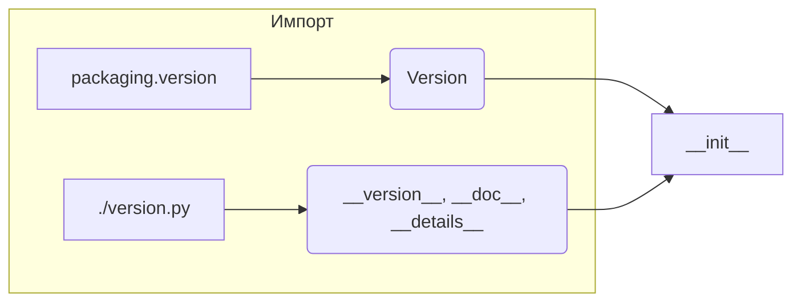

# Анализ файла `hypotez/src/category/_examples/__init__.py`

## <input code>

```python
## \file hypotez/src/category/_examples/__init__.py
# -*- coding: utf-8 -*-\
#! venv/Scripts/python.exe
#! venv/bin/python/python3.12

"""
.. module: src.category._examples 
	:platform: Windows, Unix
	:synopsis:

"""
MODE = 'dev'

"""
	:platform: Windows, Unix
	:synopsis:

"""


"""
	:platform: Windows, Unix
	:synopsis:

"""


"""
  :platform: Windows, Unix

"""
"""
  :platform: Windows, Unix
  :platform: Windows, Unix
  :synopsis:
"""MODE = 'dev'
  
""" module: src.category._examples """


""" @namespace src.category._examples """


""" """
...

from packaging.version import Version
from .version import __version__, __doc__, __details__
```

## <algorithm>

Этот файл представляет собой инициализационный модуль пакета `src.category._examples`.  Алгритм работы - это импорт необходимых модулей, он не содержит никаких вычислений или действий, кроме инициализации переменных.  Блок-схема будет простой, состоящей из единственного шага: импорта.



Пример:

* `A`: Импорт `Version` из `packaging.version` и `__version__`, `__doc__`, `__details__` из локального модуля `./version.py`.
* `B`: Инициализация переменной `MODE` (пока не используется)


## <mermaid>




## <explanation>

**Импорты:**

- `from packaging.version import Version`: Импортирует класс `Version` из пакета `packaging.version`. Этот пакет используется для работы с версиями программного обеспечения.  Он позволяет сравнивать версии,  использовать их в логике  и  имеет полезные методы для работы с версионностью.  `src` это корневой пакет, `category` - подпакет, `_examples` - вероятно подпакет для примеров.
- `from .version import __version__, __doc__, __details__`: Импортирует переменные `__version__`, `__doc__`, и `__details__` из модуля `version.py`, находящегося в подкаталоге `.`.  Предполагается, что `version.py`  содержит информацию о версии модуля, его документацию и другую метаинформацию.

**Классы:**

В этом файле нет определений классов.

**Функции:**

В этом файле нет определений функций.

**Переменные:**

- `MODE = 'dev'`: Переменная, вероятно, используется для указания режима работы (например, «разработка», «производство»).  Сейчас она не используется в этом модуле, но может использоваться в других частях кода.

**Возможные ошибки или области для улучшений:**

- **Неиспользуемые комментарии:** Несколько строк документации (`""" ... """`) пусты или повторяют информацию. Нужно очистить излишние комментарии и улучшить пояснения для более понятного кода.
- **Неиспользуемая переменная `MODE`:** Переменная `MODE`  инициализируется, но потом её значение нигде не используется. Это может быть следствие того, что она предназначена для использования в другом модуле или для  использования в будущем.
- **Отсутствие ясности назначения:**  Неясно, для чего нужен модуль `_examples`. Без дополнительной информации трудно понять, как эта часть связана с остальной частью проекта.

**Цепочка взаимосвязей:**

Этот файл является частью пакета `hypotez`, скорее всего, он содержит примеры использования компонентов `category`.  `__init__.py` - это файл инициализации пакета,  и он импортирует модуль `version.py`, который предоставляет метаинформацию о пакете.  Взаимодействия будут происходить через импорт этих модулей другими компонентами пакета или проектами, которые его используют.  Без доступа к `version.py` и другим связанным файлам,  полнота анализа ограничена.