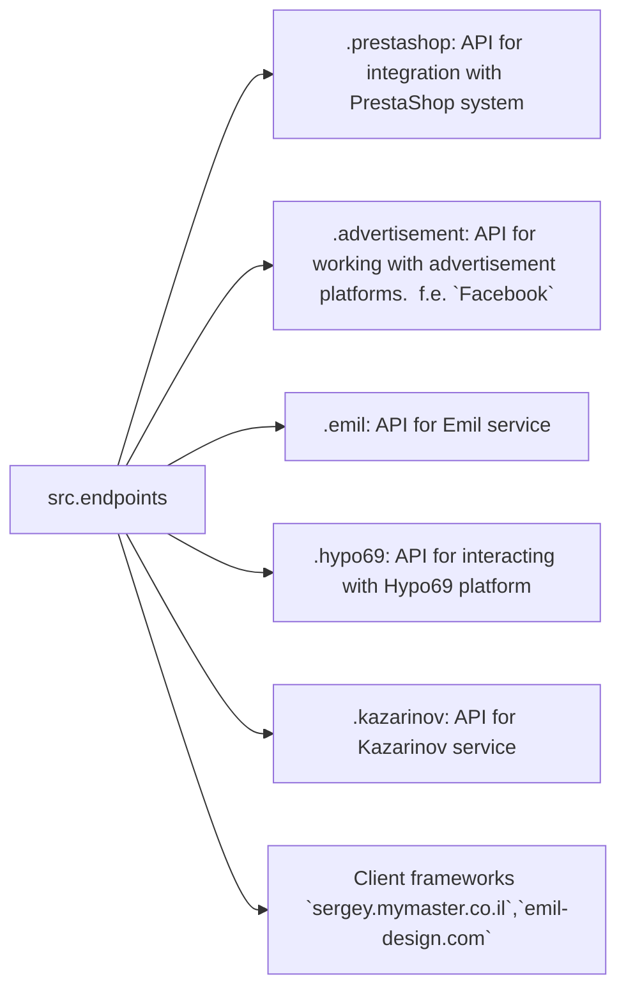

# Анализ кода модуля `endpoints`

## 1. <input code>

```
### Data Consumer Endpoints Module
=========================================================================================

The `endpoints` module provides an implementation of APIs for interacting with data consumers.
Each subdirectory represents a separate module that implements the API for a specific service.
The `endpoints` module includes submodules for integration with various consumer systems,
ensuring seamless interaction with external services.

## Module Structure


### Final Consumer Endpoints

#### 1. **PrestaShop**
Integration with the PrestaShop API, utilizing standard API features.

#### 2. **bots**
Submodule for managing integration with Telegram and Discord bots.

#### 3. **emil**
`https://emil-design.com`
Submodule for integrating with the client at https://emil-design.com (PrestaShop + Facebook).

#### 4. **kazarinov**
`https://sergey.mymaster.co.il`,`@hypo69_kazarinov_bot`
Submodule for integrating with the Kazarinov data provider (pricelist creator, Facebook promotion).

## Module Descriptions

### 1. `prestashop`
This module is designed for integration with the PrestaShop e-commerce system. It implements functionality for managing orders, products, and customers.

- **Key Features**:
  - Create, edit, and delete products.
  - Manage orders and users.

### 2. `advertisement`
The module provides an API for managing advertising platforms, including campaign creation and analytical reports.

- **Key Features**:
  - Manage advertising campaigns.
  - Collect and process analytics data.

### 3. `emil`
Interface for working with the Emil service, providing an API for data exchange.

- **Key Features**:
  - Process and send requests to the service.
  - Retrieve data from the Emil API.

### 4. `hypo69`
API for interacting with the Hypo69 platform, which offers specific business solutions.

- **Key Features**:
  - Retrieve client data.
  - Work with custom reports.

### 5. `kazarinov`
Module for integrating with the Kazarinov service. It supports analytics and data exchange functionality.

- **Key Features**:
  - Data integration between systems.
  - Generate reports and perform analytics.

## Installation and Usage

### Installation
Ensure all project dependencies are installed before starting. Use the following command:

```bash
pip install -r requirements.txt
```

### Usage
Import the required module into your code:

```python
from src.endpoints.prestashop import PrestashopAPI
from src.endpoints.advertisement import AdvertisementAPI
```

Then configure and use the methods depending on your use case.

## Contribution

If you want to contribute to the module, please follow these guidelines:

1. Follow [PEP 8](https://peps.python.org/pep-0008/) for code style.
2. Add tests for new features.
3. Leave detailed comments for any changes.

For questions and suggestions, contact the repository owner or leave comments in [Issues](#).
```

## 2. <algorithm>

No algorithm is presented in the provided code. The text describes the structure and purpose of the `endpoints` module and its submodules, but lacks specific code examples to illuStarte a step-by-step execution flow.


## 3. <mermaid>

```mermaid
graph LR
    subgraph "src.endpoints"
        src.endpoints --> prestashop
        src.endpoints --> advertisement
        src.endpoints --> emil
        src.endpoints --> hypo69
        src.endpoints --> kazarinov
        src.endpoints --> websites
    end
    prestashop -- API for PrestaShop --> "External API"
    advertisement -- API for Advertising Platforms --> "External API"
    emil -- API for Emil Service --> "External API"
    hypo69 -- API for Hypo69 Platform --> "External API"
    kazarinov -- API for Kazarinov Service --> "External API"
    websites -- Client frameworks --> "External Client"

```

This diagram shows the `src.endpoints` module interacting with various external APIs and client frameworks.  The `src.endpoints` serves as a central point for interacting with these external systems.  Each submodule (`prestashop`, `advertisement`, etc.) is responsible for handling communication with a specific external service.


## 4. <explanation>

The provided text is a module documentation, not executable code.  It describes the `endpoints` module, a Python package likely part of a larger project (`src`). This module is intended to provide APIs for interacting with various external data sources/services.

**Key Points:**

* **Structure:** The code describes a modular design, with separate submodules for each service (PrestaShop, advertising platforms, Emil service, etc.). This promotes maintainability and organization.
* **Dependencies:** The `requirements.txt` file is mentioned, implying that the `endpoints` module relies on external libraries (likely for interacting with the external APIs).
* **Functionality:** Each submodule (`prestashop`, `advertisement`, etc.) handles specific interactions with the corresponding service. The text details the general functionality of each module.
* **External Integrations:** The module is designed to integrate with different platforms (PrestaShop, various advertisement services, specific clients like emil-design.com).
* **Installation and Usage:** The instructions for installation (`pip install -r requirements.txt`) and use (`from src.endpoints.prestashop import PrestashopAPI`) are typical for Python packages.

**Possible Errors/Improvements:**

* **Missing Code:** To perform a thorough analysis, the actual Python code for the modules within `src.endpoints` would be necessary.
* **Documentation Detail:** The descriptions could be more specific, including example API calls and data structures, or a basic code overview of the interactions between the modules.
* **Testing:**  The mention of testing is crucial; the documentation lacks any specific testing or integration instructions.
* **Error Handling:** A robust API should incorporate error handling for situations where external services are unavailable or return invalid data.

**Relationship with Other Parts:**

The `endpoints` module acts as an intermediary, connecting different parts of the application (potentially a web application or command-line tool) to the external services.  The modules inside `src.endpoints` are likely interacting with data layers (databases, files, etc.) or with application logic.  The project likely has other components like data models and business logic that use this module to access and process data from these various platforms.