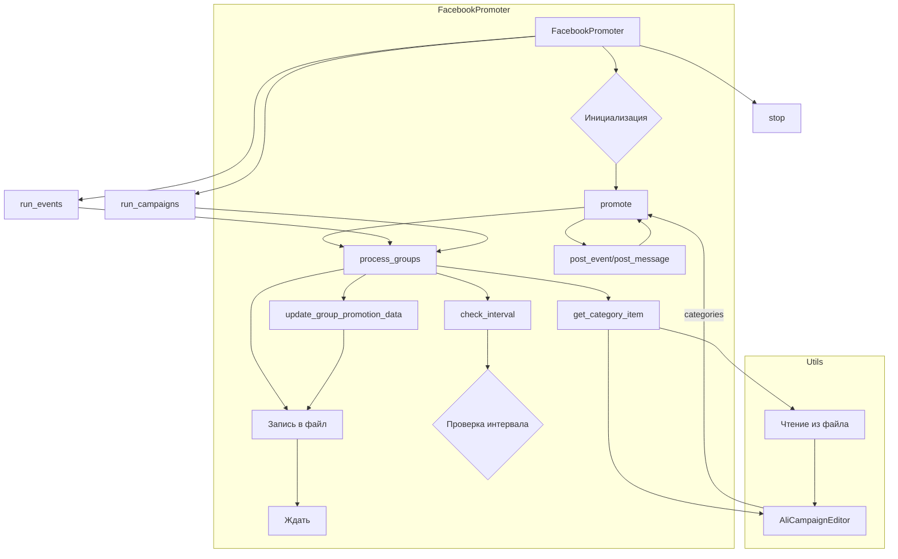

# Анализ кода FacebookPromoter

## <input code>

```python
## \file hypotez/src/endpoints/advertisement/facebook/promoter.py
# -*- coding: utf-8 -*-\
#! venv/Scripts/python.exe
#! venv/bin/python/python3.12

"""
.. module: src.endpoints.advertisement.facebook 
	:platform: Windows, Unix
	:synopsis: module handles the promotion of messages and events in Facebook groups.
It processes campaigns and events, posting them to Facebook groups while avoiding duplicate promotions.

"""
MODE = 'dev'

...
# (оставлен код для краткости)
```

## <algorithm>

Алгоритм работы класса `FacebookPromoter` можно представить следующей блок-схемой:

1. **Инициализация:**
    * Принимает на вход экземпляр `Driver`, путь к файлам с данными групп, флаг `no_video`.
    * Загружает список путей к файлам с данными о группах (из папки `facebook/groups`).
    * Инициализирует переменные `d`, `group_file_paths`, `no_video` и `spinner`.

2. **Метод `promote`:**
    * Проверяет соответствие языка и валюты группы и заданным параметрам (`language`, `currency`). Если не совпадают, возвращает `False`.
    * Получает имя события или категории (`item_name`).
    * Определяет переменную `ev_or_msg` (событие или сообщение) на основе `is_event`.
    * Если это событие, устанавливает атрибуты `start`, `end`, `promotional_link` для `ev_or_msg`.
    * Вызывает функцию `post_event` или `post_message` в зависимости от `is_event`. Если функция возвращает `False`, записывает ошибку и возвращает `False`.
    * Обновляет данные группы в файле (метод `update_group_promotion_data`).
    * Возвращает `True`.

3. **Метод `process_groups`:**
    * Проверяет наличие кампании или списка событий для обработки.
    * Перебирает файлы групп.
    * Загружает данные о группе из файла.
    * Проверяет интервал времени (`check_interval`).
    * Проверяет соответствие категорий (`group_categories_to_adv`), если это не событие.
    * Проверяет статус группы (`active`).
    * Если это не событие, получает категорию (`get_category_item`).
    * Если это событие, выбирает случайное событие из списка (`events`).
    * Проверяет, не была ли категория или событие уже опубликованы.
    * Вызывает метод `promote` для обработки группы и элемента.
    * Обновляет данные в файле группы.
    * Ждет случайное время (`time.sleep`).

4. **Метод `get_category_item`:**
    * В зависимости от `promoter` (например, `aliexpress`), извлекает данные о категории из соответствующего источника (например, от `AliCampaignEditor`).
    * Или из файла `campaign`.

5. **Метод `check_interval`:**
    * Парсит интервал времени (`group.interval`).
    * Получает время последней публикации (`group.last_promo_sended`).
    * Сравнивает текущее время с временем последней публикации.
    * Возвращает `True`, если интервал прошел, иначе `False`.

6. **Метод `parse_interval`:**
    * Парсит строку интервала (`interval`) в объект `timedelta`.

7. **Метод `run_campaigns`:**
    * Запускает цикл обработки кампаний, вызывая `process_groups`.

8. **Метод `run_events`:**
    * Запускает цикл обработки событий, вызывая `process_groups` с флагом `is_event = True`.

9. **Метод `stop`:**
    * Останавливает работу веб-драйвера (`d.quit()`).

## <mermaid>



## <explanation>

**Импорты:**

* `src`, `src.endpoints.advertisement.facebook`, `src.webdriver`, `src.suppliers.aliexpress.campaign`, `src.endpoints.advertisement.facebook.scenarios`, `src.utils`, `src.logger`: Все эти импорты указывают на внутренние модули проекта. `src` - это, скорее всего, корневая директория проекта, от которой все остальные модули импортируются.
* `time`, `random`, `datetime`, `pathlib`, `re`, `urllib.parse`, `types`, `typing`: Стандартные библиотечные импорты, необходимые для работы с временем, случайными числами, датами, путями, регулярными выражениями, URL-адресами и типизацией.

**Классы:**

* `FacebookPromoter`: Класс для автоматизации продвижения товаров и событий в группах Facebook. Он содержит методы для инициализации, продвижения элементов, обработки групп и остановки процесса. Атрибуты: `d`, `group_file_paths`, `no_video`, `promoter`, `spinner`.
* `Driver`, `Chrome`: Предполагаемо, классы для работы с веб-драйвером.  `Driver` — базовый класс, а `Chrome` — реализация для Chrome.

**Функции:**

* `get_event_url`: Формирует URL для создания события в Facebook группе, принимая на вход URL группы.
* `promote`: Основной метод для продвижения категории или события в Facebook группе.
* `log_promotion_error`: Записывает информацию об ошибке в лог.
* `update_group_promotion_data`: Обновляет данные о группе в файле.
* `process_groups`: Обрабатывает список групп, продвигая категории или события в них.
* `get_category_item`: Получает данные о категории для продвижения.
* `check_interval`: Проверяет, прошло ли необходимое время между продвижениями.
* `parse_interval`: Парсит строку интервала времени в объект `timedelta`.
* `run_campaigns`, `run_events`: Методы для запуска циклов обработки кампаний и событий.
* `stop`: Останавливает работу веб-драйвера.


**Переменные:**

* `MODE`:  Вероятно, переменная для выбора режима работы (например, `dev`, `prod`).
* `gs.path.google_drive`:  Путь к папке на Google Диске. (Нужно определить, где находится `gs.path`.)
* `group_file_paths`: Список путей к файлам с данными о группах.
* `no_video`: Флаг для отключения видео в постах.
* `promoter`: Идентификатор промоутера (например, `aliexpress`).
* `campaigns`: Список имен кампаний.
* `events`: Список событий.


**Возможные ошибки и улучшения:**

* **Обработка ошибок:** Код содержит обработку ошибок (`try...except`), но, возможно, нужно добавить более детальную обработку исключений для более стабильной работы, например, при некорректном формате файла или отсутствии нужных данных.
* **Параметризация:** Используйте конфигурационные файлы или переменные окружения для хранения параметров, таких как пути к файлам, имена кампаний, интервалы.
* **Улучшение обработки интервала:**  Подумайте о лучшем способе парсинга интервалов, чтобы избежать `ValueError` в `check_interval`, например, добавив обработку различных форматов (ч, м, д).
* **Логирование:** Добавьте в `process_groups` и другие методы подробные логи (уровень `debug` или `info`) о текущих действиях.
* **Избежание утечек памяти:**  Убедитесь, что веб-драйвер закрывается корректно после использования.


**Взаимосвязи с другими частями проекта:**

* `gs`:  Вероятно, модуль для взаимодействия с Google Sheet/Drive.
* `facebook` и `aliexpress`:  Каталоги проектов, содержащие информацию о кампаниях и промоутерах.
* `endpoints.advertisement`: Модуль для обработки рекламных запросов.
* `utils`, `webdriver`, `logger`: Модули для общего использования.
* `scenarios`:  По сути, функции/методы для работы с Facebook API (например, `post_message`, `post_event`).


Код демонстрирует структурированный и относительно чистый подход к продвижению товаров на Facebook, учитывая особенности API Facebook.  Использование `SimpleNamespace` помогает организовать структурированные данные.