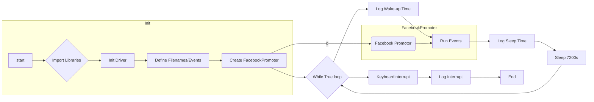

# <input code>

```python
## \file hypotez/src/endpoints/advertisement/facebook/start_event.py
# -*- coding: utf-8 -*-\n#! venv/Scripts/python.exe\n#! venv/bin/python/python3.12\n\n"""
.. module: src.endpoints.advertisement.facebook 
	:platform: Windows, Unix
	:synopsis: Отправка мероприятий в группы фейсбук

"""
MODE = 'dev'

from math import log
import header
import time
from src.utils.jjson import j_loads
from src.webdriver import Driver, Chrome
from src.endpoints.advertisement.facebook import FacebookPromoter
from src.logger import logger

d = Driver(Chrome)
d.get_url(r"https://facebook.com")

filenames:list[str] = [ "my_managed_groups.json",
                        "usa.json",
                        "he_il.json",
                        "ru_il.json",
                        "katia_homepage.json",
                        
                        "ru_usd.json",
                        "ger_en_eur.json",            
                        ]
excluded_filenames:list[str] = ["my_managed_groups.json",]

events_names:list = ["choice_day_01_10"]


promoter:FacebookPromoter = FacebookPromoter(d, group_file_paths=filenames, no_video = True)

try:
    while True:
        logger.debug(f"waikig up {time.strftime('%H:%M:%S')}",None,False)
        promoter.run_events(events_names = events_names, group_file_paths = filenames)
        logger.debug(f"going to sleep at {time.strftime('%H:%M:%S')}",None,False)
        time.sleep(7200)
        
except KeyboardInterrupt:
    logger.info("Campaign promotion interrupted.")
```

# <algorithm>

**Шаг 1:** Импортирует необходимые библиотеки.  
* `math`: для математических функций (в данном случае используется `log`, но возможно не используется).
* `time`: для работы со временем.
* `jjson`: для работы с JSON.
* `webdriver`, `Chrome`: для управления браузером Chrome.
* `FacebookPromoter`: для работы с Facebook.
* `logger`: для ведения журналов.

**Пример:**  `from src.utils.jjson import j_loads` указывает, что модуль `j_loads` находится в подпапке `utils` внутри пакета `src`.

**Шаг 2:** Инициализирует драйвер браузера Chrome. 
**Пример:** `d = Driver(Chrome)`,  `d.get_url(r"https://facebook.com")` - устанавливает соединение с браузером и переходит на страницу facebook.

**Шаг 3:** Определяет списки имен файлов и исключений.
**Пример:** `filenames` - содержит список JSON-файлов с данными о группах Facebook, `excluded_filenames` - содержит список исключений.

**Шаг 4:** Определяет список имен мероприятий.
**Пример:** `events_names` содержит имена мероприятий.

**Шаг 5:** Создает экземпляр класса `FacebookPromoter`.
**Пример:** `promoter:FacebookPromoter = FacebookPromoter(d, group_file_paths=filenames, no_video = True)`. Передает драйвер и данные для обработки Facebook.

**Шаг 6:** В цикле `while True`:
* Логирует текущее время пробуждения.
* Вызывает метод `run_events` для отправки мероприятий в группы.
* Логирует время отхода ко сну.
* Ожидает 7200 секунд (2 часа).

**Шаг 7:** Обрабатывает исключение `KeyboardInterrupt`.
**Пример:** При прерывании выполнения программы логирует сообщение.

**Пример передачи данных между функциями/методами:**
Данные о группах Facebook (из файлов `.json`) передаются в конструктор `FacebookPromoter` и используются в методе `run_events` для отправки мероприятий.


# <mermaid>



# <explanation>

**Импорты:**

* `header`: Необходимость данного импорта не определена. Возможно он содержит вспомогательные функции или константы, связанные с данной задачей, но без кода файла header нельзя дать точного объяснения.
* `jjson`:  Этот импорт, скорее всего, из внутреннего проекта, позволяет загружать JSON-данные из файлов.
* `Driver`, `Chrome`:  Из пакета `src.webdriver`. Они предоставляют функциональность для управления браузером Chrome, что необходимо для взаимодействия с Facebook.
* `FacebookPromoter`: Из `src.endpoints.advertisement.facebook`. Класс, реализующий логику отправки рекламных материалов в группы Facebook.
* `logger`: Из пакета `src.logger`. Ведет журналы операций для отслеживания событий и отладки.


**Классы:**

* `Driver`:  Управляет браузером.  Атрибуты и методы  (`get_url`, вероятно другие методы для работы с браузером) позволяют взаимодействовать с браузером, открывать веб-страницы и т.д. Неизвестно, что представляет собой сам класс, если это не "обёртка" над Selenium WebDriver, или другим фреймворком для веб-драйвера.
* `Chrome`:  Вероятно, наследник класса `Driver`, специализирующийся на браузере Chrome.
* `FacebookPromoter`:  Основной класс для взаимодействия с Facebook.  В нём должен содержаться метод `run_events` для обработки отправки мероприятий в группы, и, скорее всего, поля и методы для работы с полученными данными о группах (например, `group_file_paths`,  `no_video`).

**Функции:**

* `run_events`:  Метод в `FacebookPromoter`, принимает имена мероприятий и пути к файлам с группами, и отправляет мероприятия.  Подразумевает внутри себя множество действий (например, загрузка данных из файлов, обработка данных о группах и т.д.).


**Переменные:**

* `filenames`, `excluded_filenames`:  Списки строк, содержащих имена JSON-файлов с данными о группах Facebook.
* `events_names`: Список строк, содержащих названия мероприятий.
* `MODE`:  Строковая переменная, вероятно, для определения режима работы (например, 'dev' для разработки, 'prod' для производства).

**Возможные ошибки/улучшения:**

* **Отсутствие обработки ошибок:** Код не обрабатывает все возможные исключения при работе с файлами, API Facebook и др.  Необходимо добавить обработку ошибок (try-except блоки) для устойчивости к различным проблемам.
* **Неопределенность `header`:**  Необходимо предоставить исходный код файла `header`.
* **Уязвимость к задержке (time.sleep):**  Если `run_events` очень долго работает,  задержка в 2 часа может привести к накоплению задач и перегрузке системы.  Рассмотрите возможность асинхронной обработки.
* **Улучшение логирования:** Логирование может быть дополнено более подробными сообщениями, что значительно упростит отладку и позволит отслеживать ход выполнения.
* **Масштабируемость:**  Код может быть не масштабирован для большого количества мероприятий и групп.
* **Тестирование:**  Отсутствуют тесты для проверки корректности работы.  

**Взаимосвязи с другими частями проекта:**

Код тесно связан с другими частями проекта:

* `src.utils.jjson` для обработки JSON-данных.
* `src.webdriver` для управления браузером.
* `src.endpoints.advertisement.facebook` для доступа к Facebook API.
* `src.logger` для записи событий.

Исходя из импорта и логики, код является частью более крупной системы для автоматизированного продвижения на Facebook.