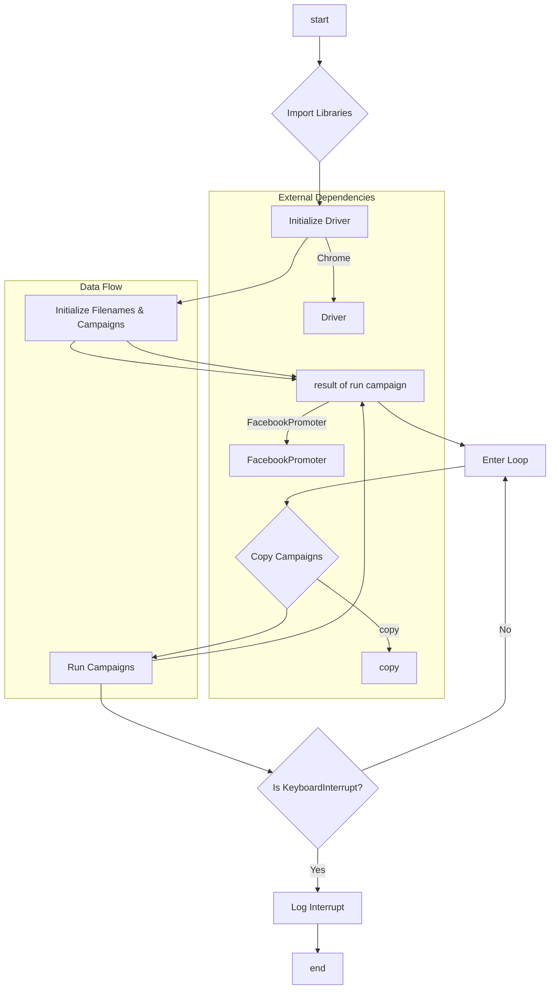

# Анализ кода start_posting_my_groups.py

## <input code>

```python
## \file hypotez/src/endpoints/advertisement/facebook/start_posting_my_groups.py
# -*- coding: utf-8 -*-\
#! venv/Scripts/python.exe
#! venv/bin/python/python3.12

"""
.. module: src.endpoints.advertisement.facebook 
	:platform: Windows, Unix
	:synopsis: Отправка рекламных объявлений в группы фейсбук (my groups?)

"""
MODE = 'dev'


import header 
import copy
from src.webdriver import Driver, Chrome
from src.endpoints.advertisement.facebook.promoter import FacebookPromoter
from src.logger import logger

d = Driver(Chrome)
d.get_url(r"https://facebook.com")

filenames:list = ['my_managed_groups.json',]  

campaigns:list = ['brands',
                  'mom_and_baby',
                  'pain',
                  'sport_and_activity',
                  'house',
                  'bags_backpacks_suitcases',
                  'man']

promoter = FacebookPromoter(d, group_file_paths = filenames, no_video = True)

try:
    while True:
        
        promoter.run_campaigns(campaigns = copy.copy(campaigns), group_file_paths = filenames)
        ...

        
except KeyboardInterrupt:
    logger.info("Campaign promotion interrupted.")
```

## <algorithm>

**Шаг 1**: Импортирование необходимых библиотек.
* Импортируются `header`, `copy`, классы `Driver`, `Chrome` из `src.webdriver`, `FacebookPromoter` из `src.endpoints.advertisement.facebook.promoter`, и `logger` из `src.logger`.


**Шаг 2**: Инициализация драйвера и навигация на страницу Facebook.
* Создается экземпляр класса `Driver` с использованием класса `Chrome`.
* Вызывается метод `get_url`, чтобы открыть страницу `https://facebook.com`.


**Шаг 3**: Инициализация списков `filenames` и `campaigns`.
* Создается список `filenames` содержащий путь к файлу с данными о группах.
* Создается список `campaigns` содержащий названия рекламных кампаний.


**Шаг 4**: Создание экземпляра `FacebookPromoter`.
* Создается экземпляр класса `FacebookPromoter`, передавая ему `d`, `filenames`, и `no_video = True`.


**Шаг 5**: Бесконечный цикл для запуска рекламных кампаний.
* Цикл `while True` будет выполняться до тех пор, пока не произойдет прерывание.
* Внутри цикла копируется список кампаний `campaigns` с помощью `copy.copy`.
* Вызывается метод `run_campaigns` экземпляра `FacebookPromoter`, передавая ему скопированные списки `campaigns` и `filenames`.


**Шаг 6**: Обработка прерывания.
* Блок `try...except KeyboardInterrupt` обрабатывает прерывание пользователя (Ctrl+C).
* При прерывании выводится сообщение в лог с помощью `logger.info`.


**Пример данных:**

* `filenames`: `['my_managed_groups.json']`
* `campaigns`: `['brands', 'mom_and_baby', ...]`
* Данные из `my_managed_groups.json` используются в методе `run_campaigns` для выбора групп Facebook.

## <mermaid>



## <explanation>

**Импорты:**

* `header`: Предположительно содержит общие заголовки и конфигурационные параметры.  Необходимость в `header`  неясна без контекста всего проекта.
* `copy`: Используется для создания копий списков `campaigns`, что предотвращает изменения исходного списка во время работы функции.
* `Driver`, `Chrome`:  Класс `Driver` из `webdriver` отвечает за работу с браузером (в данном случае Chrome), позволяя выполнять действия на веб-страницах.  `Chrome` —  likely a class to interact with the Chrome driver.
* `FacebookPromoter`: Класс для управления процессом отправки рекламных объявлений в группы Facebook. Он находится в подпакете `src.endpoints.advertisement.facebook`.
* `logger`:  Для ведения логов.


**Классы:**

* `Driver`:  Предположительно представляет собой абстрактный класс или базовый класс для управления драйвером браузера.
* `Chrome`:  Возможно, класс, предоставляющий конкретную реализацию для работы с драйвером Chrome.
* `FacebookPromoter`: Этот класс содержит логику для отправки рекламных объявлений в указанные группы.  Он принимает драйвер и информацию о группах, вероятно, использует API Facebook для выполнения действий.


**Функции:**

* `get_url`:  Функция (вероятно, метод класса `Driver`), которая открывает указанный URL в браузере.
* `run_campaigns`: Метод класса `FacebookPromoter`, который выполняет отправку объявлений для указанных рекламных кампаний.


**Переменные:**

* `MODE`: Строковая переменная, хранящая режим работы (в данном случае 'dev').
* `filenames`: Список путей к файлам с информацией о целевых группах Facebook.
* `campaigns`: Список названий рекламных кампаний.
* `d`: Экземпляр класса `Driver`.
* `promoter`: Экземпляр класса `FacebookPromoter`.

**Возможные ошибки и улучшения:**

* **Обработка ошибок:** Код обрабатывает только исключение `KeyboardInterrupt`.  Нужно добавить обработку других потенциальных исключений (например, исключения, связанные с работой с браузером или API Facebook).  Поиск ошибок нужно логгировать.
* **Управление ресурсами:** Код не содержит логики для закрытия браузера. Необходимо добавить `d.quit()` (или подобный метод) в `finally` блок или в `except` блок, чтобы избежать утечек ресурсов и ошибок.
* **Эффективность:** В бесконечном цикле  необходимо добавить проверку на успешное выполнение заданий. Возможно, необходимо ввести квоту выполнения задач.
* **Детали реализации:** Нет информации о том, как `FacebookPromoter` взаимодействует с API Facebook и как происходит проверка успешности действий.


**Цепочка взаимосвязей:**

`start_posting_my_groups.py` использует `src.webdriver` для работы с браузером, `src.endpoints.advertisement.facebook.promoter` для отправки рекламных объявлений и `src.logger` для логгирования.  `my_managed_groups.json`  (или аналогичный файл) предоставляет данные о целевых группах. Вероятно, существуют дополнительные файлы конфигурации и данные о рекламных кампаниях, которые используются во взаимодействии с API.  Взаимодействие с API Facebook происходит через методы класса `FacebookPromoter`.