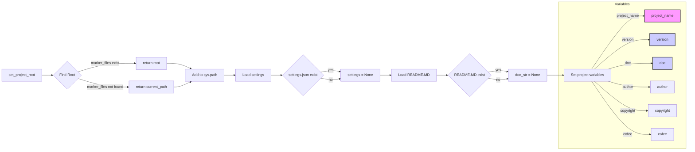

# Анализ кода файла hypotez/src/endpoints/advertisement/header.py

## <input code>

```python
## \file hypotez/src/endpoints/advertisement/header.py
# -*- coding: utf-8 -*-\
#! venv/Scripts/python.exe
#! venv/bin/python/python3.12

"""
.. module: src.endpoints.advertisement 
	:platform: Windows, Unix
	:synopsis:

"""
MODE = 'dev'


import sys
import json
from packaging.version import Version

from pathlib import Path
def set_project_root(marker_files=('pyproject.toml', 'requirements.txt', '.git')) -> Path:
    """
    Finds the root directory of the project starting from the current file's directory,
    searching upwards and stopping at the first directory containing any of the marker files.

    Args:
        marker_files (tuple): Filenames or directory names to identify the project root.
    
    Returns:
        Path: Path to the root directory if found, otherwise the directory where the script is located.
    """
    __root__:Path
    current_path:Path = Path(__file__).resolve().parent
    __root__ = current_path
    for parent in [current_path] + list(current_path.parents):
        if any((parent / marker).exists() for marker in marker_files):
            __root__ = parent
            break
    if __root__ not in sys.path:
        sys.path.insert(0, str(__root__))
    return __root__


# Get the root directory of the project
__root__ = set_project_root()
"""__root__ (Path): Path to the root directory of the project"""


from src import gs

settings:dict = None
try:
    with open(gs.path.root / 'src' /  'settings.json', 'r') as settings_file:
        settings = json.load(settings_file)
except (FileNotFoundError, json.JSONDecodeError):
    ...

doc_str:str = None
try:
    with open(gs.path.root / 'src' /  'README.MD', 'r') as settings_file:
        doc_str = settings_file.read()
except (FileNotFoundError, json.JSONDecodeError):
    ...


__project_name__ = settings.get("project_name", 'hypotez') if settings  else 'hypotez'
__version__: str = settings.get("version", '')  if settings  else ''
__doc__: str = doc_str if doc_str else ''
__details__: str = ''
__author__: str = settings.get("author", '')  if settings  else ''
__copyright__: str = settings.get("copyrihgnt", '')  if settings  else ''
__cofee__: str = settings.get("cofee", "Treat the developer to a cup of coffee for boosting enthusiasm in development: https://boosty.to/hypo69")  if settings else "Treat the developer to a cup of coffee for boosting enthusiasm in development: https://boosty.to/hypo69"
```

## <algorithm>

1. **`set_project_root` функция:**
    - Принимает кортеж `marker_files`, содержащий имена файлов (например, 'pyproject.toml', 'requirements.txt').
    - Начинает поиск корневой директории проекта от текущей директории файла (`__file__`).
    - Итерируется по родительским директориям, проверяя существование файлов из `marker_files`.
    - Если такой файл найден, то возвращает родительскую директорию, как корень проекта.
    - Если корень не найден, возвращает текущую директорию.
    - Добавляет корневую директорию в `sys.path`, если ее там нет.
    - Возвращает корневую директорию.


2. **Получение настроек (`settings`)**
    - Вызывается функция `set_project_root` для определения корневой директории проекта.
    - Используется модуль `gs`, предполагая, что он содержит класс или объект `path` для работы с путями.
    - Попытка открыть файл `settings.json` в корне проекта.
    - Загрузка настроек из файла.
    - Обработка исключений (`FileNotFoundError`, `json.JSONDecodeError`), если файл не найден или невалидный JSON.


3. **Получение документации (`doc_str`)**
    - Аналогично предыдущему шагу, но для файла `README.MD`.
    - Чтение файла и сохранение содержимого в `doc_str`.
    - Обработка исключений (`FileNotFoundError`, `json.JSONDecodeError`).


4. **Инициализация переменных проекта:**
    - Используя полученные настройки `settings`, и значения по умолчанию, заполняются переменные:
        - `__project_name__`
        - `__version__`
        - `__doc__`
        - `__author__`
        - `__copyright__`
        - `__cofee__`


**Пример:** Если файл `settings.json` находится в директории `C:/project/src` , а скрипт в `C:/project/src/endpoints/advertisement/`, то `set_project_root` вернет `C:/project/src` и добавит ее в `sys.path` если ее там нет.

## <mermaid>



## <explanation>

**Импорты:**

- `sys`: предоставляет доступ к системным переменным и функциям, включая `sys.path`.
- `json`: используется для работы с JSON-данными.
- `packaging.version`: позволяет работать с версиями программного обеспечения.
- `pathlib`: предоставляет удобный способ работы с файлами и каталогами.


**Классы:**

- Нет явных классов в этом коде.

**Функции:**

- `set_project_root(marker_files)`: находит корень проекта, идя вверх по дереву директорий.  Обратите внимание на аннотацию типа `-> Path`, что указывает на возврат пути.  Это важная функция для определения пути к проекту, не зная его в явном виде. Аргумент `marker_files` важен, т.к. позволит находить корень проекта даже если он расположен вложенно (не в том случае, если файлы, указанные в нем, лежат в папках более высокого уровня).


**Переменные:**

- `MODE`: строковая переменная, хранящая режим работы (например, 'dev' или 'prod').
- `__root__`: переменная типа `Path`, хранит путь к корню проекта.
- `settings`: словарь, содержащий настройки проекта.
- `doc_str`: строка, содержащая текст README файла.
- `__project_name__`, `__version__`, `__doc__`, `__author__`, `__copyright__`, `__cofee__`: переменные, содержащие данные из `settings.json` или значения по умолчанию.


**Возможные ошибки или области для улучшений:**

- **`gs` модуль:** код использует модуль `gs`, но его реализация не представлена. Необходимо определить, что это за модуль и как он используется для получения пути к корневой директории.
- **Обработка исключений:** обработка исключений ( `try...except` ) необходима, но может быть улучшена.  Вместо `...` нужно указать конкретные действия в случае ошибки.


**Взаимосвязь с другими частями проекта:**

- Код использует `gs` для определения пути к `settings.json` и `README.MD`, предполагая, что `gs` предоставляет функциональность для работы с файловой системой.
- Полученные переменные `__project_name__`, `__version__`, и т.д. могут быть использованы в других частях проекта (например, для генерации файлов, вывода информации или создания настроек).
- Эта часть кода является основной для установки контекста работы приложения.