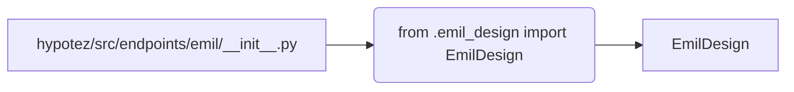

```MD
# Анализ файла hypotez/src/endpoints/emil/__init__.py

## <input code>

```python
## \file hypotez/src/endpoints/emil/__init__.py
# -*- coding: utf-8 -*-
#! venv/Scripts/python.exe
#! venv/bin/python/python3.12

"""
.. module: src.endpoints.emil 
	:platform: Windows, Unix
	:synopsis:

"""
MODE = 'dev'


from .emil_design import EmilDesign
```

## <algorithm>

Алгоритм работы файла `__init__.py` довольно прост. Файл импортирует класс `EmilDesign` из модуля `emil_design.py`, находящегося в той же директории.  В данном случае, это основной модуль для инициализации и доступа к классу `EmilDesign`.  Логика работы сводится к импорту и дальнейшему использованию этого класса.  Нет циклов, условных операторов или вызовов других функций, кроме импорта.

**Пример:**

Код не содержит явного алгоритма в виде последовательных шагов. Основная функция файла - импорт необходимых компонентов.

## <mermaid>



**Объяснение диаграммы:**

Файл `__init__.py` импортирует класс `EmilDesign` из модуля `emil_design.py` (относительный импорт). Стрелка от `__init__.py` к `EmilDesign` показывает эту зависимость.  Файл `emil_design.py` неявно импортируется, и  `__init__.py` позволяет использовать `EmilDesign` в других модулях.


## <explanation>

**Импорты:**

- `from .emil_design import EmilDesign`:  Этот импорт позволяет использовать класс `EmilDesign`, определенный в модуле `emil_design.py`, находящемся в той же директории (`endpoints/emil`).  Используется относительный импорт, что делает код более локальным и управляемым.

**Классы:**

- `EmilDesign`:  Этот класс определен в модуле `emil_design.py` и, по всей видимости, содержит код для работы с объектами или ресурсами, связанными с "Emil". Без доступа к коду модуля `emil_design.py` конкретная функциональность `EmilDesign` неизвестна.


**Функции:**

Нет явных функций в данном файле.  Все функциональные возможности заключены в классе `EmilDesign`.

**Переменные:**

- `MODE = 'dev'`:  Переменная, скорее всего, определяет режим работы (например, разработка 'dev', продакшен 'prod').  Её использование в дальнейшем в других модулях  надо будет проанализировать.

**Возможные ошибки или области для улучшений:**

- Необходим анализ модуля `emil_design.py`, чтобы получить полное понимание функциональности.
- Необходимо больше контекста, чтобы понять, как используется `MODE` и какой эффект он оказывает.
- Возможно, при наличии других файлов в папке `endpoints/emil`, `__init__.py` должен содержать больше импортов.

**Цепочка взаимосвязей:**

Файл `__init__.py` играет роль точки входа для доступа к классу `EmilDesign`.  Дальнейшее использование `EmilDesign` в других частях проекта (например, в `main.py`, контроллерах и т.д.) будет определять взаимодействие с другими модулями.  Схема взаимосвязей сильно зависит от структуры всего проекта, которая, к сожалению, не известна.