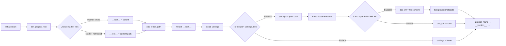

# <input code>

```python
## \file hypotez/src/endpoints/header.py
# -*- coding: utf-8 -*-\
#! venv/Scripts/python.exe
#! venv/bin/python/python3.12

"""
.. module: src.endpoints 
	:platform: Windows, Unix
	:synopsis:

"""
MODE = 'dev'


import sys
import json
from packaging.version import Version

from pathlib import Path
def set_project_root(marker_files=('pyproject.toml', 'requirements.txt', '.git')) -> Path:
    """
    Finds the root directory of the project starting from the current file's directory,
    searching upwards and stopping at the first directory containing any of the marker files.

    Args:
        marker_files (tuple): Filenames or directory names to identify the project root.
    
    Returns:
        Path: Path to the root directory if found, otherwise the directory where the script is located.
    """
    __root__:Path
    current_path:Path = Path(__file__).resolve().parent
    __root__ = current_path
    for parent in [current_path] + list(current_path.parents):
        if any((parent / marker).exists() for marker in marker_files):
            __root__ = parent
            break
    if __root__ not in sys.path:
        sys.path.insert(0, str(__root__))
    return __root__


# Get the root directory of the project
__root__ = set_project_root()
"""__root__ (Path): Path to the root directory of the project"""

from src import gs

settings:dict = None
try:
    with open(gs.path.root / 'src' /  'settings.json', 'r') as settings_file:
        settings = json.load(settings_file)
except (FileNotFoundError, json.JSONDecodeError):
    ...

doc_str:str = None
try:
    with open(gs.path.root / 'src' /  'README.MD', 'r') as settings_file:
        doc_str = settings_file.read()
except (FileNotFoundError, json.JSONDecodeError):
    ...


__project_name__ = settings.get("project_name", 'hypotez') if settings  else 'hypotez'
__version__: str = settings.get("version", '')  if settings  else ''
__doc__: str = doc_str if doc_str else ''
__details__: str = ''
__author__: str = settings.get("author", '')  if settings else ''
__copyright__: str = settings.get("copyrihgnt", '')  if settings else ''
__cofee__: str = settings.get("cofee", "Treat the developer to a cup of coffee for boosting enthusiasm in development: https://boosty.to/hypo69")  if settings else "Treat the developer to a cup of coffee for boosting enthusiasm in development: https://boosty.to/hypo69"
```

# <algorithm>

1. **`set_project_root` function:**
    * Takes a tuple of marker files as input.
    * Starts from the current file's directory.
    * Iterates through parent directories.
    * Checks if any of the marker files exist in the current parent directory.
    * If found, sets `__root__` to the parent directory and breaks the loop.
    * If not found in any parent, `__root__` remains the initial directory.
    * Adds the root directory to `sys.path` if it's not already present.
    * Returns the `__root__` Path object.

    *Example:* If `__file__` points to `hypotez/src/endpoints/header.py`, the function will search for `pyproject.toml`, `requirements.txt`, and `.git` in `hypotez/src/endpoints`, `hypotez/src`, `hypotez`, etc. until one of them is found.

2. **Initialization:**
    * Calls `set_project_root` to determine the project root and stores the result in `__root__`.

3. **Loading settings:**
    * Tries to open `gs.path.root / 'src' / 'settings.json'`.
    * Parses the JSON content into the `settings` dictionary.
    * Handles `FileNotFoundError` and `json.JSONDecodeError` if the file is not found or corrupted.

4. **Loading documentation:**
    * Tries to open `gs.path.root / 'src' / 'README.MD'`.
    * Reads the content of the file into the `doc_str` variable.
    * Handles `FileNotFoundError` and `json.JSONDecodeError` if the file is not found or corrupted.

5. **Setting project metadata:**
    * Extracts values from the `settings` dictionary (or defaults if the dictionary is empty or doesn't contain the key).
    * Assigns the values to variables like `__project_name__`, `__version__`, `__doc__`, etc.

# <mermaid>



**Dependencies:**

* `sys`: For interacting with the Python runtime environment, including manipulating the `sys.path` variable.
* `json`: For working with JSON data.
* `packaging.version`:  For handling version strings.
* `pathlib`: For working with file paths in a more object-oriented way.
* `src.gs`:  This is a crucial dependency; it presumably contains the `gs.path.root` attribute, which provides access to the project root directory.  The lack of definition for `gs.path` or the full import path for `src.gs` is critical to understanding the dependencies and usage.

# <explanation>

* **Imports:**
    * `sys`: Used to manipulate the Python path.
    * `json`: Used for loading and parsing JSON data from the `settings.json` file.
    * `packaging.version`: Likely for handling version strings in a robust way, possibly ensuring compatibility across different Python versions.
    * `pathlib`: Provides a more object-oriented approach to working with file paths and directories.
    * `src.gs`:  Essential for determining the project's root directory, but without knowing the definition of `src.gs` or its full import path, its role and behavior are unclear.

* **`set_project_root` function:**
    * This function is crucial for correctly identifying the project root directory, which is necessary for finding relative paths to files such as `settings.json`.
    * It elegantly handles cases where the script isn't directly located at the project root.
    * **Improvement:**  Adding error handling to check for cases where no marker file is found would make the function more robust.

* **Variables:**
    * `__root__`: A `Path` object representing the root directory of the project.
    * `settings`: A dictionary containing project settings loaded from `settings.json`.
    * `doc_str`: Contains the contents of the README.MD file.
    * Other variables (`__project_name__`, `__version__`, etc.): Store metadata about the project, obtained from the `settings` dictionary (if present).

* **Error handling:**
    * `try...except` blocks gracefully handle potential `FileNotFoundError` and `json.JSONDecodeError` exceptions when reading `settings.json` and `README.MD`. This is excellent practice to prevent unexpected crashes.


* **Possible Improvements:**
    * **Logging:** Adding logging would provide valuable information about the execution, particularly if there are issues with finding the project root or loading settings.
    * **Type hints:** While the code uses type hints (e.g., `-> Path`), it would benefit from more comprehensive type hints to improve code maintainability and readability, especially in the `src` module.

* **Relationship to other parts of the project:**
    * `gs.path.root` strongly suggests a relationship with the `gs` module, likely responsible for managing file paths related to the project. Further investigation into the `gs` module is needed for a more thorough analysis of the overall codebase architecture.  The lack of understanding on this dependency is the main source of missing context, making full analysis and explanation incomplete.