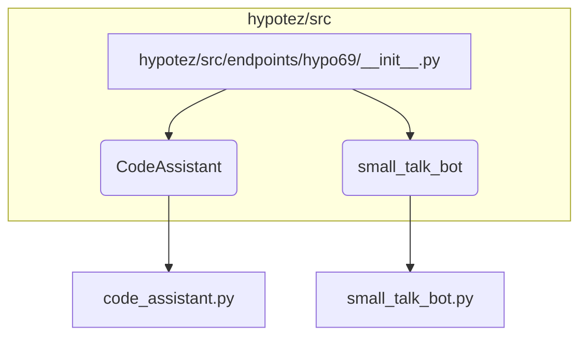

```MD
# Анализ кода hypotez/src/endpoints/hypo69/__init__.py

## <input code>

```python
## \file hypotez/src/endpoints/hypo69/__init__.py
# -*- coding: utf-8 -*-\
#! venv/Scripts/python.exe
#! venv/bin/python/python3.12

"""
.. module: src.endpoints.hypo69 
	:platform: Windows, Unix
	:synopsis:

"""
MODE = 'dev'


from .code_assistant import CodeAssistant
from .small_talk_bot import bot as small_talk_bot
```

## <algorithm>

В данном файле, скорее всего, инициализируется модуль `hypo69` в приложении `hypotez`.  Алгритм работы на этом уровне - просто импортирование модулей.  Нет циклов или условных операторов, поэтому пошаговую блок-схему представить сложно.


## <mermaid>



## <explanation>

**Импорты:**

* `from .code_assistant import CodeAssistant`: Импортирует класс `CodeAssistant` из модуля `code_assistant.py`, который, вероятно, находится в той же директории (`hypotez/src/endpoints/hypo69/`).  Символ `.` указывает на относительный импорт.
* `from .small_talk_bot import bot as small_talk_bot`: Импортирует переменную `bot` (вероятно, объект или класс) из модуля `small_talk_bot.py` в текущем пакете и переименовывает её в `small_talk_bot`.

**Классы:**

* `CodeAssistant`:  Класс, представляющий код-помощника.  Подробности о нём неизвестны без просмотра файла `code_assistant.py`.

**Функции:**

* Нет функций.

**Переменные:**

* `MODE = 'dev'`: Глобальная переменная, определяющая режим работы (вероятно, 'dev' - режим разработки).  Это константа.


**Взаимосвязи с другими частями проекта:**

* Модуль `hypo69` зависит от `code_assistant.py` и `small_talk_bot.py`.
* Вероятно, эти модули, в свою очередь, зависят от других частей проекта, но это не видно из предоставленного кода.   Например, `small_talk_bot.py` может использовать библиотеки для обработки естественного языка.

**Возможные ошибки или улучшения:**

* Отсутствует явное описание того, что делает модуль `hypo69`.
* Не указано, как будут использоваться импортированные классы `CodeAssistant` и `small_talk_bot`. Необходимо посмотреть на вызовы этих объектов.


**Выводы:**

Данный файл `__init__.py` служит для импортирования необходимых компонентов для модуля `hypo69`.  Для полного понимания функциональности проекта необходимы все связанные с ним файлы.