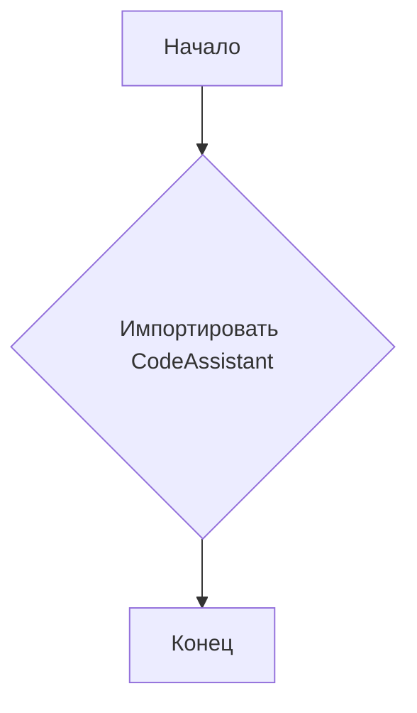
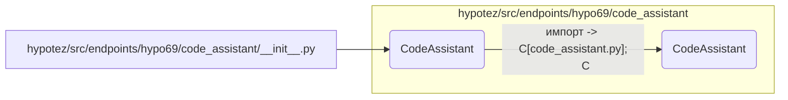

```MD
# Анализ кода hypotez/src/endpoints/hypo69/code_assistant/__init__.py

## <input code>

```python
## \file hypotez/src/endpoints/hypo69/code_assistant/__init__.py
# -*- coding: utf-8 -*-
#! venv/Scripts/python.exe
#! venv/bin/python/python3.12

"""
.. module: src.endpoints.hypo69.code_assistant 
	:platform: Windows, Unix
	:synopsis:

"""
MODE = 'dev'

from .code_assistant import CodeAssistant
```

## <algorithm>

Этот код, являющийся файлом инициализации модуля `code_assistant`, выполняет простую задачу: импортирует класс `CodeAssistant` из подмодуля `code_assistant`.  

Блок-схема:



Пример:

Если в файле `code_assistant.py` определен класс `CodeAssistant`, то выполнение этого файла инициализации просто создаст ссылку на этот класс.


## <mermaid>



## <explanation>

**Импорты:**

* `from .code_assistant import CodeAssistant`: Эта строка импортирует класс `CodeAssistant` из файла `code_assistant.py`, находящегося в том же каталоге (`./code_assistant.py`).  Символ `.` перед именем файла указывает на то, что файл находится в том же каталоге, что и файл инициализации `__init__.py`. Это стандартная практика организации Python-проектов, особенно в структурах типа `src/`.  Важно, что `code_assistant.py` должен быть в подкаталоге `hypotez/src/endpoints/hypo69/code_assistant`.

**Классы:**

* `CodeAssistant`: Этот класс, вероятно, определен в `code_assistant.py` и содержит логику, связанную с ассистентом кода.  Для дальнейшего анализа нужно посмотреть сам `code_assistant.py`.

**Функции:**

В данном файле нет определенных функций.

**Переменные:**

* `MODE = 'dev'`:  Это строковая переменная, вероятно, определяющая режим работы (например, 'dev' - для разработки, 'prod' - для производства).  Данная переменная скорее всего используется в других частях проекта для настройки поведения.


**Возможные ошибки и улучшения:**

* Отсутствует документация для переменной `MODE`.  Рекомендуется добавить пояснение к этой переменной, например: `MODE = 'dev' # Режим разработки`.
* Отсутствует импорт из `__init__.py`  -  для реализации других подмодулей.

**Взаимосвязи с другими частями проекта:**

Этот файл является частью модуля, вероятно, отвечающего за ассистирование программисту при написании кода.  Он подключается другими частями проекта, которые нуждаются в функционале класса `CodeAssistant`. Для определения полной картины проекта, требуется проанализировать вызовы и использование этого файла в других модулях проекта.


```