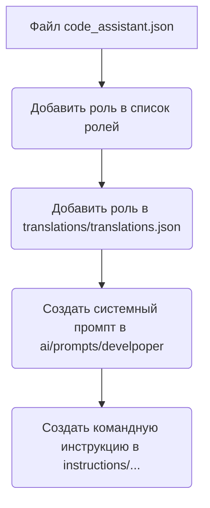
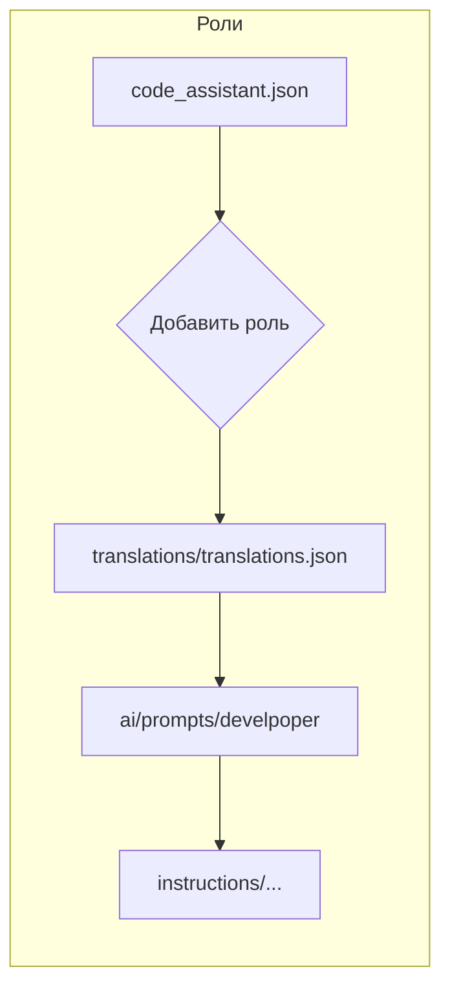

```MD
# Анализ кода для создания новой роли

**1. <input code>**

```%% порядок действий для создания новой роли
graph TD
    A[Файл `code_assistant.json`] --> B[Добавить роль в список ролей]
    B --> C[Добавить роль в файл переводов `translations/translations.json`]
    C --> D[Создать системный промпт в `ai/prompts/develpoper`]
    D --> E[Создать командную инструкцию в `instructions/...`]

    %% Настройка стилей блоков
    style A width: 300px
    style B width: 300px
    style C width: 300px
    style D width: 300px
    style E width: 300px
```

**2. <algorithm>**

Алгоритм представляет собой последовательность действий, изображенных в виде блок-схемы:



**Пример:**

Предположим, новая роль называется "Программист Python".  Алгоритм будет выполняться следующим образом:
1. В файле `code_assistant.json` добавляется запись о новой роли "Программист Python".
2. В файле `translations/translations.json` добавляется перевод для этой роли на нужные языки.
3. В директории `ai/prompts/develpoper` создается новый системный промпт, адаптированный для роли "Программист Python".
4. В директории `instructions/...` создается командная инструкция, описывающая действия пользователя, взаимодействующего с ролью "Программист Python".


**3. <mermaid>**



**Описание диаграммы:**

Диаграмма `graph LR` визуализирует последовательные шаги в создании новой роли.  Корневым узлом является `code_assistant.json`.  В результате последовательного выполнения этих шагов, на различных уровнях директории проекта, создаётся новое описание для роли.

**Зависимости:**


Этот код описывает *порядок действий*, а не код программы. Зависимости скрыты в комментариях, указывающих на файлы и директории проекта (`code_assistant.json`, `translations/translations.json`, `ai/prompts/develpoper`, `instructions/...`). Эти зависимости подразумевают существование данных файлов и соответствующей структуры каталогов.


**4. <explanation>**

* **Импорты:** Отсутствуют. Код представляет собой схему процесса, а не программный код.
* **Классы:** Отсутствуют. Код описывает порядок действий, а не классы.
* **Функции:** Отсутствуют. Код описывает порядок действий, а не функции.
* **Переменные:** Отсутствуют. Код описывает порядок действий, а не переменные.
* **Возможные ошибки/улучшения:**
    * Нет проверки существования файлов. При реализации этот момент стоит учесть.
    * Нет указания формата данных в `code_assistant.json`, `translations/translations.json` и других файлах.
    * Нет указаний на скрипт/программу, которая реализует описанные действия.

**Цепочка взаимосвязей с другими частями проекта:**

Указанные файлы (`code_assistant.json`, `translations/translations.json`, `ai/prompts/develpoper`, `instructions/...`) — компоненты системы, которые вероятно интегрируются с другим кодом (например, с кодом, обрабатывающим пользовательские запросы) в проекте.  Эти файлы представляют собой хранилище данных, влияющих на поведение системы. Без доступа к остальному коду проекта невозможно полностью представить всю картину взаимодействия.

**Вывод:**

Данный код представляет собой блок-схему процесса создания новой роли в системе, описывая порядок действий. Он важен для понимания последовательности создания данных для системы, но сам по себе не является исполняемым кодом. При реализации необходимо учитывать детали структуры данных и валидации.