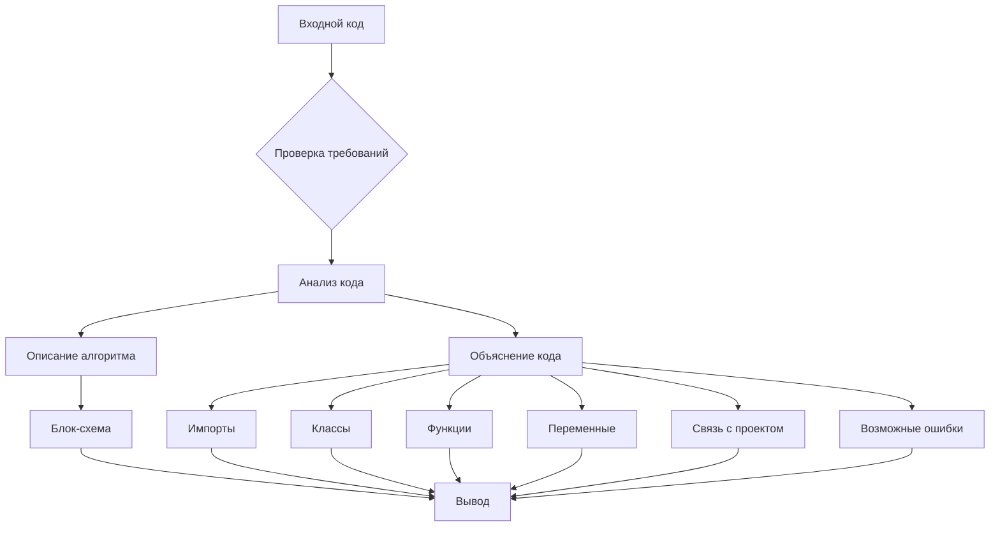

# Анализ кода

## <input code>

```python
# Резюме для промпта:

### Основные требования:
1. **Анализ кода**:
   - Предоставьте исходный код без изменений.
   - Опишите алгоритм работы кода в виде пошаговой блок-схемы, показывая перемещение данных между функциями или классами.
   - Объясните работу кода, включая импорты, классы, функции, переменные и их связи с другими частями проекта.
   - Укажите потенциальные ошибки или улучшения, если они есть.

2. **Формат ответа**:
   - **<input code>**: Исходный код без изменений.
   - **<algorithm>**: Пошаговое описание алгоритма работы кода с примерами.
   - **<explanation>**: Детальное объяснение кода, включая:
     - Импорты: их назначение и связи с другими модулями.
     - Классы: их назначение, атрибуты и методы, связи с другими компонентами.
     - Функции: описание назначения, аргументов и возвращаемых значений.
     - Переменные: описание типов и использования.
     - Связь с другими частями проекта и потенциальные ошибки или улучшения.

### Пример вызова:
Представлен код, который анализируется и объясняется в соответствии с инструкциями.

---

Этот промпт предназначен для детального анализа предоставленного кода с пояснением всех его аспектов, включая логику, структуру и потенциальные улучшения.
```

## <algorithm>



Этот код, сам по себе, не является исполняемым кодом. Он представляет собой промпт (запрос) для другого кода. Алгоритм его работы - это обработка этого текста и генерация описания (блок-схема, объяснение).  Данные передаются внутрь алгоритма в виде текста.  Результатом является структура текста, описывающая предполагаемый код.


## <mermaid>


## <explanation>

Этот код не содержит исполняемого кода. Это промпт, определяющий **структуру и требования к анализу** кода.  Промпт задает формат и шаги для описания кода, включая структурированные разделы (Анализ, Алгоритм, Объяснение), и ожидаемый результат (блок-схема, детали функций, переменных и т.д.). Промпт фокусируется на _процессе анализа_ кода, а не на самим кодом.

**Импорты**:  Отсутствуют.
**Классы**: Отсутствуют.
**Функции**: Отсутствуют.
**Переменные**: Отсутствуют.

**Возможные ошибки или улучшения**:  Нет исполняемого кода для выявления ошибок. Этот текст служит инструкцией, поэтому ошибок в нем нет.  Для потенциального улучшения можно добавить примеры реального кода, который этот промпт должен анализировать.


**Связь с другими частями проекта**:  Промпт сам по себе не связан с другими частями проекта.  Он представляет собой шаблон для анализа кода, который затем может быть применен к различным проектам.