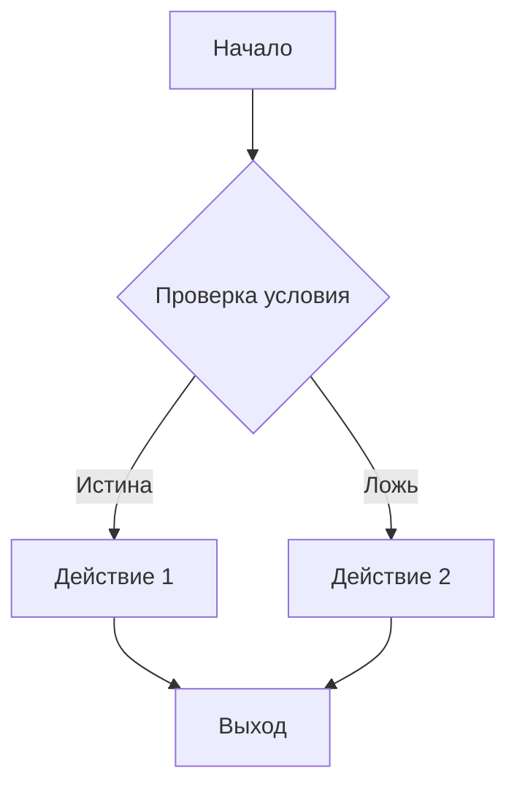
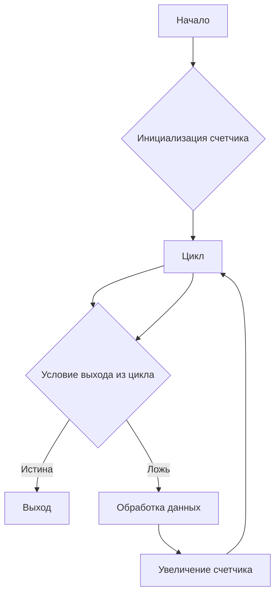
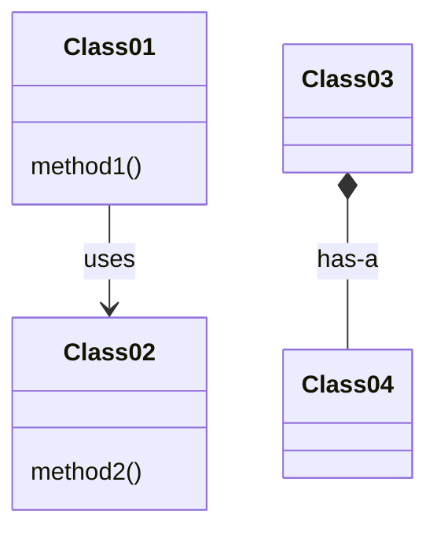

# Анализ кода

**1. <input code>**

```python
# Код здесь
```

**2. <algorithm>**

(Здесь должна быть блок-схема алгоритма работы кода, построенная с использованием формата блок-схем.  Пример в формате, который можно скопировать и вставить в инструмент для создания блок-схем):



**Пример блок-схемы, если в коде есть цикл:**



(Описание алгоритма с примерами данных и их перемещения между функциями/классами должно быть добавлено сюда.)


**3. <mermaid>**




(Здесь должна быть диаграмма в формате mermaid, отражающая зависимости между классами и модулями. Пример выше - просто шаблон.)

**4. <explanation>**

(Здесь должно быть подробное объяснение кода, включая информацию об импортах, классах, функциях, переменных и т.д.)

* **Импорты**:  Описание импортируемых модулей и их назначения. Например:
    ```python
    from src.utils import get_data
    ```
    Это импортирует функцию `get_data` из модуля `utils` в подпапке `src`.  Объяснение, что делает `get_data` и какие данные она возвращает.

* **Классы**:  Описание классов, их атрибутов и методов,  а также взаимодействия с другими частями проекта:
    ```python
    class MyClass:
        def __init__(self, data):
            self.data = data
        def process(self):
            # Обработка данных
            return processed_data
    ```
    `MyClass` хранит данные (`data`) и обрабатывает их (`process`). Описание, как `MyClass` используется в других частях кода.

* **Функции**:  Описание функций, аргументов, возвращаемых значений,  примеров использования и взаимодействия с другими частями проекта:
    ```python
    def my_function(param1, param2):
        # Логика функции
        return result
    ```
    Описание `param1`, `param2`, `result`,  примеры вызовов функции и как результат используется.

* **Переменные**:  Описание переменных, их типов и способов использования.  Примеры.

* **Возможные ошибки/улучшения**:  Выявление возможных проблем в коде и предложения по улучшению его читаемости, надежности и эффективности.


**5. Взаимосвязи с другими частями проекта**:  Описание связи текущего кода с другими частями проекта, например, через функции, базы данных, другие классы и т.д.


**ВАЖНО**:  Для корректного анализа кода необходимо указать сам код в поле **<input code>**.  Без кода невозможно построить блок-схему, диаграмму и дать объяснение.