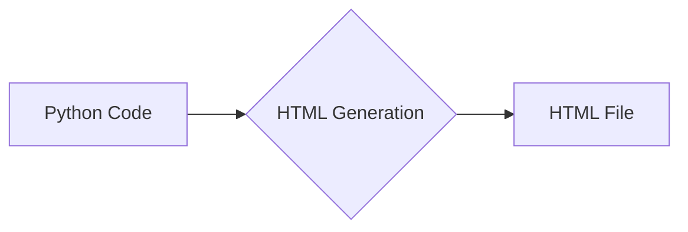

# Анализ кода для генерации HTML-документации Python-файлов

## 1. <input code>

```html
<!-- INSTRUCTION -->

<p>Для каждого входного Python-файла создайте документацию в формате <code>HTML</code> для последующего использования. Документация должна соответствовать следующим требованиям:</p>

<ol>
  <li>
    <strong>Формат документации</strong>:
    <ul>
      <li>Используйте стандарт <code>HTML</code>.</li>
      <li>Каждый файл должен начинаться с заголовка и краткого описания его содержимого.</li>
      <li>Для всех классов и функций используйте следующий формат комментариев:
        <pre><code>python
def function(param: str, param1: Optional[str | dict | str] = None) -> dict | None:
    """
    Args:
        param (str): Описание параметра `param`.
        param1 (Optional[str | dict | str], optional): Описание параметра `param1`. По умолчанию значение равно `None`.

    Returns:
        dict | None: Описание возвращаемого значения. Возвращает словарь или `None`.

    Raises:
        SomeError: Описание ситуации, в которой возникает исключение `SomeError`.
    """
</code></pre>
      </li>
      <li>Используйте <code>ex</code> вместо <code>e</code> в блоках обработки исключений.</li>
    </ul>
  </li>

  <li>
    <strong>Оглавление (TOC)</strong>:
    <ul>
      <li>Включите раздел оглавления в начале каждого документа.</li>
      <li>Структура должна включать ссылки на все основные разделы документации модуля.</li>
    </ul>
  </li>

  <li>
    <strong>Форматирование документации</strong>:
    <ul>
      <li>Используйте правильный синтаксис <code>HTML</code> для всех заголовков, списков и ссылок.</li>
      <li>Для документирования классов, функций и методов включайте структурированные разделы с описаниями, деталями параметров, значениями возвращаемых данных и поднятыми исключениями.</li>
    </ul>
  </li>

  <li>
    <strong>Заголовки разделов</strong>:
    <ul>
      <li>Используйте заголовки первого уровня (<code>&lt;h1&gt;</code>), второго уровня (<code>&lt;h2&gt;</code>), третьего уровня (<code>&lt;h3&gt;</code>) и четвертого уровня (<code>&lt;h4&gt;</code>) последовательно по всему файлу.</li>
    </ul>
  </li>

  <li>
    <strong>Пример файла</strong>:
    <!-- Пример HTML-файла -->
    </li>
</ol>

<p>Создайте соответствующую документацию для каждого входного Python-файла в формате <code>HTML</code>.</p>

<!-- END OF INSTRUCTION -->
```

## 2. <algorithm>

Этот код представляет собой набор инструкций для генерации HTML-документации для Python-кода.  Алгоритм работы заключается в:

1. Принимает Python-код в качестве входных данных.
2. Использует шаблон для создания HTML-документации, заполняя его информацией из Python-кода.
3. Генерирует HTML-файл.


Пример: Если на вход поступает файл `my_module.py` с функцией `my_function`, то алгоритм создаст HTML-файл, содержащий раздел для `my_module.py`, а в нём – заголовки, описание, параметры, возвращаемые значения и исключения функции `my_function`.


## 3. <mermaid>



## 4. <explanation>

Код не содержит реализацию генерации HTML.  Он предоставляет *инструкции* по созданию HTML-документации.  Он описывает:

* **Формат документации**: Определяет структуру HTML-файлов, включая заголовки, описания, параметры функций и методов, возвращаемые значения и исключения.  Использует стандартные HTML-теги.
* **Оглавление (TOC)**: Необходимость создания оглавления в HTML-документе.
* **Форматирование**: Важные моменты для правильного форматирования HTML, например, использования заголовков (`<h1>`, `<h2>`, ...), списков (`<ul>`, `<li>`) и правильного синтаксиса HTML.
* **Пример файла**: Показан образец HTML-файла для структурирования документации.


**Возможные ошибки и улучшения:**

* **Отсутствует реализация:** Код не содержит реализацию, необходимо дополнительно разработать код, который будет парсить Python-код и генерировать соответствующий HTML.
* **Обработка ошибок:** Необходимо предусмотреть обработку ошибок при парсинге Python-кода, таких как некорректный синтаксис или отсутствие необходимой информации для генерации.
* **Шаблоны:** Использование шаблонов для генерации HTML-кода может существенно упростить и ускорить процесс.


**Цепочка взаимосвязей:**

Этот код описывает *процесс* генерации документации.  Он *не* содержит реализации генерации.  Он служит инструкцией для последующих этапов разработки.  Следующие этапы включают в себя:

1. **Парсер Python-кода:**  Необходимо написать код, который проанализирует Python-файл и извлечёт информацию о классах, функциях, параметрах и т.д.
2. **Генератор HTML:**  Необходимо разработать код, который на основе извлечённой информации сгенерирует соответствующий HTML-код.
3. **Шаблоны HTML (возможно):** Использование шаблонизатора (например, Jinja2) для более гибкой и структурированной генерации HTML.

Этот код задаёт формат, но не является полным и готовым решением.