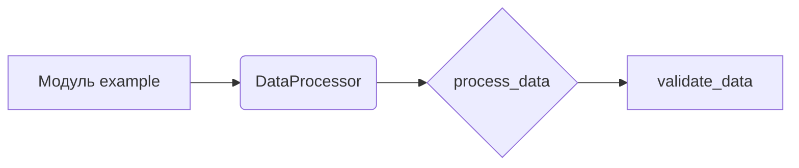

# ИНСТРУКЦИЯ по написанию документации для файлов Python

## Обзор

Данный документ описывает инструкцию по написанию документации для файлов Python, использующей формат Markdown.  Документация должна быть структурированной и содержать полное описание функций, классов и методов, включая параметры, возвращаемые значения, исключения и примеры.  Также, необходимы таблицы содержания (TOC).

## Формат документации

* **Формат Markdown (.md):** Используйте стандарт Markdown для форматирования документации.

* **Заголовок и краткое описание:** Каждый файл должен начинаться с заголовка и краткого описания содержимого.

* **Комментарии для функций и классов (PEP 484):** Для функций и классов используйте следующую структуру документации в комментариях:
    ```python
    def функция(параметр: тип, параметр1: тип = значение по умолчанию) -> тип возвращаемого значения:
        """
        Args:
            параметр (тип): Описание параметра.
            параметр1 (тип, optional): Описание параметра. По умолчанию значение `значение по умолчанию`.

        Returns:
            тип возвращаемого значения: Описание возвращаемого значения. Возвращает `тип возвращаемого значения` или `None`.

        Raises:
            Исключение: Описание ситуации, при которой возникает исключение.
        """
    ```

* **Использование `ex` вместо `e`:** В блоках обработки исключений используйте `ex` вместо `e`.

* **Таблица содержания (TOC):** В начале каждого файла документации должна быть таблица содержания с ссылками на все основные разделы.

* **Форматирование документации:** Используйте правильный синтаксис Markdown для заголовков, списков и ссылок.  Дополните описание классами, методами и функциями подробными разделами с описанием, параметрами, возвращаемыми значениями и возможными исключениями, как показано в примере.

## Структура файла документации

1. **Заголовок уровня 1 (`#`)**: Название модуля.
2. **Раздел "Обзор" (уровень 2 `##`)**: Краткое описание назначения модуля.
3. **Раздел "Классы" (уровень 2 `##`)**: Описание всех классов с подробным описанием методов (уровень 3 `###`).
4. **Раздел "Функции" (уровень 2 `##`)**: Описание всех функций с подробным описанием параметров, возвращаемых значений и исключений (уровень 3 `###`).

## Пример (файл `example.md`)

```markdown
# Модуль example

## Обзор

Этот модуль предоставляет функции для обработки данных.

## Классы

### `DataProcessor`

**Описание**: Класс для обработки данных.

**Методы**:

- `process_data(data: list) -> dict`: Обрабатывает данные и возвращает результат.

## Функции

### `validate_data(data: dict) -> bool`

**Описание**: Проверяет данные на корректность.

**Параметры**:
- `data` (dict): Данные для проверки.

**Возвращаемые значения**:
- `bool`: `True`, если данные валидны, иначе `False`.

**Исключения**:
- `ValueError`: Если данные содержат некорректные значения.

```

## Mermaid Диаграмма (пример)



**Описание диаграммы:**  Диаграмма демонстрирует взаимосвязь между модулем `example`, классом `DataProcessor` и функцией `validate_data`.  `process_data` использует `validate_data` для проверки данных.

**Дополнительные замечания:**

Эта инструкция предоставляет общий шаблон для написания документации.  Более специфические требования могут быть добавлены в зависимости от контекста проекта.
```
```mermaid
graph LR
    subgraph "Документация"
        A[instruction_doc_writer_md_en.md] --> B(Функции);
        B --> C(validate_data);
        B --> D(process_data);
        C --> E[Проверка данных];
        D --> F[Обработка данных];
        
        A --> G(Классы);
        G --> H(DataProcessor);
        H --> I[process_data];
    end