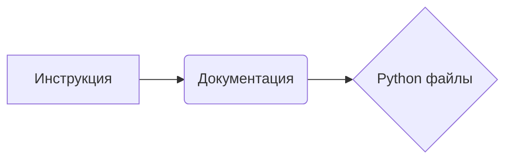

```MD
# ИНСТРУКЦИЯ по генерации документации Python-файлов

## Обзор

Данная инструкция описывает шаги по созданию документации для Python-файлов в формате Markdown. Документация должна быть структурированной, содержать оглавление, подробные описания классов, функций, и методов, а также примеры использования.

## Формат документации

Каждый файл должен начинаться с заголовка и краткого описания содержимого.  Для функций и классов должны использоваться docstrings с подробными описаниями, аргументами, возвращаемыми значениями и возможными исключениями.

### Пример docstring для функции:

```python
def function(param: str, param1: Optional[str | dict | str] = None) -> dict | None:
    """
    Args:
        param (str): Описание параметра `param`.
        param1 (Optional[str | dict | str], optional): Описание параметра `param1`. По умолчанию `None`.

    Returns:
        dict | None: Описание возвращаемого значения. Возвращает словарь или `None`.

    Raises:
        SomeError: Описание ситуации, в которой возникает исключение `SomeError`.
    """
    pass
```

### Правила форматирования Markdown

- Используйте заголовки первого, второго, третьего и четвертого уровней.
- Используйте списки для описания параметров, возвращаемых значений и исключений.
- Используйте синтаксис Markdown для форматирования текста.

## Структура документации

Документация должна содержать следующие разделы:

1. **Заголовок** (Описание файла)
2. **Обзор** (Краткое описание)
3. **Содержание** (TOC с перечислением разделов)
4. **Классы** (Описание каждого класса, методы, атрибуты)
5. **Функции** (Описание каждой функции, аргументы, возвращаемые значения, исключения)
6. **Переменные** (Описание глобальных переменных, типы, использование)

## Обработка исключений


Используйте `ex` вместо `e` в блоках обработки исключений.


##  Пример файла (markdown)

```markdown
# Модуль обработки данных

## Обзор

Этот модуль предоставляет инструменты для обработки данных.


## Содержание

[Обзор](#Обзор)
[Классы](#Классы)
[Функции](#Функции)


## Классы

### `DataProcessor`

**Описание**: Класс для обработки данных.

**Атрибуты**:

- `data`: Данные для обработки (список или словарь).

**Методы**:

- `process_data(data: list) -> dict`: Обрабатывает данные и возвращает результат в виде словаря.


## Функции

### `validate_input(data)`

**Описание**: Проверяет корректность входных данных.

**Параметры**:

- `data`: Входные данные (словарь).


**Возвращает**:

- `True` если данные корректны, `False` иначе.

**Вызывает исключения**:

- `InvalidDataError`: Если данные некорректны.


```

## Подключаемые зависимости

Для написания документации в формате markdown нет внешних зависимостей.  Все необходимые элементы (заголовки, списки, таблицы, ссылки)  поддерживаются стандартным синтаксисом markdown.


## Цепочка взаимосвязей

В данном случае, инструкция является отдельным документом и не описывает взаимодействие с другими модулями проекта. Если бы это был модуль в более крупном проекте, то была бы возможность обозначить его взаимосвязь с другими модулями или классами.
```


**<explanation>**

Эта инструкция описывает *процесс* создания документации к Python-коду, а не конкретный код. Она служит руководством для создания документации для других файлов.  Инструкция определяет необходимые элементы документации, рекомендуемые форматы и структуры.  Нет импортов, классов или функций для анализа. Вместо этого, инструкция предоставляет шаблон того, как следует создавать документацию.


**Возможные ошибки или улучшения**:

- Необходимо указать, как обрабатывать сложные типы данных в `docstring` (например, сложные структуры данных, списки, словари, экземпляры классов).
- Необходимо более подробно описать обработку исключений, включая типы исключений, контекст их возникновения и желаемое поведение программы в случае возникновения исключения.

**Цепочка взаимосвязей**:

Инструкция по созданию документации не зависит напрямую от других частей проекта. Однако, она является ключевым элементом для создания и поддержания документации кода в целом.  Она влияет на способ документирования всех классов, функций и методов в проекте, тем самым облегчая понимание и использование кода другими разработчиками.