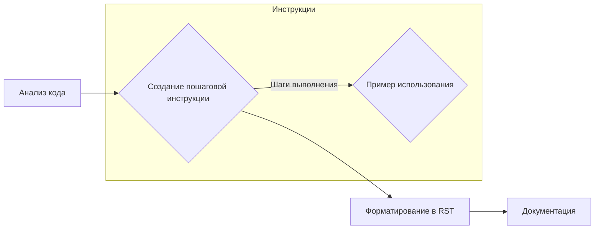

# Анализ кода - Инструкции для генерации документации

**1. <input code>**

```
**Инструкции для генерации документации к коду**

1. **Анализируй код**: Пойми логику и действия, выполняемые данным фрагментом кода.
  
2. **Создай пошаговую инструкцию**:
    - **Описание**: Объясни, что делает данный блок кода.
    - **Шаги выполнения**: Опиши последовательность действий в коде.
    - **Пример использования**: Приведи пример кода, как использовать данный фрагмент в проекте.

3. **Форматирование**: Следуй структуре в `reStructuredText (RST)`:

```rst
Как использовать этот блок кода
=========================================================================================\n\nОписание
-------------------------
[Объяснение, что делает код.]

Шаги выполнения
-------------------------
1. [Описание первого шага.]
2. [Описание второго шага.]
3. [Продолжай по необходимости...]

Пример использования
-------------------------
.. code-block:: python

    [Пример использования кода]
```

4. **Избегай расплывчатых терминов** вроде "получаем" или "делаем". Будь конкретным, что именно делает код, например: "проверяет", "валидирует" или "отправляет".
```

**2. <algorithm>**

Этот код представляет собой набор инструкций для написания документации к коду.  Нет явной блок-схемы в классическом понимании. Алгоритм состоит из четких шагов:

1. **Анализ кода:** Код необходимо проанализировать, чтобы понять его логику и действия.
2. **Создание пошаговой инструкции:**  Составление последовательности действий кода с примерами его использования.
3. **Форматирование в RST:** Подготовка документации в формате reStructuredText с использованием шаблона, представленного в коде.
4. **Избегать расплывчатости:**  Указание на то, что нужно использовать конкретные глаголы для описания действий кода.

**Пример:** Представьте, что у вас есть функция `calculate_average`.  Алгоритм будет включать шаги:

* Анализ функции `calculate_average`:  Узнать, что она делает (считает среднее значение).
* Создание пошаговой инструкции:  
   1. Взять список чисел
   2. Сложить все числа в списке
   3. Разделить сумму на количество чисел
   4. Вернуть среднее значение.
* Форматирование: Применение шаблона RST для описания этой функции.


**3. <mermaid>**



Эта диаграмма показывает взаимосвязь между этапами написания документации.  Нет прямых зависимостей от других частей проекта, так как это чисто текстовые инструкции.

**4. <explanation>**

* **Импорты:**  Нет импортов, так как код состоит из инструкций и шаблонов.
* **Классы:** Нет классов.
* **Функции:** Нет функций.
* **Переменные:** Нет переменных.
* **Возможные ошибки/улучшения:**  Инструкции не определяют специфические параметры кода, которые нужно документировать (например, типы данных, аргументы функций). Было бы полезно добавить рекомендации по типам кода, которые необходимо документировать, форматам (например, JSON, CSV) или другим особенностям. В идеале, инструкция должна быть более конкретной в отношении типов кода, которые следует описывать и форматов, для улучшения процесса документирования. 

**Цепочка взаимосвязей с другими частями проекта:**  Эти инструкции предназначены для *любого* кода, который будет разрабатываться в проекте. Они служат руководством для генерации документации, которая затем будет частью документации проекта.