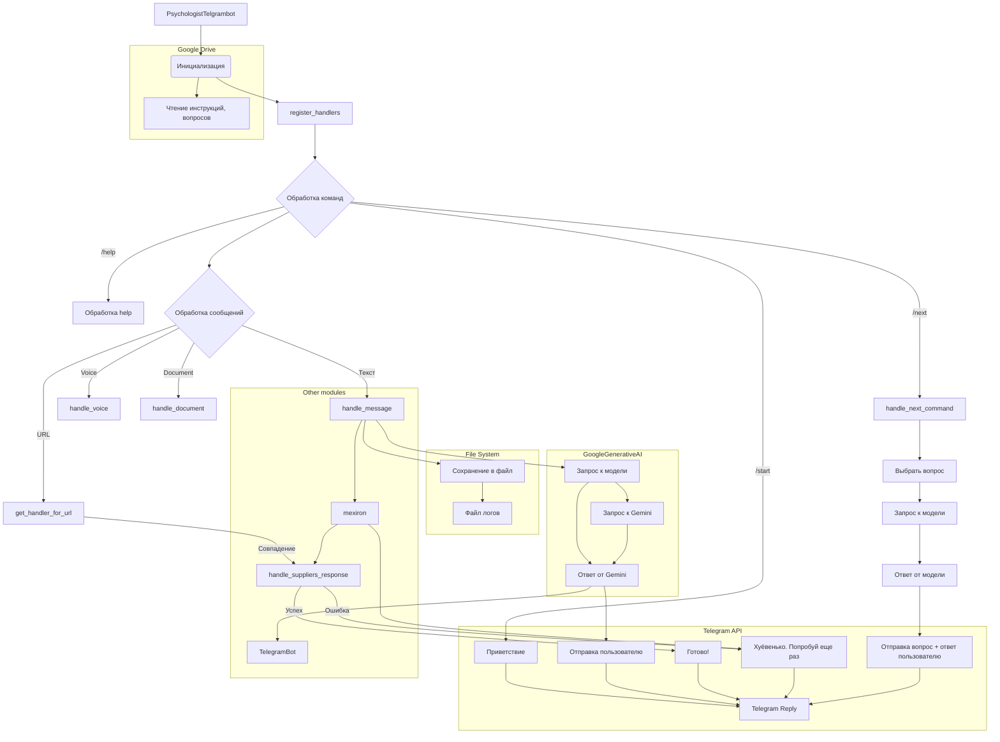

```MD
# <input code>

```python
## \file hypotez/src/endpoints/hypo69/psychologist_bot/bot.py
# -*- coding: utf-8 -*-\
#! venv/Scripts/python.exe
#! venv/bin/python/python3.12

"""
.. module: src.endpoints.hypo69.psychologist_bot 
	:platform: Windows, Unix
	:synopsis:

"""
MODE = 'dev'

"""
	:platform: Windows, Unix
	:synopsis:

"""


"""
	:platform: Windows, Unix
	:synopsis:

"""


"""
  :platform: Windows, Unix

"""
"""
  :platform: Windows, Unix
  :platform: Windows, Unix
  :synopsis:
"""MODE = 'dev'
  
""" module: src.endpoints.hypo69.psychologist_bot """


...
""" t.me/hypo69_psychologist_bot_bot's specific bot with customized behavior."""

import asyncio
from pathlib import Path
from typing import Optional
from dataclasses import dataclass, field
import random
from telegram import Update
from telegram.ext import CommandHandler, MessageHandler, filters, CallbackContext

from src import gs
from src.bots.telegram import TelegramBot
from src.webdriver import Driver, Chrome
from src.ai.gemini import GoogleGenerativeAI
from src.utils.file import read_text_file, recursively_read_text_files, save_text_file
from src.utils.url import is_url
from src.logger import logger

@dataclass
class PsychologistTelgrambot(TelegramBot):
    """Telegram bot with custom behavior for Kazarinov."""

    token: str = field(init=False)
    d: Driver = field(init=False)
    model: GoogleGenerativeAI = field(init=False)
    system_instruction: str = field(init=False)
    questions_list: list = field(init=False)
    timestamp: str = field(default_factory=lambda: gs.now)

    def __post_init__(self):
        mode = 'test'
        #self.token = gs.credentials.telegram.hypo69_test_bot if mode == 'test' else gs.credentials.telegram.hypo69_psychologist_bot
        self.token = gs.credentials.telegram.hypo69_psychologist_bot
        super().__init__(self.token)

        self.d = Driver(Chrome)
        
        self.system_instruction = read_text_file(
            gs.path.google_drive / 'hypo69_psychologist_bot' / 'prompts' / 'chat_system_instruction.txt'
        )
        self.questions_list = recursively_read_text_files(
            gs.path.google_drive / 'hypo69_psychologist_bot' / 'prompts' / 'train_data' / 'q', ['*.*'], as_list=True
        )

        self.model = GoogleGenerativeAI(
            api_key=gs.credentials.gemini.hypo69_psychologist_bot,
            system_instruction=self.system_instruction,
            generation_config={"response_mime_type": "text/plain"}
        )
        
        self.register_handlers()

    # ... (rest of the code)
```

# <algorithm>

**Пошаговая блок-схема:**

1. **Инициализация:**
    * Создается экземпляр класса `PsychologistTelgrambot`.
    * В конструкторе `__post_init__` считываются необходимые данные (токен, инструкции, вопросы).
    * Создаются экземпляры `Driver`, `GoogleGenerativeAI`.
    * Регистрируются обработчики команд и сообщений (`register_handlers`).

2. **Обработка команд:**
    * При команде `/start` возвращается приветствие.
    * При команде `/help` вызывается соответствующий обработчик.

3. **Обработка сообщений:**
    * Проверяются текстовые сообщения (`handle_message`).
    * Записывается сообщение пользователя в файл журнала.
    * Получается ответ от модели `GoogleGenerativeAI`.
    * Отправляется ответ пользователю.
    * (Дополнительные проверки) – для обработки URL.
    * Обработка voice и document messages.

4. **Обработка URL:**
    * Функция `get_handler_for_url` анализирует URL в сообщении.
    * Если URL соответствует определенному шаблону (например, поставщикам), вызывается соответствующая функция обработки (`handle_suppliers_response`, `handle_onetab_response`).


5. **Обработка внутренних команд**:
    * При команде `/next` – выбирается случайный вопрос из списка, отправляется в модель, и оба сообщения отправляются пользователю.


**Примеры данных:**

* **Входные данные:** Текстовое сообщение пользователя "Привет, расскажи мне про поставщиков".
* **Переменные:** `response = "Привет, расскажи мне про поставщиков"`.
* **Взаимодействие:** Вызов `get_handler_for_url`, поиск совпадения с URL поставщиков, вызов функции `handle_suppliers_response`.
* **Вывод:** Ответ от модели (`GoogleGenerativeAI`), например: "Вот информация о поставщиках".

# <mermaid>



# <explanation>

**Импорты:**

* `asyncio`: для асинхронного программирования.
* `pathlib`: для работы с путями к файлам.
* `typing`: для типов данных.
* `dataclasses`: для создания классов данных.
* `random`: для случайного выбора.
* `telegram`: для работы с Telegram API.
* `telegram.ext`: для создания обработчиков команд и сообщений.
* `src.gs`: предположительно, содержит глобальные настройки.
* `src.bots.telegram`: базовый класс бота для Telegram.
* `src.webdriver`: для работы с веб-драйвером.
* `src.ai.gemini`: для доступа к модели Gemini.
* `src.utils.file`: для работы с файлами.
* `src.utils.url`: для проверки URL.
* `src.logger`: для логирования.

**Классы:**

* `PsychologistTelgrambot(TelegramBot)`:  наследуется от класса `TelegramBot`.  Класс представляет собой бота для Telegram, который имеет специфические функции для работы с психологом, например, чтение вопросов, запрос ответов от `GoogleGenerativeAI` и отправка ответов пользователю.  Атрибуты `token`, `d`, `model`, `system_instruction`, `questions_list`, `timestamp` хранят необходимые данные для работы бота. `__post_init__` – инициализирует атрибуты и регистрирует обработчики команд. `register_handlers` – регистрирует обработчики для разных типов сообщений.  `handle_message` - обрабатывает текстовые сообщения от пользователя, в том числе обрабатывает URL.  `get_handler_for_url` – используется для маршрутизации сообщений на основе URL.  `handle_suppliers_response`, `handle_onetab_response` – обрабатывают URL, связанные с поставщиками и OneTab.  `handle_next_command` – генерирует и отправляет случайные вопросы и ответы пользователю. `handle_document` – обрабатывает загруженные документы.


**Функции:**

* `start`, `help_command`: Обработчики стандартных команд бота.
* `handle_message`: Обрабатывает текстовые сообщения, записывает их в лог и запрашивает ответ от модели.
* `handle_voice`: Обработчик голосовых сообщений.
* `handle_document`: Обработчик документов.
* `handle_suppliers_response`, `handle_onetab_response`: Обработчики URL, связанные с поставщиками и OneTab. Они вызываются из `get_handler_for_url`.  Эти функции, скорее всего, вызывают сценарии из модуля `mexiron`.
* `get_handler_for_url`:  Определяет, какой обработчик должен быть вызван для данного URL.
* `handle_next_command`:  Отправляет случайные вопросы из `questions_list` пользователю и получает ответ от модели `GoogleGenerativeAI`.


**Переменные:**

* `MODE`: хранит режим работы (например, 'dev', 'test').
* `token`: токен доступа к Telegram боту.
* `d`: экземпляр драйвера для веб-драйвера (Chrome).
* `model`: экземпляр класса `GoogleGenerativeAI`.
* `system_instruction`: инструкция для модели `GoogleGenerativeAI`.
* `questions_list`: список вопросов для бота.
* `timestamp`: текущая дата и время.
* `log_path`: путь к файлу логов чата.


**Возможные ошибки и улучшения:**

* Отсутствие явного указания на `mexiron` в коде.  Необходимо указать, как используется модуль `mexiron`.
* Отсутствие обработки ошибок при чтении вопросов.
* Необъектная структура – `mexiron`-функциональность вложенна в бот. Может быть лучше создать отдельный класс или модуль для работы с `mexiron`.
* Переменные `price`, `mexiron_name`, `urls` используются в `handle_onetab_response`, но не определены.  Они, вероятно, должны быть получены из сообщения пользователя.
* Логирование ошибок должно быть более подробным и содержать информацию о типе ошибки.
* Использование `super().__init__(...)` в `__post_init__` может вызвать неявную зависимость от параметров, задаваемых в базовом классе `TelegramBot`.

**Взаимосвязи с другими частями проекта:**

* `gs`: содержит глобальные настройки и данные, используемые ботом.
* `src.bots.telegram`: предоставляет базовые функции для работы с Telegram ботами.
* `src.webdriver`: предоставляет инструменты для работы с веб-драйверами.
* `src.ai.gemini`: обеспечивает доступ к модели Gemini для генерации текста.
* `src.utils.file`: предоставляет функции для работы с файлами.
* `src.utils.url`: предоставляет функции для работы с URL.
* `src.logger`: предоставляет инструменты для логирования.
* `mexiron`: вероятно, представляет собой отдельный модуль или класс для работы с определенными сценариями.  Он используется в `handle_suppliers_response` и `handle_onetab_response`.  Необходимо добавить детали о его назначении и использовании.