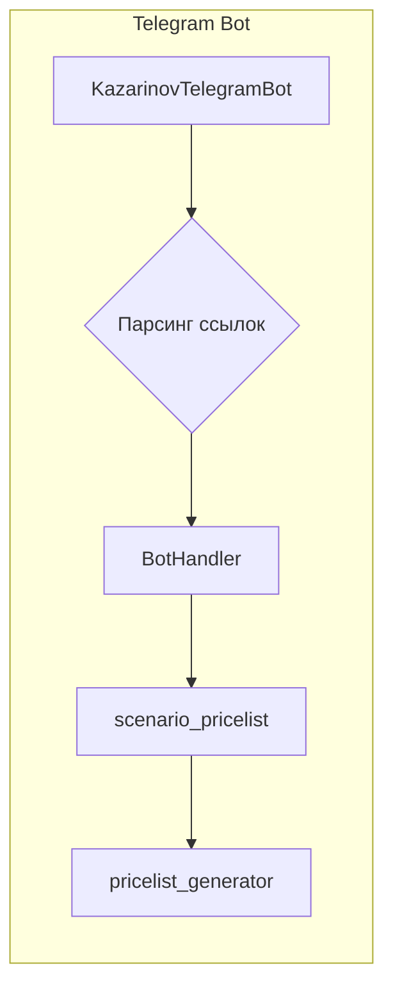

```MD
# Анализ кода из файла README.MD

## <input code>

```KazarinovTelegramBot`
- https://one-tab.co.il
- https://morlevi.co.il
- https://grandavance.co.il
- https://ivory.co.il
- https://ksp.co.il 
-------- 
`BotHandler` 
- парсит линки

bot -> handler -> scenario_pricelist -> pricelist_generator
```

## <algorithm>

К сожалению, предоставленный код в формате README.MD не содержит достаточно информации для построения подробной блок-схемы.  Он представляет собой описание архитектуры, а не код.  Поэтому блок-схема не может быть построена.

## <mermaid>



## <explanation>

**Описание архитектуры Telegram бота:**

Предоставленный фрагмент текста описывает архитектуру Telegram бота, а не код. Он показывает, как различные компоненты (модули) взаимодействуют друг с другом.

* **KazarinovTelegramBot:**  Является, по всей видимости, главным обработчиком сообщений от пользователя.  Он отвечает за ввод данных.
* **BotHandler:** Это обработчик, который принимает данные от `KazarinovTelegramBot` (например, ссылки) и выполняет над ними некоторую обработку (например, парсинг).
* **scenario_pricelist:**  Модуль, который получает данные из `BotHandler` и формирует какой-то сценарий или список цен.
* **pricelist_generator:** Модуль, который получает данные из `scenario_pricelist` и генерирует конечный список цен, возможно, в нужном формате для отправки пользователю.

**Отсутствующая информация и возможные улучшения:**

* **Нет кода:** Отсутствует сам код на каком-либо языке программирования.  Невозможно проанализировать типы данных, логику работы, переменные и т.д.
* **Неясные детали:** Непонятно, как `BotHandler` парсит ссылки.  Не указан формат данных, которые передаются между модулями.
* **Нет описания парсинга:** Не описан алгоритм парсинга ссылок, какие данные извлекаются.  
* **Нет информации о технологии:** Не указана технологическая платформа для разработки бота (Python, Node.js, etc). Это существенно влияет на понимание реализации и возможного языка кода.

**Цепочка взаимосвязей:**

```
KazarinovTelegramBot -> BotHandler -> scenario_pricelist -> pricelist_generator
```

Взаимосвязи описаны в схеме выше, где `KazarinovTelegramBot` получает данные из входящих сообщений, передает их `BotHandler`, и так далее по цепочке.  

**Возможные ошибки:**

Необходимо больше информации, чтобы определить потенциальные ошибки. Без кода невозможно сказать о таких ошибках, как ошибки в логике парсинга, проблемы с вводом данных, некорректная обработка исключений и т.д.

**Заключение:**

Данные README не содержат достаточной информации для детального анализа.  Для более глубокого понимания проекта необходимо предоставить сам код.