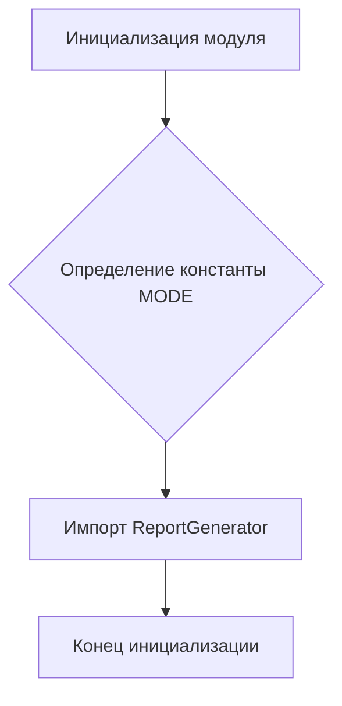
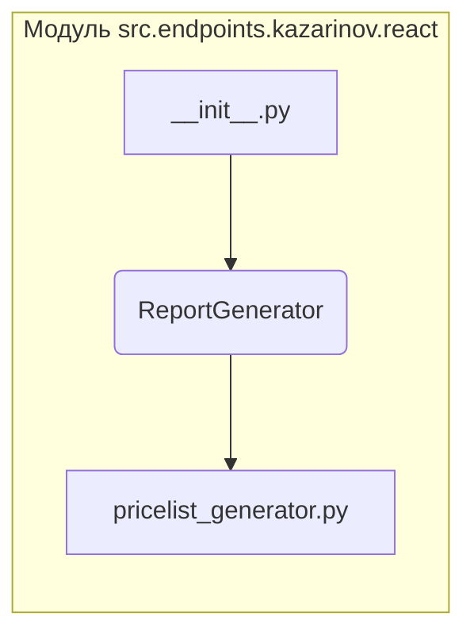

# <input code>

```python
## \file hypotez/src/endpoints/kazarinov/react/__init__.py
# -*- coding: utf-8 -*-
#! venv/Scripts/python.exe
#! venv/bin/python/python3.12

"""
.. module: src.endpoints.kazarinov.react 
	:platform: Windows, Unix
	:synopsis: Генератор прайслистов в формате `pdf`, `html`

"""
MODE = 'dev'

from .pricelist_generator import ReportGenerator
```

# <algorithm>

Этот код представляет собой инициализацию модуля `src.endpoints.kazarinov.react`.  Он не содержит логики выполнения, а скорее определяет константу `MODE` и импортирует класс `ReportGenerator` из подмодуля `pricelist_generator`.

**Блок-схема:**



**Пример:**

1.  Инициализируется модуль.
2.  Определяется значение переменной `MODE` равной 'dev'.
3.  Импортируется класс `ReportGenerator` из подмодуля `pricelist_generator`.
4.  Инициализация завершена.

Данные не передаются между функциями или классами в данном коде.


# <mermaid>




# <explanation>

* **Импорты:**
    * `from .pricelist_generator import ReportGenerator`:  Этот импорт подключает класс `ReportGenerator` из файла `pricelist_generator.py` в том же каталоге (`./pricelist_generator.py`).  Это означает, что `ReportGenerator` будет доступен для использования в этом модуле.  Он предполагает, что `pricelist_generator.py` находится в подкаталоге `react` относительно текущего файла `__init__.py`.

* **Классы:**
    * `ReportGenerator`:  Этот класс, вероятно, определен в файле `hypotez/src/endpoints/kazarinov/react/pricelist_generator.py` и отвечает за генерацию прайслистов.  Подробная информация о нем не доступна на основе предоставленного кода.  Нам нужно посмотреть код `ReportGenerator` для понимания его деталей.

* **Функции:**
    * Нет функций в данном коде.

* **Переменные:**
    * `MODE = 'dev'`: Это константа, которая, скорее всего, определяет режим работы приложения (например, 'dev' для разработки, 'prod' для производства).  Это может быть использовано в других частях кода для выбора различных конфигураций.

* **Возможные ошибки или области для улучшений:**
    * Отсутствует проверка существования файла `pricelist_generator.py`. Если файла нет, произойдет ошибка импорта.
    *  Не указана документация для `ReportGenerator` (документированные атрибуты и методы).

* **Связи с другими частями проекта:**
    * Этот модуль является частью проекта `hypotez` и, судя по пути, связан с обработкой данных и генерацией отчетов для какой-то бизнес-логики. Для определения точных связей нужно изучить другие части кодовой базы.  Вероятно, этот код используется другими частями приложения для генерации и использования сгенерированных прайслистов.


**Дальнейшие шаги:**

Для более глубокого анализа требуется посмотреть код файла `hypotez/src/endpoints/kazarinov/react/pricelist_generator.py`.  Это позволит понять логику генерации прайслистов и взаимодействие с другими частями приложения.