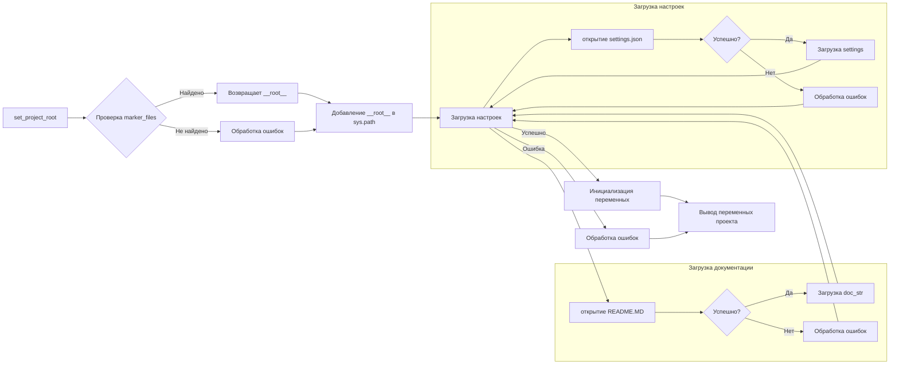

```MD
# <input code>

```python
## \file hypotez/src/endpoints/kazarinov/react/header.py
# -*- coding: utf-8 -*-\
#! venv/Scripts/python.exe
#! venv/bin/python/python3.12

"""
.. module: src.endpoints.kazarinov.react 
	:platform: Windows, Unix
	:synopsis:

"""
MODE = 'dev'

import sys
import json
from packaging.version import Version

from pathlib import Path
def set_project_root(marker_files=('pyproject.toml', 'requirements.txt', '.git')) -> Path:
    """
    Finds the root directory of the project starting from the current file's directory,
    searching upwards and stopping at the first directory containing any of the marker files.

    Args:
        marker_files (tuple): Filenames or directory names to identify the project root.
    
    Returns:
        Path: Path to the root directory if found, otherwise the directory where the script is located.
    """
    __root__:Path
    current_path:Path = Path(__file__).resolve().parent
    __root__ = current_path
    for parent in [current_path] + list(current_path.parents):
        if any((parent / marker).exists() for marker in marker_files):
            __root__ = parent
            break
    if __root__ not in sys.path:
        sys.path.insert(0, str(__root__))
    return __root__


# Get the root directory of the project
__root__ = set_project_root()
"""__root__ (Path): Path to the root directory of the project"""

from src import gs

settings:dict = None
try:
    with open(gs.path.root / 'src' /  'settings.json', 'r') as settings_file:
        settings = json.load(settings_file)
except (FileNotFoundError, json.JSONDecodeError):
    ...

doc_str:str = None
try:
    with open(gs.path.root / 'src' /  'README.MD', 'r') as settings_file:
        doc_str = settings_file.read()
except (FileNotFoundError, json.JSONDecodeError):
    ...


__project_name__ = settings.get("project_name", 'hypotez') if settings  else 'hypotez'
__version__: str = settings.get("version", '')  if settings  else ''
__doc__: str = doc_str if doc_str else ''
__details__: str = ''
__author__: str = settings.get("author", '')  if settings  else ''
__copyright__: str = settings.get("copyrihgnt", '')  if settings  else ''
__cofee__: str = settings.get("cofee", "Treat the developer to a cup of coffee for boosting enthusiasm in development: https://boosty.to/hypo69")  if settings  else "Treat the developer to a cup of coffee for boosting enthusiasm in development: https://boosty.to/hypo69"
```

# <algorithm>

**Шаг 1:**  `set_project_root(marker_files)` находит корневой каталог проекта.
    * Начинает поиск с текущего каталога файла.
    * Проверяет, содержат ли родительские каталоги указанные `marker_files` (pyproject.toml, requirements.txt, .git).
    * Если найден, то возвращает этот каталог.
    * Добавляет корневой каталог в `sys.path`, чтобы модули `src` были доступны.


**Шаг 2:** Получение корневого каталога.
    * Вызов `set_project_root()` для получения пути к корневому каталогу проекта.
    * Результат сохраняется в переменной `__root__`.


**Шаг 3:** Загрузка настроек.
    * Попытка открыть файл `settings.json` в корневом каталоге проекта.
    * Если файл существует и правильно отформатирован, загружает данные в словарь `settings`.
    * Если файл не найден или некорректно отформатирован, обрабатывает ошибку (пропускает этот блок).


**Шаг 4:** Загрузка документации.
    * Попытка открыть файл `README.MD` в корневом каталоге проекта.
    * Если файл существует, загружает содержимое в переменную `doc_str`.
    * Если файл не найден или некорректно отформатирован, обрабатывает ошибку.


**Шаг 5:** Инициализация переменных.
    * Создает переменные, содержащие информацию о проекте (имя проекта, версия, документация и т.д.).
    * Получает значения из словаря `settings` или устанавливает значения по умолчанию, если `settings` не определен или значение не найдено.


# <mermaid>


**Зависимости:**
* `pathlib`: для работы с путями к файлам.
* `json`: для работы с JSON-файлами.
* `packaging.version`: для работы с версиями.
* `sys`: для управления переменной `sys.path`.
* `gs`: из модуля `src`. Вероятно, содержит вспомогательные функции для работы с путями проекта.

# <explanation>

**Импорты:**
* `sys`: предоставляет доступ к системным переменным и функциям, в данном случае используется для манипуляции с `sys.path`.
* `json`: используется для работы с файлами JSON, например, для загрузки настроек проекта.
* `packaging.version`: используется для работы с версиями пакетов.
* `pathlib`: предоставляет удобный способ работы с путями к файлам.
* `src.gs`: импортирует модуль `gs`, скорее всего, содержащий вспомогательные функции для работы с файлами проекта.

**Классы:**
Нет определенных классов.

**Функции:**
* `set_project_root(marker_files)`: Находит корневой каталог проекта, начиная с текущего файла, поднимаясь по иерархии каталогов.
    * Аргумент `marker_files`: кортеж, содержащий имена файлов или каталогов, по которым происходит поиск.
    * Возвращает `Path` объект, представляющий корневой каталог или текущий каталог, если не найден корневой.


**Переменные:**
* `MODE`, `__root__`, `settings`, `doc_str`:  имеют типизацию.
* `__project_name__`, `__version__`, `__doc__`, `__details__`, `__author__`, `__copyright__`, `__cofee__`:  содержат информацию о проекте, полученную из `settings.json` или установлены по умолчанию.

**Возможные ошибки и улучшения:**
* **Обработка ошибок:**  Код включает `try...except` блоки для обработки `FileNotFoundError` и `json.JSONDecodeError`, но это не идеально. Могло бы быть более подробная обработка ошибок.
* **Проверка корректности данных:**  В коде нет проверки корректности данных, полученных из `settings.json`.
* **Документация:** можно добавить более подробную документацию к функциям и переменным.
* **`gs` модуль:**  Код использует `gs.path.root`.  Необходима информация о назначении и реализации этого модуля для лучшего понимания.


**Взаимосвязи с другими частями проекта:**
Код активно использует `gs`, импортированный из `src`.  Предполагается, что `gs` содержит вспомогательные функции для работы с ресурсами проекта, такими как поиск и обработка пути.  Функция `set_project_root` необходима для того, чтобы определить корневую директорию проекта, так что все модули могли бы импортироваться правильно.  Связь с `settings.json` и `README.MD` — это получение важной информации о проекте. Код, вероятно, является частью большего проекта, где эти данные используются для инициализации или конфигурации других частей системы.