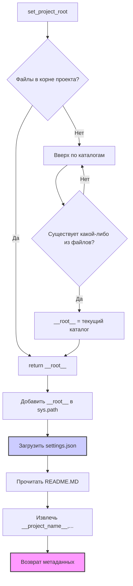

```MD
# Объяснение кода из файла hypotez/src/endpoints/kazarinov/scenarios/header.py

## <input code>

```python
## \file hypotez/src/endpoints/kazarinov/scenarios/header.py
# -*- coding: utf-8 -*-\
#! venv/Scripts/python.exe
#! venv/bin/python/python3.12

"""
.. module: src.endpoints.kazarinov.scenarios 
	:platform: Windows, Unix
	:synopsis:

"""
MODE = 'dev'

import sys
import json
from packaging.version import Version

from pathlib import Path
def set_project_root(marker_files=('pyproject.toml', 'requirements.txt', '.git')) -> Path:
    """
    Finds the root directory of the project starting from the current file's directory,
    searching upwards and stopping at the first directory containing any of the marker files.

    Args:
        marker_files (tuple): Filenames or directory names to identify the project root.
    
    Returns:
        Path: Path to the root directory if found, otherwise the directory where the script is located.
    """
    __root__:Path
    current_path:Path = Path(__file__).resolve().parent
    __root__ = current_path
    for parent in [current_path] + list(current_path.parents):
        if any((parent / marker).exists() for marker in marker_files):
            __root__ = parent
            break
    if __root__ not in sys.path:
        sys.path.insert(0, str(__root__))
    return __root__


# Get the root directory of the project
__root__ = set_project_root()
"""__root__ (Path): Path to the root directory of the project"""

from src import gs

settings:dict = None
try:
    with open(gs.path.root / 'src' /  'settings.json', 'r') as settings_file:
        settings = json.load(settings_file)
except (FileNotFoundError, json.JSONDecodeError):
    ...

doc_str:str = None
try:
    with open(gs.path.root / 'src' /  'README.MD', 'r') as settings_file:
        doc_str = settings_file.read()
except (FileNotFoundError, json.JSONDecodeError):
    ...


__project_name__ = settings.get("project_name", 'hypotez') if settings  else 'hypotez'
__version__: str = settings.get("version", '')  if settings  else ''
__doc__: str = doc_str if doc_str else ''
__details__: str = ''
__author__: str = settings.get("author", '')  if settings  else ''
__copyright__: str = settings.get("copyrihgnt", '')  if settings  else ''
__cofee__: str = settings.get("cofee", "Treat the developer to a cup of coffee for boosting enthusiasm in development: https://boosty.to/hypo69")  if settings  else "Treat the developer to a cup of coffee for boosting enthusiasm in development: https://boosty.to/hypo69"
```

## <algorithm>

1. **Инициализация:** Устанавливается переменная `MODE` со значением 'dev'. Импортируются необходимые библиотеки: `sys`, `json`, `Version` из `packaging`, `Path` из `pathlib`.
2. **Нахождение корневой директории проекта:** Функция `set_project_root` ищет корень проекта, начиная с текущего файла и идя вверх по дереву каталогов.  Она проверяет, существуют ли файлы `pyproject.toml`, `requirements.txt`, или `.git` в текущем или родительском каталоге. Если такой каталог найден, то добавляется в `sys.path` для импорта модулей из корня проекта.
3. **Чтение настроек проекта:** Считываются настройки проекта из файла `settings.json` в переменную `settings` с использованием `gs.path.root`.  Обработка исключений `FileNotFoundError` и `json.JSONDecodeError` при отсутствии или неправильном формате файла.
4. **Чтение документации проекта:** Считывается файл `README.MD` в переменную `doc_str` (аналогично предыдущему шагу).
5. **Получение метаданных проекта:** Из переменной `settings` извлекаются значения `project_name`, `version`, `author`, `copyright`, `cofee`,  предотвращая ошибки при отсутствии соответствующих ключей в `settings`.
6. **Возвращаемое значение:** Функция `set_project_root` возвращает корневой каталог проекта (`__root__`).
7. **Использование метаданных:** В коде используются `__project_name__`, `__version__`, `__doc__` и другие переменные, содержащие метаданные проекта.

## <mermaid>



## <explanation>

**Импорты:**
- `sys`: Предоставляет доступ к системным переменным и функциям. Используется для добавления корневого каталога в `sys.path`.
- `json`: Используется для работы с файлами JSON (чтения и записи настроек).
- `packaging.version`: Библиотека для работы с версиями.  Используется в более современных проектах, чем просто проверка версии.
- `pathlib`: Предоставляет объект `Path`, который облегчает работу с файлами и каталогами.


**Классы:**
- Нет явных классов в данном коде.


**Функции:**
- `set_project_root(marker_files)`: Находит корневой каталог проекта, начиная с текущего файла и двигаясь вверх по дереву каталогов.  Аргумент `marker_files` позволяет настраивать файлы/каталоги, используемые для определения корневого каталога. Возвращает `Path` до корневого каталога.


**Переменные:**
- `MODE`: Строковая переменная, которая используется, вероятно, для обозначения режима работы проекта (например, 'dev', 'prod').
- `__root__`: Переменная `Path`, хранящая корневой путь проекта, полученный с помощью `set_project_root`.
- `settings`: Словарь, содержащий настройки проекта, загруженные из файла `settings.json`.
- `doc_str`: Строковая переменная, хранящая содержимое файла `README.MD`.
- `__project_name__`, `__version__`, `__author__`, `__copyright__`, `__cofee__`: Переменные, содержащие метаданные проекта, полученные из файла `settings.json`.
- `marker_files`: Кортеж, содержащий имена файлов или каталогов, используемые для определения корневого каталога проекта.


**Возможные ошибки и улучшения:**

- **Обработка ошибок:** Использование `try...except` для обработки `FileNotFoundError` и `json.JSONDecodeError` – хорошая практика, но в некоторых случаях можно использовать более специфические исключения или использовать `contextlib.suppress` для более точного управления исключениями.


**Взаимосвязи с другими частями проекта:**

- `gs.path.root`: Предполагается, что `gs` - это модуль, который предоставляет полезные функции, связанные с файловыми путями. Это указывает на наличие в проекте структуры для управления путями, вероятно, связанной с файлами конфигурации. Код полагается на наличие этой структуры для корректного поиска настроек. Необходимо уточнить реализацию `gs.path.root`, чтобы полностью понять взаимосвязи.


**Общее:**

Код выполняет полезную задачу по определению корневого каталога проекта и извлечению метаданных.  Правильное использование `Path` и обработка ошибок делают его надежным.  Необходим дальнейший анализ модуля `gs` для понимания полного контекста.