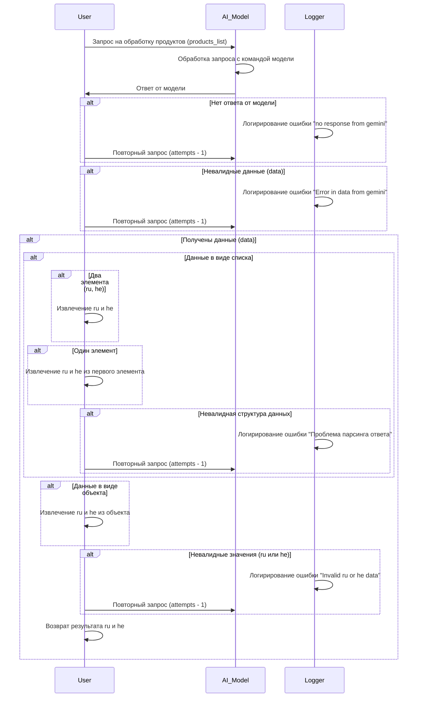

# Анализ кода

## <input code>



## <algorithm>

Алгоритм представляет собой описание процесса обработки запроса на обработку списка продуктов (products_list) через модель AI.

1. **Инициализация**: Пользователь отправляет запрос `products_list` модели AI.
2. **Обработка модели**: Модель AI обрабатывает запрос.
3. **Ответ от модели**: Модель возвращает данные.
4. **Проверка ответа**:
   - Если ответа нет, логгируется ошибка "no response from gemini" и отправляется повторный запрос.
   - Если данные невалидны, логгируется ошибка "Error in data from gemini" и отправляется повторный запрос.
5. **Проверка структуры данных**:
   - Если данные – список:
     - Если список содержит два элемента (ru, he), извлекаются эти значения.
     - Если список содержит один элемент, извлекаются значения ru и he из этого элемента.
     - Если структура невалидна, логгируется ошибка "Проблема парсинга ответа" и отправляется повторный запрос.
   - Если данные – объект, извлекаются значения ru и he из объекта.
6. **Проверка значений**:
   - Если значения ru или he невалидны, логгируется ошибка "Invalid ru or he data" и отправляется повторный запрос.
7. **Возврат результата**:  Пользователю возвращается результат с извлеченными значениями ru и he.


## <mermaid>

```mermaid
graph LR
    A[User] --> B{AI_Model};
    B --> C{Обработка запроса};
    C -- Ответ OK --> D[Данные];
    C -- Нет ответа --> E[Logger (Ошибка)];
    C -- Невалидные данные --> E;
    D -- Список (ru, he) --> F[Извлечение ru, he];
    D -- Список (1 элемент) --> F;
    D -- Объект --> F;
    D -- Невалидная структура --> E;
    D -- Невалидные значения (ru/he) --> E;
    F --> G[User (Возврат ru, he)];
    E --> H[Повторный запрос];
    H --> B;
    style G fill:#ccf;
```

## <explanation>

Данный код представляет собой блок-схему, описывающую взаимодействие пользователя с моделью AI для обработки списка продуктов.  Он не содержит Python-код, а описывает процесс.

* **Импорты**:  В данном примере импортов нет. Это описание последовательности действий.
* **Классы**: Нет классов. Вместо этого, есть описание участников (User, AI_Model, Logger).
* **Функции**:  Нет функций в классическом понимании.  Это диаграмма взаимодействия, описывающая шаги алгоритма.
* **Переменные**: Переменные представлены в виде входных данных (products_list), результатах, и атрибутах (например, количество попыток - attempts). Типы этих переменных не указаны, но предполагается, что это может быть список, объект или другое структурированное данные.
* **Возможные ошибки или области для улучшений**:  Описание слишком упрощенно.  Необходимо более детальное описание логики внутри обработки модели AI, а также спецификаций возвращаемых данных. Например, как модель AI получает запрос, какие ошибки могут быть, как происходит повторный запрос и т.д.

**Взаимосвязь с другими частями проекта**:  Описание предполагает, что существуют компоненты для логирования (`Logger`), модели AI (`AI_Model`), а также механизм для отправки и получения запросов (`User`). Эти компоненты являются частью более крупного проекта, который отвечает за обработку данных и взаимодействие с пользователем.