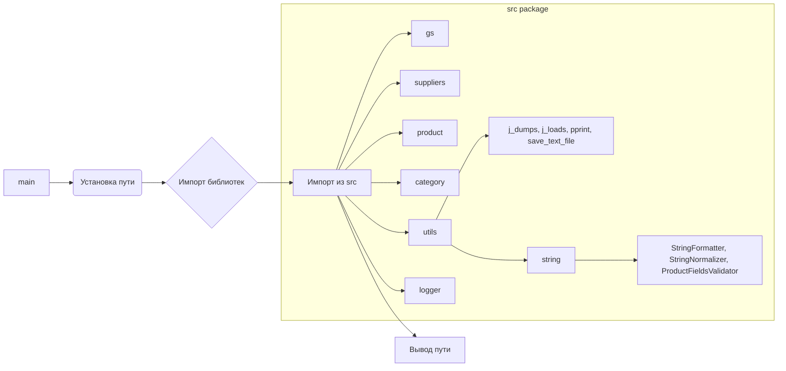

```MD
# <input code>

```python
## \file hypotez/src/endpoints/prestashop/_examples/header.py
# -*- coding: utf-8 -*-
#! venv/Scripts/python.exe
#! venv/bin/python/python3.12

"""
.. module: src.endpoints.prestashop._examples 
	:platform: Windows, Unix
	:synopsis:

"""
MODE = 'dev'

"""
	:platform: Windows, Unix
	:synopsis:

"""


"""
	:platform: Windows, Unix
	:synopsis:

"""


"""
  :platform: Windows, Unix

"""
"""
  :platform: Windows, Unix
  :platform: Windows, Unix
  :synopsis:
"""MODE = 'dev'
  
""" module: src.endpoints.prestashop._examples """


import sys
import os
from pathlib import Path

dir_root : Path = Path (os.getcwd()[:os.getcwd().rfind('hypotez')+11])
sys.path.append (str (dir_root) )  # Добавляю корневую папку в sys.path
dir_src = Path (dir_root, 'src')
sys.path.append (str (dir_root) ) 
...

print(dir_root)
# ----------------
from pathlib import Path
import json
import re
# ----------------

from src import gs
from src.suppliers import Supplier
from src.product import Product, ProductFields, ProductFieldsLocators
from src.category import Category
from src.utils import j_dumps, j_loads,   pprint, save_text_file
from src.logger import logger
from src.utils.string import StringFormatter, StringNormalizer, ProductFieldsValidator
...
```

# <algorithm>

Алгоритм работы данного кода состоит из нескольких этапов:

1. **Установка пути:** Код определяет корневую директорию проекта (`dir_root`) и добавляет её в системный путь (`sys.path`). Это необходимо для импорта модулей из других директорий проекта.

2. **Импорт библиотек:** После установки пути, происходит импорт необходимых библиотек (`sys`, `os`, `pathlib`, `json`, `re`,  и модулей из пакета `src`).

3. **Дополнительные импорты:** Далее импортируются классы и функции из различных модулей пакета `src`.
   - `gs`: Вероятно, модуль для работы с Google Sheets или другим схожим сервисом.
   - `Supplier`, `Product`, `ProductFields`, `ProductFieldsLocators`, `Category`: Модули, связанные с сущностями данных (поставщики, продукты, категории).
   - `j_dumps`, `j_loads`, `pprint`, `save_text_file`: Функции для работы с JSON, форматирования вывода и сохранения данных в текстовые файлы.
   - `logger`: Модуль для ведения логов.
   - `StringFormatter`, `StringNormalizer`, `ProductFieldsValidator`: Функции для работы со строками, нормализации и валидации данных.

4. **Вывод пути:** Наконец, выводится путь к корню проекта (`dir_root`).

**Пример:**
Если `os.getcwd()` возвращает `/home/user/project/hypotez`, то `dir_root` будет `/home/user/project/`.
Затем `sys.path` дополняется этой строкой.

# <mermaid>



**Объяснение диаграммы:**

Главная функция (`main`) вызывает функцию установки пути, которая в свою очередь вызывает импорт библиотек и модулей из пакета `src`.  `src` содержит модули `gs`, `suppliers`, `product`, `category`, `utils`, `logger`, и `utils.string`. В свою очередь,  `utils.string` содержит подмодули  `StringFormatter`, `StringNormalizer`, `ProductFieldsValidator`.
Эта диаграмма отображает иерархию импортов и зависимости между модулями.

# <explanation>

**Импорты:**

- `sys`, `os`, `pathlib`: Стандартные библиотеки Python, используемые для управления системным путем, файловой системой и работа с путями.
- `json`, `re`: Библиотеки для работы с JSON-данными и регулярными выражениями (вероятно, для парсинга и обработки текста).
-  Модули из `src`: Это явное указание на то, что этот скрипт входит в состав более крупного проекта, где `src` - это основная директория с пакетами и модулями приложения.  Это позволяет структурировать код и использовать общие функции.


**Классы:**

- `Supplier`, `Product`, `Category`: Представляют собой классы, вероятно, описывающие структуру данных для поставщиков, продуктов и категорий, используемые в приложении. 
- `ProductFields`, `ProductFieldsLocators`: Предполагаемые классы для хранения и поиска полей в структуре данных продукта.
-  `StringFormatter`, `StringNormalizer`, `ProductFieldsValidator`: Классы для форматирования, нормализации и валидации строк, вероятно, предназначенные для обработки данных.
- `gs`: Модуль для работы с внешними данными, скорее всего, связан с сервесом Google Sheets или похожим инструментом.

**Функции:**

- `j_dumps`, `j_loads`: Функции для сериализации и десериализации данных в формате JSON.
- `pprint`: Функция для красивого вывода данных (часто используется для отладки).
- `save_text_file`: Функция для сохранения текстовых данных в файлы.
- `logger`: Модуль для записи логов в файл/консоль.

**Переменные:**

- `dir_root`:  Путь к корневой директории проекта.
- `dir_src`: Путь к директории `src`.
- `MODE`: Переменная, вероятно, определяющая режим работы приложения ('dev', 'prod' и т.д.).

**Возможные ошибки/улучшения:**

- Не хватает комментариев в коде.
- Отсутствует обработка исключений (например, при работе с файлами или JSON).
- Не совсем понятно, что происходит с `...` в коде. Необходимо его продолжить для полноценного анализа.
- Проверка корректности пути к корню проекта (обработка случаев, когда `hypotez` не найдена).
- Вариант использования `sys.path.append(str(dir_root))` дважды выглядит избыточным.

**Взаимосвязь с другими частями проекта:**

Код устанавливает путь к корневому каталогу проекта, подключая модули из директории `src`. Это указывает на то, что этот код является частью более крупного проекта, где `src` содержит общие библиотеки и классы.  Без доступа к остальному коду проекта трудно определить все зависимости и взаимосвязи.