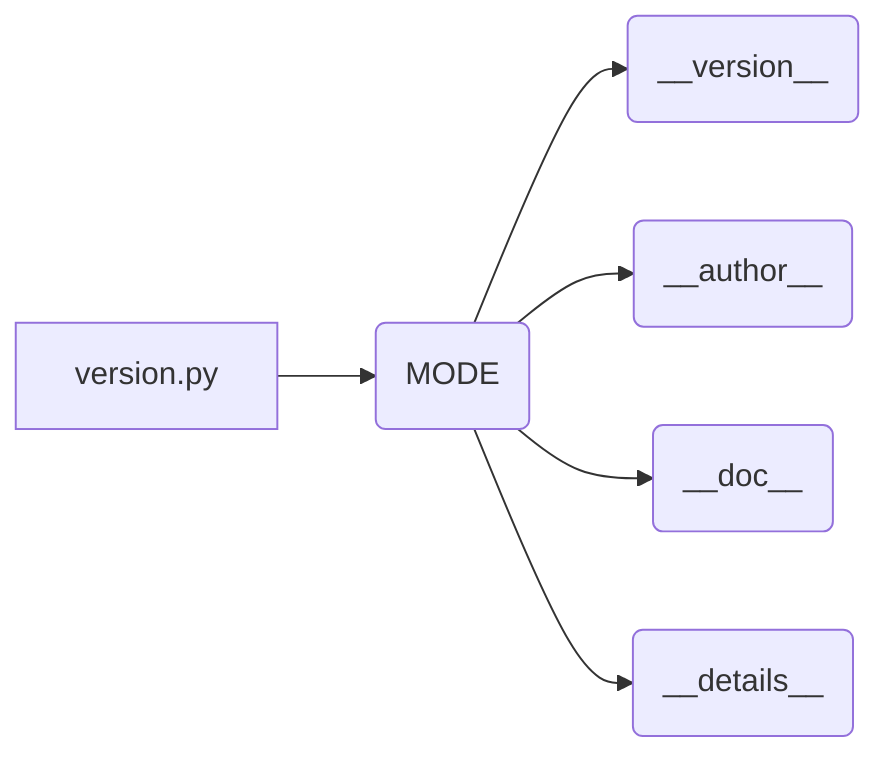

# <input code>

```python
## \file hypotez/src/endpoints/prestashop/_examples/version.py
# -*- coding: utf-8 -*-\
#! venv/Scripts/python.exe
#! venv/bin/python/python3.12

"""
.. module: src.endpoints.prestashop._examples 
	:platform: Windows, Unix
	:synopsis:

"""
MODE = 'dev'

"""
	:platform: Windows, Unix
	:synopsis:

"""


"""
	:platform: Windows, Unix
	:synopsis:

"""


"""
  :platform: Windows, Unix

"""
"""
  :platform: Windows, Unix
  :platform: Windows, Unix
  :synopsis:
"""MODE = 'dev'
  
""" module: src.endpoints.prestashop._examples """


"""
- `__version__`: This variable holds the version of the module or package.
- `__name__`: Contains the name of the module. If the script is being run directly, the value will be `"__main__"`.
- `__doc__`: The module's documentation string.
- `__details__`: This variable likely contains additional details about the module, but the exact purpose depends on the specific module or package.
- `__annotations__`: Contains type annotations for variables and functions in the module.
- `__author__`: The name(s) of the author(s) of the module.
"""
__name__:str
__version__="3.12.0.0.0.4"
__doc__:str
__details__:str="Details about version for module or class"
__annotations__

__author__='hypotez '
```

# <algorithm>

Этот код не содержит алгоритма в традиционном понимании. Он определяет переменные, описывающие модуль,  и устанавливает значения переменных, которые описывают версию, автора и т.д.  Данные не перемещаются между функциями или классами, поскольку в коде нет вызовов функций или методов.

# <mermaid>



# <explanation>

Этот файл `version.py` — это модуль Python, содержащий метаданные о самом себе:

* **`__version__`**:  Строковая переменная, хранящая версию модуля.  В данном случае "3.12.0.0.0.4".

* **`__name__`**: Строковая переменная, хранящая имя модуля (`version.py`).  Если этот файл запускается как скрипт (не импортируется в другой), то `__name__` будет равно `"__main__"`.  В данном контексте `__name__:str` — это **типовая аннотация** , указывающая на строковый тип переменной.

* **`__doc__`**: Строковая переменная, хранящая документацию модуля.  В данном случае пустая строка.

* **`__details__`**: Строковая переменная, хранящая дополнительные детали.

* **`__annotations__`**: Пустая переменная.  В Python 3.x можно указывать типы переменных и функций. 

* **`__author__`**:  Строковая переменная, содержащая имя автора модуля. В данном случае это `"hypotez"`.

* **`MODE`**: Строковая переменная, вероятно, определяющая режим работы. В данном случае установлено значение "dev".

**Структура файла**: Файл предназначен для хранения информации о самом модуле/пакете.  Он не содержит выполняемого кода (никаких функций, циклов и т.д.).

**Связь с другими частями проекта**: Этот файл является частью проекта `hypotez`.  Его содержимое необходимо для описания модуля в контексте проекта.  Его использование подразумевает, что другие части проекта будут взаимодействовать с этим модулем, используя эти метаданные для, например, управления версиями.  Влияния на другие части проекта могут включать:
- **Система управления версиями (например, Git):**  Значение `__version__` используется для отслеживания изменений и версии.
- **Инструменты документирования:**  `__doc__` используется для генерации документации.
- **Автоматизированные инструменты:**  Модули/пакеты могут использовать эти переменные для проверки версий, автоустановок и т.д.


**Возможные ошибки/улучшения**:

* Отсутствие реальной логики. В файле нет ни одной функции или метода, которые могут выполнить какую-то работу.
* Неиспользование `__all__` для списка импортируемых атрибутов. Необходимость указания, какие атрибуты будут доступны при импорте.
* Отсутствие более подробной документации. Недостаточно информации о назначении переменных `MODE`, `__details__`, `__annotations__`.