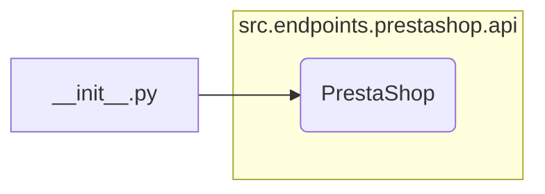

```MD
# Анализ кода hypotez/src/endpoints/prestashop/api/__init__.py

1. **<input code>**

```python
## \file hypotez/src/endpoints/prestashop/api/__init__.py
# -*- coding: utf-8 -*-\
#! venv/Scripts/python.exe
#! venv/bin/python/python3.12

"""
.. module: src.endpoints.prestashop.api 
	:platform: Windows, Unix
	:synopsis:

"""
MODE = 'dev'

from .api import PrestaShop
```

2. **<algorithm>**

Код представляет собой инициализацию модуля `prestashop.api`. Алгоритм прост: он импортирует класс `PrestaShop` из подмодуля `api` того же каталога.  По сути, это импорт, без вычислений или сложных логических операций.

**Пример:**

Начальный момент -> Импорт `PrestaShop` -> Конец.

**Перемещение данных:**  В этом случае нет перемещения данных между функциями. Данные не обрабатываются.


3. **<mermaid>**



4. **<explanation>**

* **Импорты:**  `from .api import PrestaShop` импортирует класс `PrestaShop` из подмодуля `api` текущей директории (`./api`).  Это типичный импорт, используемый для доступа к определениям классов и функций внутри связанных модулей.  Связь - `src.endpoints.prestashop.api` является подмодулем проекта. Импорт указывает на существование файла `api.py` в каталоге `hypotez/src/endpoints/prestashop/api/`.

* **Классы:** Класс `PrestaShop` определен в файле `api.py`.  Данный код инициализирует модуль. Подробное описание класса `PrestaShop` не предоставлено и необходимо дополнительное исследование.

* **Функции:** В этом фрагменте кода нет функций. Есть константа `MODE`.

* **Переменные:**  `MODE = 'dev'` -  строковая константа, вероятно, используемая для указания режима работы (например, разработки).  Тип - строка.

* **Возможные ошибки/улучшения:**

    * Отсутствие документации для класса `PrestaShop` (в файле `api.py`).
    *  Необходимо убедиться в существовании файла `.api.py` в указанном пути.
    * Нет  информации о том, как этот модуль используется в большей системе.

**Цепочка взаимосвязей:**

Файл `__init__.py` в данном контексте служит для инициализации модуля `prestashop.api`.  Для понимания полной картины, необходимо рассмотреть взаимодействие с другими частями приложения, которые будут импортировать и использовать этот модуль для взаимодействия с API Престашоп.  Например, это может быть часть веб-приложения, выполняющего запросы к API Престашоп.