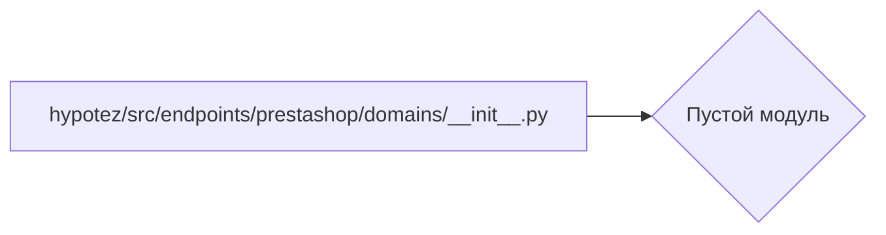

# Анализ кода hypotez/src/endpoints/prestashop/domains/__init__.py

## <input code>

```python
## \file hypotez/src/endpoints/prestashop/domains/__init__.py
# -*- coding: utf-8 -*-\
#! venv/Scripts/python.exe
#! venv/bin/python/python3.12

"""
.. module: src.endpoints.prestashop.domains 
	:platform: Windows, Unix
	:synopsis:

"""
MODE = 'dev'

"""
	:platform: Windows, Unix
	:synopsis:

"""


"""
	:platform: Windows, Unix
	:synopsis:

"""


"""
  :platform: Windows, Unix

"""
"""
  :platform: Windows, Unix
  :platform: Windows, Unix
  :synopsis:
"""MODE = 'dev'
  
""" module: src.endpoints.prestashop.domains """
```

## <algorithm>

Код представляет собой пустой модуль `__init__.py` для пакета `hypotez/src/endpoints/prestashop/domains`.  Он не содержит логики,  а скорее служит организационным контейнером для потенциальных модулей и классов внутри этого пакета.  Блок-схема будет пустой, так как нет исполняемых действий.

## <mermaid>



## <explanation>

**Импорты:**

Модуль `__init__.py` не содержит импортов. Это обычная практика для создания пакета Python.  Внутри папки `domains` могут располагаться дополнительные модули или файлы, которые будут импортированы другими частями приложения.

**Классы:**

В файле нет определений классов.

**Функции:**

Нет функций.

**Переменные:**

`MODE = 'dev'` — строковая переменная, хранящая константу, вероятно, режим работы.  В контексте проекта,  `MODE` вероятно используется для выбора поведения (разработка, продакшен и т.д.) в других частях приложения.

**Возможные ошибки и улучшения:**

* **Недостаток функциональности:**  Файл `__init__.py` пустой. Он не содержит никакой логики и не выполняет какую-либо работу. Это может быть приемлемо в зависимости от дизайна проекта, но может быть полезно добавить импорт подключаемых модулей или конфигураций.


**Цепочка взаимосвязей:**

Данный модуль является частью более крупного проекта `hypotez`. Взаимосвязь будет определяться тем, как другие части проекта используют или импортируют модули, потенциально находящиеся внутри пакета `hypotez/src/endpoints/prestashop/domains`.  Например, если в этом пакете определены классы, отвечающие за взаимодействие с  Prestashop, то они будут импортированы и использованы в других частях приложения.  Именно здесь будет прослеживаться связь с другими частями проекта.  Пока же эта связь не прослеживается, так как  файл пустой.