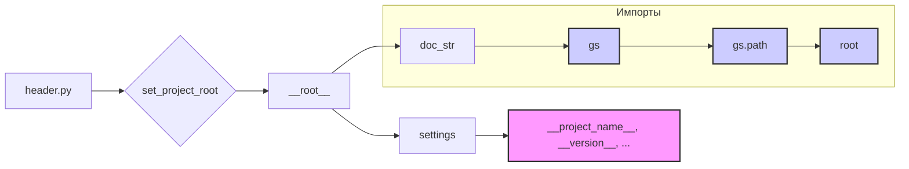

# Анализ кода hypotez/src/logger/header.py

## <input code>

```python
## \file hypotez/src/logger/header.py
# -*- coding: utf-8 -*-\
#! venv/Scripts/python.exe
#! venv/bin/python/python3.12

"""
module: src.logger 
	:platform: Windows, Unix
	:synopsis: Модуль определяющий корневой путь к проекту. Все импорты строятся относительно этого пути.
    :TODO: В дальнейшем перенести в системную переменную"""
MODE = 'dev'

import sys
import json
from packaging.version import Version

from pathlib import Path
def set_project_root(marker_files=('pyproject.toml', 'requirements.txt', '.git')) -> Path:
    """
    Finds the root directory of the project starting from the current file's directory,
    searching upwards and stopping at the first directory containing any of the marker files.

    Args:
        marker_files (tuple): Filenames or directory names to identify the project root.
    
    Returns:
        Path: Path to the root directory if found, otherwise the directory where the script is located.
    """
    __root__:Path
    current_path:Path = Path(__file__).resolve().parent
    __root__ = current_path
    for parent in [current_path] + list(current_path.parents):
        if any((parent / marker).exists() for marker in marker_files):
            __root__ = parent
            break
    if __root__ not in sys.path:
        sys.path.insert(0, str(__root__))
    return __root__


# Get the root directory of the project
__root__ = set_project_root()
"""__root__ (Path): Path to the root directory of the project"""

from src import gs

settings:dict = None
try:
    with open(gs.path.root / 'src' / 'settings.json', 'r') as settings_file:
        settings = json.load(settings_file)
except (FileNotFoundError, json.JSONDecodeError):
    ...

doc_str:str = None
try:
    with open(gs.path.root / 'src' / 'README.MD', 'r') as settings_file:
        doc_str = settings_file.read()
except (FileNotFoundError, json.JSONDecodeError):
    ...


__project_name__ = settings.get("project_name", 'hypotez') if settings  else 'hypotez'
__version__: str = settings.get("version", '')  if settings  else ''
__doc__: str = doc_str if doc_str else ''
__details__: str = ''
__author__: str = settings.get("author", '')  if settings  else ''
__copyright__: str = settings.get("copyrihgnt", '')  if settings  else ''
__cofee__: str = settings.get("cofee", "Treat the developer to a cup of coffee for boosting enthusiasm in development: https://boosty.to/hypo69")  if settings  else "Treat the developer to a cup of coffee for boosting enthusiasm in development: https://boosty.to/hypo69"
```

## <algorithm>

1. **`set_project_root`**:
   - Принимает кортеж `marker_files` (файлы/директории, по которым определяет корень проекта).
   - Начинает поиск с текущей директории файла (`__file__`).
   - Итерируется по родительским директориям.
   - Проверяет существование `marker_files` в каждой родительской директории.
   - Если найдена директория содержащая `marker_files`, то устанавливает `__root__` в эту директорию и завершает поиск.
   - Если корень не найден, возвращает текущую директорию.
   - Добавляет `__root__` в `sys.path` если его там нет, для корректного импорта модулей из проекта.

2. **`__root__`**:
   - Вызывает `set_project_root()` для определения корня проекта.
   - Результат сохраняется в переменной `__root__`.

3. **`settings`**:
   - Инициализируется как `None`.
   - Пытается прочитать файл `settings.json` в папке `src` относительно `__root__`.
   - Если файл найден и правильно сформирован, загружает данные в `settings`.
   - В случае `FileNotFoundError` или `json.JSONDecodeError` игнорирует ошибку.

4. **`doc_str`**:
   - Аналогично `settings`, пытается прочитать файл `README.MD`.

5. **`__project_name__`, `__version__`, `__doc__`, `__details__`, `__author__`, `__copyright__`, `__cofee__`**:
   - Извлекает данные из словаря `settings` (или использует значения по умолчанию) для формирования метаданных проекта.


**Пример**: Предположим, файл `header.py` находится в `/home/user/project/hypotez/src/logger`. Если директория `/home/user/project` содержит `pyproject.toml`, то `__root__` будет установлен в `/home/user/project`.


## <mermaid>



## <explanation>

**Импорты:**

- `sys`: Предоставляет доступ к системным переменным и функциям, в частности, `sys.path`, для корректного импорта модулей.
- `json`: Для работы с JSON-файлами (`settings.json`).
- `packaging.version`: Вероятно, для обработки версий пакетов.
- `pathlib`: Для удобной работы с путями к файлам и директориям.
- `src.gs`: Модуль `gs`, предположительно, предоставляющий вспомогательные функции для работы с проектом, включая `gs.path.root` для определения корневого пути.


**Классы:**

Нет явных классов в данном коде.

**Функции:**

- `set_project_root(marker_files)`: Ищет корневой каталог проекта, начиная с текущей директории, по указанным файлам (`marker_files`). Возвращает `Path` к корневому каталогу. Важная функция для организации импорта и относительных путей внутри проекта.

**Переменные:**

- `__root__`: `Path` объект, хранящий корневой каталог проекта. Используется для относительных путей при работе с файлами.
- `settings`, `doc_str`: Словари, хранящие данные из `settings.json` и `README.MD` соответственно.
- `MODE`: Строковая константа, вероятно, определяющая режим работы проекта (например, `dev`, `prod`).


**Возможные ошибки или области для улучшений:**

- **Перенос `__root__` в системные переменные**:  Как отмечено в документации, лучше было бы хранить корневой путь в переменной окружения, чтобы избежать необходимости его вычисления каждый раз.
- **Обработка ошибок**: Блоки `try...except` для чтения файлов `settings.json` и `README.MD` обрабатывают лишь `FileNotFoundError` и `json.JSONDecodeError`. Могут быть и другие исключения при работе с файлами.
- **Стандартизация `marker_files`**: Используемые файлы (`.git`, `pyproject.toml`, `requirements.txt`) – хороший выбор, но можно добавить валидацию, чтобы исключить ошибочные значения.
- **Документация**: Документация могла бы быть более подробной и покрыть большее количество случаев использования.


**Взаимосвязи с другими частями проекта:**

Модуль `gs` (в частности, `gs.path`) тесно связан с другими частями проекта.  Он определяет, как строится путь к ресурсам, и, возможно, участвует в логике других модулей.  Поиск пути к `settings.json` и `README.MD` в коде происходит с использованием `gs.path.root`, поэтому этот модуль напрямую влияет на работу `header.py`.