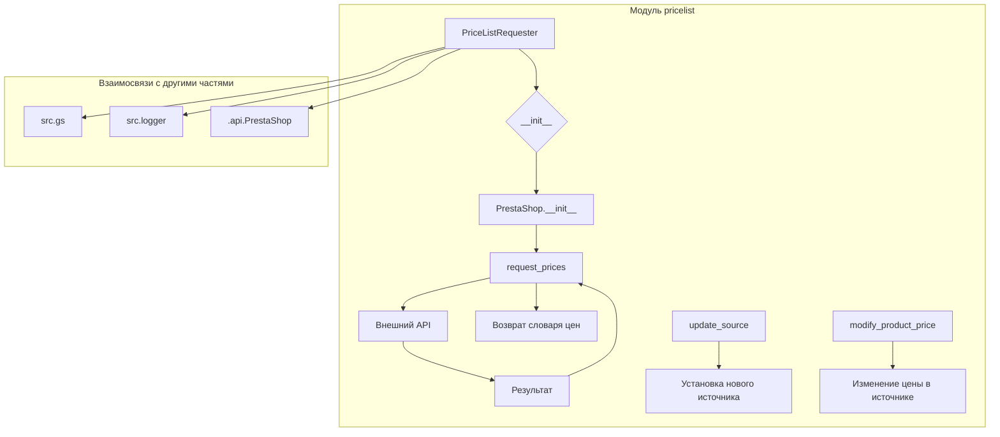

```MD
# <input code>

```python
## \file hypotez/src/endpoints/prestashop/pricelist.py
# -*- coding: utf-8 -*-\
#! venv/Scripts/python.exe
#! venv/bin/python/python3.12

"""
.. module: src.endpoints.prestashop 
	:platform: Windows, Unix
	:synopsis:

"""
MODE = 'dev'

import sys
import os
from attr import attr, attrs
from pathlib import Path
from typing import Union

import header
from src import gs
from src.logger import logger
from src.utils.jjson import j_loads, j_loads_ns
from .api import PrestaShop
from types import SimpleNamespace

class PriceListRequester(PrestaShop):
    """
    Класс для запроса списка цен.

    Inherits:
        PrestaShop
    """

    def __init__(self, api_credentials):
        """
        Инициализирует объект класса PriceListRequester.

        @param api_credentials: Словарь с учетными данными для API,
                                включая 'api_domain' и 'api_key'.
        """
        super().__init__(api_credentials['api_domain'], api_credentials['api_key'])

    def request_prices(self, products):
        """
        Запрашивает список цен для указанных товаров.

        @param products: Список товаров, для которых требуется получить цены.
        @return: Словарь, где ключами являются товары, а значениями - их цены.
                 Например: {'product1': 10.99, 'product2': 5.99}
        """
        # Здесь код для отправки запроса на получение цен из источника данных
        pass

    def update_source(self, new_source):
        """
        Обновляет источник данных для запроса цен.

        @param new_source: Новый источник данных.
        """
        self.source = new_source

    def modify_product_price(self, product, new_price):
        """
        Модифицирует цену указанного товара.

        @param product: Название товара.
        @param new_price: Новая цена товара.
        """
        # Здесь код для изменения цены товара в источнике данных
        pass
```

# <algorithm>

**Шаг 1**: Инициализация `PriceListRequester`.

   - Получает `api_domain` и `api_key` из `api_credentials`.
   - Вызывает конструктор родительского класса `PrestaShop` с этими данными.
   - Пример: `api_credentials = {'api_domain': 'example.com', 'api_key': '12345'}`, создается `PriceListRequester` с указанными значениями.


**Шаг 2**: Запрос цен (`request_prices`).

   - Принимает список товаров (`products`).
   - Отправляет запрос к внешнему API (источник данных) для получения цен товаров.
   - Возвращает словарь, где ключи - названия товаров, значения - их цены.
   - Пример: `products = ['product1', 'product2']`, возвращаемый словарь: `{'product1': 10.99, 'product2': 5.99}`


**Шаг 3**: Обновление источника данных (`update_source`).

   - Принимает новый источник данных (`new_source`).
   - Обновляет поле `self.source` в объекте `PriceListRequester`.
   - Пример: `new_source = 'new_data_source'`, поле `self.source` изменяется на `new_data_source`.


**Шаг 4**: Модификация цены товара (`modify_product_price`).

   - Принимает название товара (`product`) и новую цену (`new_price`).
   - Изменяет цену товара в источнике данных.
   - Пример: `product = 'product1'`, `new_price = 12.99`, цена товара `product1` изменяется на `12.99`.


# <mermaid>




# <explanation>

**Импорты:**

- `sys`, `os`: Стандартные модули Python для работы с системой.
- `attr`: Библиотека для аннотирования атрибутов классов.
- `pathlib`: Для работы с путями к файлам и директориям.
- `typing`: Для указания типов переменных (типизация).
- `header`:  Предполагается, что этот импорт связан с заголовками или конфигурацией проекта, но без контекста файла `header.py` трудно сказать точнее.
- `gs`: Ссылка на модуль `gs` (вероятно, связанный с Google Sheets или другим сервисом).
- `logger`: Модуль для логирования, из пакета `src.logger`.
- `jjson`: Модуль для работы с JSON, из пакета `src.utils.jjson` (подразумевается, что работает с JSON).
- `PrestaShop`: Класс из модуля `.api`, который, вероятно, отвечает за взаимодействие с API Престашоп.  Это указывает на архитектуру с выделением слоёв (API).
- `SimpleNamespace`: Для создания пространства имён.

**Классы:**

- `PriceListRequester`: Наследуется от `PrestaShop`, предоставляет методы для запроса и изменения цен.
    - `__init__`: Инициализирует объект, принимает учетные данные API и передает их родительскому классу.
    - `request_prices`: Запрашивает цены товаров.  Важно, что здесь нет логики запроса, она делегирована внешнему API (`PrestaShop`).
    - `update_source`: Обновляет источник данных для запросов.
    - `modify_product_price`:  Изменяет цену товара, без реализации.
    
**Функции:**

- Нет самостоятельных функций за пределами методов класса.
   - Методы класса, как `request_prices`,  `update_source` и `modify_product_price` имеют четко определённые входы (аргументы) и выходы (возвращаемые значения).

**Переменные:**

- `MODE`:  Переменная, вероятно, для определения режима работы (например, `dev`, `prod`).
- `api_credentials`: Словарь с данными для авторизации.


**Возможные ошибки/улучшения:**

- Методы `request_prices`, `modify_product_price` не содержат реализации запросов к API. Необходимо заполнить `pass` с реальным кодом для отправки запросов и обработки ответов.
- Отсутствует обработка ошибок: нет проверок на корректность данных или исключений при работе с API.
- Неясно, как связаны `src.gs` и `src.logger` с классом `PriceListRequester`. Необходим дополнительный контекст.
- В `request_prices` нет проверки на корректность ответа от API.

**Взаимосвязи с другими частями:**

- `PriceListRequester` использует `PrestaShop`, который, в свою очередь, вероятно, использует библиотеки для работы с API.
- Есть зависимости на модули `src.gs` и `src.logger`, возможно, для работы с данными или логированием.  Это указывает на более сложную архитектуру проекта, с разделением по слоям и модулям. Подробная информация об этих модулях нужна для полного понимания.